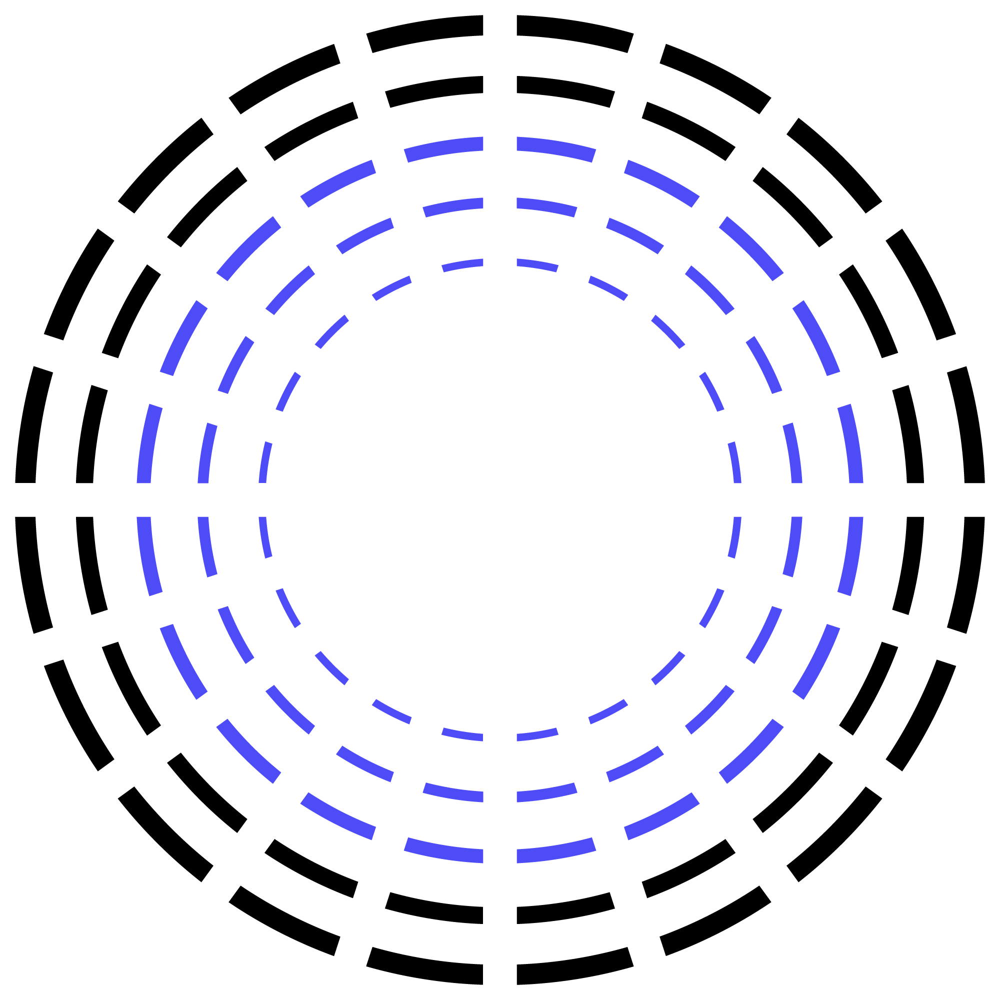
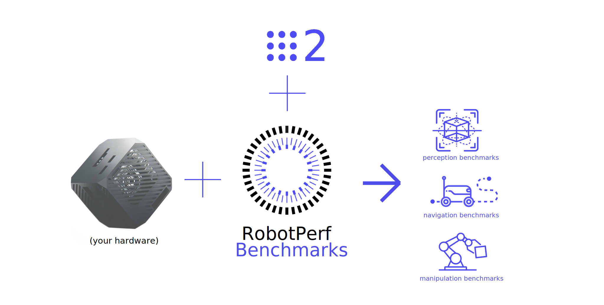

# RobotPerf Benchmarks

[**Benchmarks** 🤖](#benchmarks) | [*Contributing* 🌍](#contributing) | [`Contact and support` 📨](#contact-and-support)

RobotPerf is an **open reference benchmarking suite that is used to evaluate robotics computing performance** fairly with [ROS 2](https://accelerationrobotics.com/ros.php) as its common baseline, *so that robotic architects can make informed decisions about the hardware and software components of their robotic systems*. 

The project's <ins>mission is to build open, fair and useful robotics benchmarks that are technology agnostic, vendor-neutral and provide unbiased evaluations of robotics computing performance for hardware, software, and services</ins>.  As a reference performance benchmarking suite in robotics, RobotPerf *can be used to evaluate robotics computing performance across compute substratrated including CPUs, GPUs, FPGAs and other compute accelerators*. The benchmarks are designed to be representative of the performance of a robotic system and to be reproducible across different robotic systems. For that, RobotPerf builds on top of ROS 2, the de facto standard for robot application development.

## Why RobotPerf?

 The myriad combinations of robot hardware and robotics software make assessing robotic-system performance challenging, specially in an architecture-neutral, representative, and reproducible manner. RobotPerf addresses this issue delivering **a reference performance benchmarking suite that is used to evaluate robotics computing performance across CPU, GPU, FPGA and other compute accelerators**.

| Mission | Vission |
|:---:|:---:|
|  Represented by consortium of robotics leaders from industry, academia and research labs, RobotPerf is formated as an open project whose mission is to build open, fair and useful robotics benchmarks that are technology agnostic, vendor-neutral and provide unbiased evaluations of robotics computing performance for hardware, software, and services. |  Benchmarking helps assess performance. Performance information can help roboticists design more efficient robotic systems and select the right hardware for each robotic application. It can also help understand the trade-offs between different algorithms that implement the same capability. |

## Benchmarks

RobotPerf benchmarks aim to cover the **complete robotics pipeline** including perception, localization, control, manipulation and navigation. *In time, new benchmarks will be added and new categories may appear over time*. If you wish to contribute a new benchmark, please read the [contributing guidelines](#contributing).

| `a` Perception | `b` Localization | `c` Control | `d` Navigation | `e` Manipulation |
|:---:|:---:|:---:|:---:|:---:|
|  |  |  |  |  | 

### `A` Perception

| ID | Benchmark summary | `ROBOTCORE` | `Kria KR260` | `Jetson Nano` | `Jetson AGX Orin` |
|:---:|---|:---:|:---:|:---:|:---:|
| [`a1`]() | TODO |  |  |  |  |

### Localization
TODO
### Control
TODO
### Navigation
TODO
### Manipulation
TODO

## Contributing

## Contact and support

For getting involved in the project and/or receiving support to run the RobotPerf benchmarks, [`contact here`](mailto:contact@accelerationrobotics.com).

[^1]: Quigley, M., Conley, K., Gerkey, B., Faust, J., Foote, T., Leibs, J., ... & Ng, A. Y. (2009, May). ROS: an open-source Robot Operating System. In ICRA workshop on open source software (Vol. 3, No. 3.2, p. 5).
[^2]: Macenski, S., Foote, T., Gerkey, B., Lalancette, C., & Woodall, W. (2022). Robot Operating System 2: Design, architecture, and uses in the wild. Science Robotics, 7(66), eabm6074.
