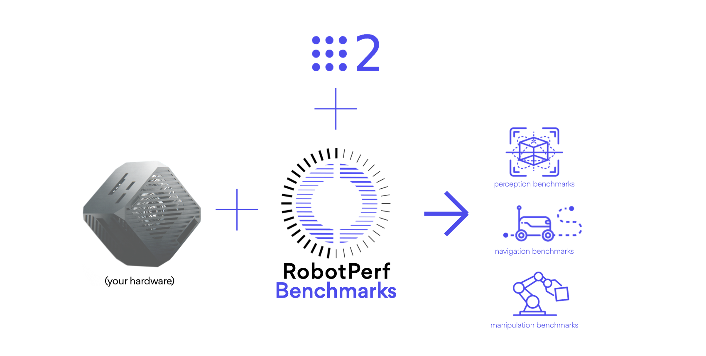

# RobotPerf Benchmarks

[**Benchmark results** 🤖](#benchmarks) | [Benchmark spec 📖](benchmarks/README.md) | [*Contributing* 🌍](#contributing) | [`Contact and support` 📨](#contact-and-support)

RobotPerf is an **open reference benchmarking suite that is used to evaluate robotics computing performance** fairly with [ROS 2](https://accelerationrobotics.com/ros.php) as its common baseline, *so that robotic architects can make informed decisions about the hardware and software components of their robotic systems*. 

The project's <ins>mission is to build open, fair and useful robotics benchmarks that are technology agnostic, vendor-neutral and provide unbiased evaluations of robotics computing performance for hardware, software, and services</ins>.  As a reference performance benchmarking suite in robotics, RobotPerf *can be used to evaluate robotics computing performance across compute substratrated including CPUs, GPUs, FPGAs and other compute accelerators*. The benchmarks are designed to be representative of the performance of a robotic system and to be reproducible across different robotic systems. For that, RobotPerf builds on top of ROS 2, the de facto standard for robot application development.

Refer to the [Benchmark Specification](benchmarks/README.md) for more details.

## Why RobotPerf?

 The myriad combinations of robot hardware and robotics software make assessing robotic-system performance challenging, specially in an architecture-neutral, representative, and reproducible manner. RobotPerf addresses this issue delivering **a reference performance benchmarking suite that is used to evaluate robotics computing performance across CPU, GPU, FPGA and other compute accelerators**.

| Mission | Vision | Standards |
|---|---|----|
|  Represented by consortium of robotics leaders from industry, academia and research labs, RobotPerf is formated as an open project whose mission is to build open, fair and useful robotics benchmarks that are technology agnostic, vendor-neutral and provide unbiased evaluations of robotics computing performance for hardware, software, and services. |  Benchmarking helps assess performance. Performance information can help roboticists design more efficient robotic systems and select the right hardware for each robotic application. It can also help understand the trade-offs between different algorithms that implement the same capability. | RobotPerf benchmarks aligns to robotics standards so that you <ins>don’t spend time reinventing the wheel and re-develop what already works</ins>. Benchmarks are conducted using [ROS 2](https://accelerationrobotics.com/ros.php) as its common baseline. RobotPerf also aligns to standardization initiatives within the ROS ecosystem related to computing performance and benchmarking such as [REP 2008](https://github.com/ros-infrastructure/rep/pull/324) (ROS 2 Hardware Acceleration Architecture and Conventions).|

## Benchmarks

RobotPerf benchmarks aim to cover the **complete robotics pipeline** including perception, localization, control, manipulation and navigation. *In time, new benchmarks will be added and new categories may appear over time*. If you wish to contribute a new benchmark, please read the [contributing guidelines](#contributing).

| `a` Perception | `b` Localization | `c` Control | `d` Manipulation | `e` Navigation |
|:---:|:---:|:---:|:---:|:---:|
|  |  |  |  |  | 

<!-- perception-benchmarks-init -->

<!-- perception-benchmarks-fini -->

## Robotics Computing: Visualizing Performance

For robotic architects, delving into the multifaceted dimensions of computing performance is crucial, yet often intricate. RobotPerf™ stands as a beacon in this space, offering a range of visualizations tailored for clarity and depth. One such illustration is the polar plot, which displays benchmarks within a particular robotic computing category on separate axes. Through RobotPerf™, architects can instantly perceive a system's proficiency across these benchmarks. They can pinpoint both the strengths and areas of improvement, and thereby make informed decisions in design and optimization. With RobotPerf™, the complexity of robotics computing performance is transformed into actionable insights, making the architect's role not only simpler but also more effective. 

## Contributing

Start by reading the [benchmark specification](benchmarks/README.md). You can contribute to the project both as an individual or as a organization. If you are an individual, feel free to contribute by running the benchmarks and/or by contributing with new benchmarks (see [spec](benchmarks/README.md)). Once ready, submit a [pull request](https://github.com/robotperf/benchmarks/pulls) and/or [raise issues](https://github.com/robotperf/benchmarks/issues) as appropriate. If you are an organization willing to commit resources to the project and contribute to it, please [`contact here`](mailto:contact@accelerationrobotics.com).

## Contact and support

For getting involved in the project and/or receiving support to run the RobotPerf benchmarks, [`contact here`](mailto:contact@accelerationrobotics.com).

[^1]: Quigley, M., Conley, K., Gerkey, B., Faust, J., Foote, T., Leibs, J., ... & Ng, A. Y. (2009, May). ROS: an open-source Robot Operating System. In ICRA workshop on open source software (Vol. 3, No. 3.2, p. 5).
[^2]: Macenski, S., Foote, T., Gerkey, B., Lalancette, C., & Woodall, W. (2022). Robot Operating System 2: Design, architecture, and uses in the wild. Science Robotics, 7(66), eabm6074.
[^3]: AMD Ryzen 5 PRO 4650G, see https://www.amd.com/en/products/apu/amd-ryzen-5-pro-4650g
[^4]: ROBOTCORE® is a robot-specific processing unit that helps map Robot Operating System (ROS) computational graphs to its CPUs, GPU and FPGA efficiently to obtain best performance. More at https://accelerationrobotics.com/robotcore.php