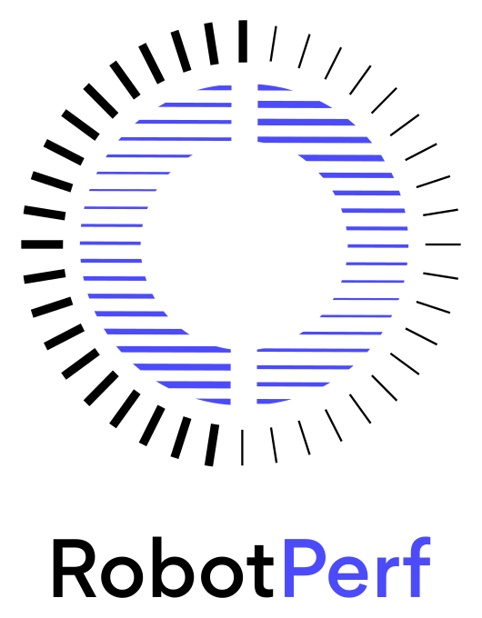
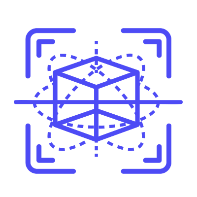

# Benchmark Specification

- [Benchmark Specification](#benchmark-specification)
  - [Motivation](#motivation)
    - [A quantitative approach](#a-quantitative-approach)
    - [Why ROS 2 for performance benchmarking in robotics?](#why-ros-2-for-performance-benchmarking-in-robotics)
    - [Value for stakeholders](#value-for-stakeholders)
    - [Standard-driven benchmarking in robotics](#standard-driven-benchmarking-in-robotics)
      - [Other industry standards](#other-industry-standards)
      - [Prior work](#prior-work)
  - [General concepts](#general-concepts)
    - [Nomenclature](#nomenclature)
    - [Category](#category)
    - [IDs](#ids)
    - [ROS 2-native](#ros-2-native)
    - [Computing Targets](#computing-targets)
    - [Metric](#metric)
    - [Type](#type)
    - [Machine-readable definition of benchmarks](#machine-readable-definition-of-benchmarks)
    - [Readibility of benchmarks](#readibility-of-benchmarks)
  - [Creating a new benchmark](#creating-a-new-benchmark)


<a href="https://accelerationrobotics.com/robotperf.php"></a>

This document describes **how each RobotPerf benchmark should be designed and implemented**. The benchmarks are designed to be <ins>representative of the performance of a robotic system and should be easily reproducible</ins> across compute targets. The benchmarks are designed to be <ins>technology agnostic</ins> and <ins>vendor-neutral</ins> so that they can be used to evaluate robotics computing performance across compute substratrated including CPUs, GPUs, FPGAs and other compute accelerators. The benchmarks are designed to be <ins>open and fair</ins> so that robotic architects can make informed decisions about the hardware and software components of their robotic systems. For all these reasons, we build on top of ROS 2, the de facto standard for robot application development.

*The current document is purposely written informal to allow rapid iterations and feedback. In time, the format of this document may change to a more formal specification*.

## Motivation

Benchmarking is the act of running a computer program with a known workload to assess the program's relative performance. In the context of robotics, performance information can help roboticists design more efficient robotic systems and select the right hardware for their robotic application. It can also help understand the trade-offs between different algorithms that implement the same capability, and help them choose the best approach for their use case. Performance data can also be used to compare different versions of robotics middleware and to identify regressions. Finally, performance information can be used to help prioritize future development efforts.


The myriad combinations of robot hardware and robotics software make assessing robotic-system performance in an architecture-neutral, representative, and reproducible manner challenging. This specification attempts to provide some guidelines to help roboticists benchmark their systems in a consistent and reproducible manner by following a quantitative approach. This repository also provides a set of tools and examples to help guide roboticists while collecting and reporting performance data.


### A quantitative approach
Performance must be studied with real examples and measurements on real robotic computations, rather than simply as a collection of definitions, designs and/or marketing actions. When creating benchmarks, prefer to use realistic data and situations rather than data designed to test one edge case. Follow the quantitative approach [^1] when designing your architecture.

### Why ROS 2 for performance benchmarking in robotics?

Robot behaviors take the form of computational graphs, with data flowing between computation Nodes, across physical networks (communication buses) and while mapping to underlying sensors and actuators. The popular choice to build these computational graphs for robots these days is the Robot Operating System (ROS), a framework for robot application development. ROS enables you to build computational graphs and create robot behaviors by providing libraries, a communication infrastructure, drivers and tools to put it all together. Most companies building real robots today use ROS or similar event-driven software frameworks. ROS is thereby the common language in robotics, with several [hundreds of companies](https://github.com/vmayoral/ros-robotics-companies) and thousands of developers using it everyday. ROS 2  was redesigned from the ground up to address some of the challenges in ROS and solves many of the problems in building reliable robotics systems.

### Value for stakeholders

In the ROS 2 ecosystem:

- Package maintainers can use these guidelines to integrate performance benchmarking tools (e.g. instrumentation) and data (e.g. results, plots and datasets) in their packages.

- Consumers can use the guidelines in this spec to benchmark ROS Nodes and Graphs in an architecture-neutral, representative, and reproducible manner, as well as the corresponding performance data offered in ROS packages to set expectations on the capabilities of each.

- Hardware vendors and robot manufacturers can use these guidelines to show evidence of the performance of their systems solutions with ROS in an architecture-neutral, representative, and reproducible manner.

Outside of the ROS 2 ecosystem, these guidelines can be used to propose reference benchmarks for robotics middleware and to compare the performance of different robotics middleware solutions.


### Standard-driven benchmarking in robotics

RobotPerf benchmarks aligns (*and will contribute*) to robotics standards so that you don’t spend time reinventing the wheel and re-develop what already works for most. Particularly benchmarks are conducted using the Robot Operating System 2 ([ROS 2](https://accelerationrobotics.com/ros.php)) as its common baseline. RobotPerf also aligns to standardization initiatives within the ROS ecosystem related to computing performance and benchmarking such as [REP 2008](https://github.com/ros-infrastructure/rep/pull/324) (ROS 2 Hardware Acceleration Architecture and Conventions).

#### Other industry standards
There are no globally accepted industry standards for benchmarking robotic systems. The closest initiative to a standardization effort in robotics is the European H2020 Project EUROBENCH which aimed at creating the first benchmarking framework for robotic systems in Europe focusing on bipedal locomotion. The project has been completed in 2022 and the results are available in [^2]. The project has been a great success and has been used to benchmark a wide range of bidepal robotic systems throughout experiments however there're no public plans to escalate the project to other types of robots, nor the tools have been used elsewhere.

When looking at other related areas to robotics we find the MLPerf Inference and MLCommons initiatives which are the closest to what we are trying to achieve in ROS 2. The MLPerf Inference is an open source project that aims to define a common set of benchmarks for evaluating the performance of machine learning inference engines. The MLCommons is an open source project that aims to define a common set of benchmarks for evaluating the performance of machine learning models. Both projects have been very successful and are widely used in the industry. The MLPerf Inference project has been completed in 2021 and the results inference benchmarks available in [^3]. The MLCommons project has become an industry standard in Machine Learning and the results publicly disclosed in [^4].

#### Prior work
There're various past efforts in the robotics community to benchmark ROS robotic systems. The following are some of the most representative ones:

- [ros2_benchmarking](https://github.com/piappl/ros2_benchmarking/): First implementation available for ROS 2, aimed to provide a framework to compare ROS and ROS 2 communications.
- [performance_test](https://gitlab.com/ApexAI/performance_test/): Tool is designed to measure inter and intra-process communications. Runs at least one publisher and at least one subscriber, each one in one independent thread or process and records different performance metrics. It also provides a way to generate a report with the results through a different package.
- [reference_system](https://github.com/ros-realtime/reference-system/): Tool designed to provide a framework for creating reference systems that can represent real-world distributed systems in order to more fairly compare various configurations of each system (e.g. measuring performance of different ROS 2 executors). It also provides a way to generate reports as well.
- [ros2-performance](https://github.com/irobot-ros/ros2-performance/): Another framework to evaluate ROS communications and inspired on `performance_test`. There's a decent rationale in the form of a proposal, a good evaluation of prior work and a well documented set of experiments.
- [system_metrics_collector](https://github.com/ros-tooling/system_metrics_collector/): A lightweight and *real-time* metrics collector for ROS 2. Automatically collects and aggregates *CPU* % used and *memory* % performance metrics used by both system and ROS 2 processes. Data is aggregated in order to provide constant time average, min, max, sample count, and standard deviation values for each collected metric. *Deprecated*.
- [ros2_latency_evaluation](https://github.com/Barkhausen-Institut/ros2_latency_evaluation/): A tool to benchmarking performance of a ROS 2 Node system in separate processses (initially focused on both inter-process and intra-process interactions, later focused). Forked from `ros2-performance`.
- [ros2_timer_latency_measurement](https://github.com/hsgwa/ros2_timer_latency_measurement/):  A minimal *real-time safe* testing utility for measuring jitter and latency.  Measures nanosleep latency between ROS child threads and latency of timer callbacks (also within ROS) across two different Linux kernel setups (`vanilla` and a `RT_PREEMPT`` patched kernel).
- [buildfarm_perf_tests](https://github.com/ros2/buildfarm_perf_tests/): Tests which run regularly on the official ROS 2 buildfarm. Formally, extends `performance_test` with additional tests that measure additional metrics including CPU usage, memory, resident anonymous memory or virtual memory.
- [ros2_tracing](https://github.com/ros2/ros2_tracing): Tracing tools for ROS 2 built upon LTTng which allow collecting runtime execution information on real-time distributed systems, using the low-overhead LTTng tracer. Performance evaluation can be scripted out of the data collected from all these trace points. The ROS 2 core layers (`rmw`, `rcl`, `rclcpp`) have been instrumented with LTTng probes which allow collecting information of ROS 2 targets without the need to modify the ROS 2 core code (*system under test)*. There are various publications available about `ros2_tracing` [^5], [^6] and it is used actively to benchmark ROS 2 in real scenarios, including perception and mapping [^7], hardware acceleration [^8], [^9] or self-driving mobility [^10].


## General concepts

### Nomenclature
Below is the current list of all the terminology deemed important to distinguish. Recommendations for additional terminology are welcomed and can be done through pull requests or discussion during [working group meetings](https://github.com/ros-acceleration/community#meetings).

- **Application.** An application refers to a particular use case that aims to achieve a specific objective in the real world. Each application will vary and may span one or more tasks or sub-tasks. An example of an application would be an autonomous vehicle, which would be associated with a specific set of tasks, sub-tasks, and workloads.
- **Benchmark.** A benchmark is a standardized test or set of tests used to evaluate the performance of computer hardware, software, or systems. A benchmark typically consists of a workload designed to simulate real-world tasks and measure the time it takes to complete them.
- **Benchmarking Suite.** A benchmarking suite refers to a collection of benchmarks, each typically covering one or multiple components of the robotics pipeline.
- **Dataset.** A dataset is a tool that enables standardization of the information used for evaluating benchmarks. A rosbag is one type of dataset that is used for recording and playing back ROS message data. It is a file containing a recorded stream of ROS messages in a serialized format, along with the metadata necessary to reproduce the original message stream. The rosbag can be replayed later to simulate a specific scenario or to analyze data.
- **Meta-package.** A meta-package is a type of package that groups together multiple related packages, providing a convenient way to manage and distribute them as a single unit.
- **Package.** In the context of ROS2, a package is a basic unit of code organization that contains related ROS nodes, libraries, launch files, configuration files, and other resources necessary to implement a particular functionality or behavior.
- **Reference Implementation.** A reference implementation is a standardized implementation of a benchmark that is used as a baseline for comparison with other implementations. The reference implementation serves as a common point of reference for evaluating the performance of different hardware or software configurations.
- **tracing**: logging (partial) execution information while the system is running. `tracing` is used to understand what goes on in a running software system.
- **benchmarking**: a method of comparing the performance of various systems by running a common test.

From these definitions, inherently one can determine that both benchmarking and tracing are connected in the sense that the test/benchmark will use a series of measurements for comparison. These measurements will come from tracing probes or other logging mechanisms. In other words, tracing will collect data that will then be fed into a benchmark program for comparison.

### Category
Each benchmark should be categorized as one of the following:

| `a` Perception | `b` Localization | `c` Control | `d` Manipulation | `e` Navigation |
|:---:|:---:|:---:|:---:|:---:|
|  | |  |  |  |

To reflect the category of the benchmark, the benchmark's ROS 2 package name should be prefixed with the corresponding **category identifier letter**  (*e.g. `a` if related to Perception*).
### IDs
Each benchmark should have an associated ID that is unique across all benchmarks. The ID should be a string and correspond with the preffix of the associated ROS 2 package name to that benchmark and that includes the Category (*e.g. ID: `a1`, package name: `a1_perception_2node`*). The ID should be used to identify the benchmark in the RobotPerf suite.

### ROS 2-native 
Each benchmark should be a ROS 2 package and should build and run using the common ROS 2 development flows (build tools, meta-build tools, etc.).

### Computing Targets

Each computing target will be marked with a symbol denoting its group as in:
  - `edge` -> 📟
  - `workstation` -> 🖥️
  - `datacenter` -> 🗄
  - `cloud` -> ⛅

This way, targets can be grouped and compared easily.
### Metric

Benchmarks should be designed to measure one or more metrics. Each metric should be associated with a unit of measurement. Robots are deterministic machines and their performance should be understood by considering metrics such as the following:

- **latency**: time between the start and the completion of a task.
- **system reaction time**: time between receipt of an external stimulus and the beginning of the system's actions (for example, time between an obstacle sensor firing and the first velocity command taking this into account)
- **software system reaction time**: time between when an external stimulus is received by the robot's software and when the corresponding action has been executed by the software. This is usually the more directly measurable version of system reaction time.
- **message latency**: Time between publishing a message and invocation of the corresponding callback on the receiver side
- **execution latency**: Time between when an event leading to an execution (such as a timer firing, or a message being received) occurs, and when the corresponding callback is called
- **bandwidth or throughput**: the total amount of work done in a given time for a task. When measuring bandwidth or throughput in a ROS 2 system Messages per second is interesting, and the total number of bytes per second is interesting too.
- **power**: the electrical energy per unit of time consumed while executing a given task.
- **performance-per-watt**: total amount of work (generally *bandwidth* or *throughput*) that can be delivered for every watt of power consumed.
- **memory**: the amount of short-term data (not to be confused with storage) required while executing a given task.

These metrics can help determine performance characteristics of a robotic system. Of most relevance for robotic systems we often encounter the *real-time* and *determinism* characteristics defined as follows:

- **real-time**: ability of completing a task's computations while meeting time deadlines
- **determinism**: that the same external or internal event leads to the same system behavior, with executions in the same order, each time.


For example, a robotic system may be able to perform a task in a short amount of time (*low latency*), but it may not be able to do it in *real-time*. In this case, the system would be considered to be *non-real-time* given the time deadlines imposed. On the other hand, a robotic system may be able to perform a task in *real-time*, but it may not be able to do it in a short amount of time. In this case, the system would be considered to be *non-interactive*. Finally, a robotic system may be able to perform a task in real-time and in a short amount of time, but it may consume a lot of *power*. In this case, the system would be considered to be *non-energy-efficient*.

In another example, a robotic system that can perform a task in 1 second with a power consumption of `2W` is twice as fast (*latency*) as another robotic system that can perform the same task in 2 seconds with a power consumption of `0.5W`. However, the second robotic system is twice as efficient as the first one. In this case, the solution that requires less power would be the best option from an energy efficiency perspective (with a higher *performance-per-watt*). Similarly, a robotic system that has a high bandwidth but consumes a lot of energy might not be the best option for a mobile robot that must operate for a long time on a battery.

Therefore, it is important to consider different of these metrics when benchmarking a robotic system. The metrics presented in this specification are intended to be used as a guideline, and should be adapted to the specific needs of a robot.

### Type
There're different types of benchmarking approaches, specially when related to performance. When related to the aspect that's being measured, we distinguish between two types of performance testing:

- `Functional performance testing`: Functional performance is the measurable performance of the system’s functions which the user can experience. For example, in a motion planning algorithm, measures could include items like the ratio the algorithm gets the motion plan right.

- `Non-functional performance testing`: The measurable performance of those aspects that don't belong to the system's functions. In the motion planning example, the latency the planner, the memory consumption, the CPU usage, etc.

In `RobotPerf` non-functional benchmarks can be of two types depending on how data is collected: :white_circle: `grey` or :black_circle: `black`. This should be specified on each measurement:

```
             Probe      Probe
             +            +
             |            |
    +--------|------------|-------+     +-----------------------------+
    |        |            |       |     |                             |
    |     +--|------------|-+     |     |                             |
    |     |  v            v |     |     |        - latency   <--------------+ Probe
    |     |                 |     |     |        - throughput<--------------+ Probe
    |     |     Function    |     |     |        - memory    <--------------+ Probe
    |     |                 |     |     |        - power     <--------------+ Probe
    |     +-----------------+     |     |                             |
    |      System under test      |     |       System under test     |
    +-----------------------------+     +-----------------------------+


              Functional                            Non-functional


    +-------------+                     +----------------------------+
    | Test App.   |                     |  +-----------------------+ |
    |  + +  +  +  |                     |  |    Application        | |
    +--|-|--|--|--+---------------+     |  |                   <------------+ Probe
    |  | |  |  |                  |     |  +-----------------------+ |
    |  v v  v  v                  |     |                            |
    |     Probes                  |     |                      <------------+ Probe
    |                             |     |                            |
    |       System under test     |     |   System under test        |
    |                             |     |                      <------------+ Probe
    |                             |     |                            |
    |                             |     |                            |
    +-----------------------------+     +----------------------------+


             Black-Box                            Grey-box

```

- `Black-box performance testing` (⚫): Measures performance by eliminating the layers above the *layer-of-interest* and replacing those with a specific test application that stimulates the layer-of-interest in the way you need it. This allows to gather the measurement data right inside your specific test application. The acquisition of the data (the probe) resides inside the test application. A major design constraint in such a test is that you have to eliminate the “application” in order to test the system. Otherwise, the real application and the test application would likely interfere.

- `Grey-box performance testing` (⚪): More application-specific measure which is capable of watching internal states of the system and can measure (probe) certain points in the system, thus generate the measurement data with minimal interference. Requires to instrument the complete application.


### Machine-readable definition of benchmarks
So that benchmark information can be easily consumed by other tools, each benchmark should be defined in a machine-readable format. The format will use YAML data serialization language. A YAML file named `benchmark.yaml` should be placed in the root of the ROS 2 package describing each benchmark at any of its results.

For a practical example, refer to the [TEMPLATE](./TEMPLATE.yaml).

### Readibility of benchmarks
For readibility purposes, each benchmark will include a README.md file that describes the benchmark and its results. The README.md file should be placed in the root of the ROS 2 package and will be auto-generated from the machine-readable definition of the benchmark (`benchmark.yaml` file)


## Creating a new benchmark
Create a new benchmark by following these steps:

1. Select the [category](#category) of the benchmark and its corresponding category identifier letter.
2. Compose the benchmark [ID](#ids) by concatenating the category identifier letter with a number that is unique across all benchmarks of that category (generally, iterate to the next number available).
3. Create the corresponding ROS 2 package with the name `<ID>_<benchmark_name>` (*e.g. `a1_perception_2node`*) in the right category folder (*e.g. `perception`*). The benchmark should follow this specification's guidelines.
4. Create a `benchmark.yaml` file within the ROS 2 package that describes the benchmark. At least the following fields should be defined:
   - `id`: id of the benchmark
   - `name`: name of the benchmark
   - `description`: short description of the benchmark
   - `short`: short description of the benchmark
   - `graph`: depiction of the computational graph of the benchmark
   - `reproduction`: instructions on how to reproduce the benchmark. Additional reproduction fields can be added as needed (e.g. `reproduction-robotcore` if special instructions are needed to reproduce the benchmark on [ROBOTCORE](https://accelerationrobotics.com/robotcore.php) hardware)
   - `results`: a list of results (`result`), each containing:
     - `type`: `grey` for grey-box and `black` for black-box
     - `metric`: metric measured, e.g. latency, power, throughput, etc.
    - `metric_unit`: unit of the metric measured, e.g. ms, W, etc.
     - `hardware`: name of the hardware used to run the benchmark
     - `timestampt`: timestamp of the result
     - `value`: value of the metric
     - `note`: a note or comment about the result
     - `category`: category of the hardware used to run the benchmark, typically one of the following:
       - `edge/embedded`
       - `workstation`
       - `data center`
       - `cloud`
     - datasource: path of the datasource to obtain the result (relative to [rosbags](https://github.com/robotperf/rosbags) repository of RobotPerf)

For a practical example, refer to the [TEMPLATE](./TEMPLATE.yaml). 


[^1]: Hennessy, J. L., & Patterson, D. A. (2011). Computer architecture: a quantitative approach. Elsevier.
[^2]: European robotic framework for bipedal locomotion benchmarking. https://eurobench2020.eu/
[^3]: MLPerf™ inference benchmarks. https://github.com/mlcommons/inference
[^4]: MLCommons. https://mlcommons.org/en/
[^5]: Bédard, C., Lütkebohle, I., & Dagenais, M. (2022). ros2_tracing: Multipurpose Low-Overhead Framework for Real-Time Tracing of ROS 2. IEEE Robotics and Automation Letters, 7(3), 6511-6518.
[^6]: Bédard, C., Lajoie, P. Y., Beltrame, G., & Dagenais, M. (2022). Message Flow Analysis with Complex Causal Links for Distributed ROS 2 Systems. arXiv preprint arXiv:2204.10208.
[^7]: Lajoie, P. Y., Bédard, C., & Beltrame, G. (2022). Analyze, Debug, Optimize: Real-Time Tracing for Perception and Mapping Systems in ROS 2. arXiv preprint arXiv:2204.11778.
[^8]: Mayoral-Vilches, V., Neuman, S. M., Plancher, B., & Reddi, V. J. (2022). "RobotCore: An Open Architecture for Hardware Acceleration in ROS 2". https://arxiv.org/pdf/2205.03929.pdf
[^9]: Mayoral-Vilches, V. (2021). "Kria Robotics Stack". https://www.xilinx.com/content/dam/xilinx/support/documentation/white_papers/wp540-kria-robotics-stack.pdf
[^10]: Li, Z., Hasegawa, A., & Azumi, T. (2022). Autoware_Perf: A tracing and performance analysis framework for ROS 2 applications. Journal of Systems Architecture, 123, 102341.
