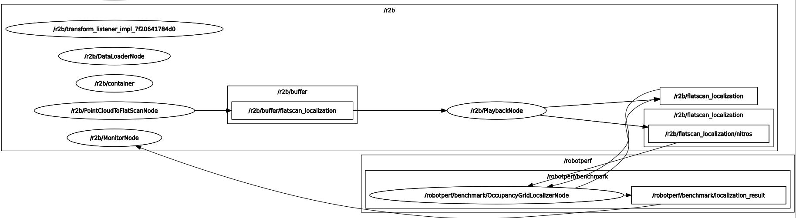

# b2_map_localization

Map localization ROS Component.

### ID
b2

### Description
A map localization ROS robotics operation. Used to demonstrate the occupancy grid localizer component [isaac_ros_occupancy_grid_localizer](https://github.com/NVIDIA-ISAAC-ROS/isaac_ros_map_localization/tree/main/isaac_ros_occupancy_grid_localizer) package.




## Reproduction Steps

```bash
# Create a ROS 2 overlay workspace
mkdir -p /tmp/benchmark_ws/src

# Clone the benchmark repository
cd /tmp/benchmark_ws/src && git clone https://github.com/robotperf/benchmarks

# Fetch dependencies
source /opt/ros/humble/setup.bash
cd /tmp/benchmark_ws && sudo rosdep update || true && sudo apt-get update &&
  sudo rosdep install --from-paths src --ignore-src --rosdistro humble -y

# Build the benchmark
colcon build --merge-install --packages-up-to b2_map_localization

# Source the workspace as an overlay, launch the benchmark
source install/setup.bash
RMW_IMPLEMENTATION=rmw_cyclonedds_cpp ros2 launch b2_map_localization trace_b2_map_localization.launch.py

```

## Results

| Type | Hardware | Metric | Value | Category | Timestamp | Note | Data Source |
| --- | --- | --- | --- | --- | --- | --- | --- |
| [:white_circle:](https://github.com/robotperf/benchmarks/blob/main/benchmarks/README.md#type) | ROBOTCORE | latency | 66.82 | edge | 14-10-2022 |  | [perception/image](https://github.com/robotperf/rosbags/tree/main/perception/image) |

