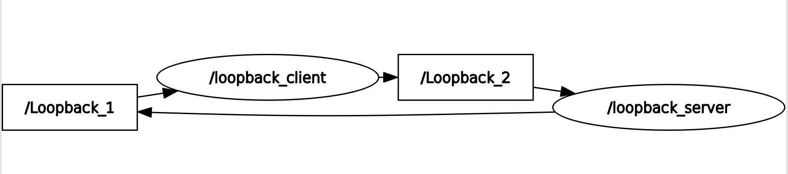

# n1_intra_process

Network computational graph composed by two components.

### ID
n1

### Description
A simple network computational graph composed by two components. Used to demonstrate a simple ping-pong for intra-process communication.



## Reproduction Steps

```bash
Refer to https://github.com/robotperf/benchmarks/tree/main/benchmarks/network/n1_intra_process and review the launch files to reproduce this package.
```

## Results

| Type | Hardware | Metric | Value | Category | Timestamp | Note | Data Source |
| --- | --- | --- | --- | --- | --- | --- | --- |


