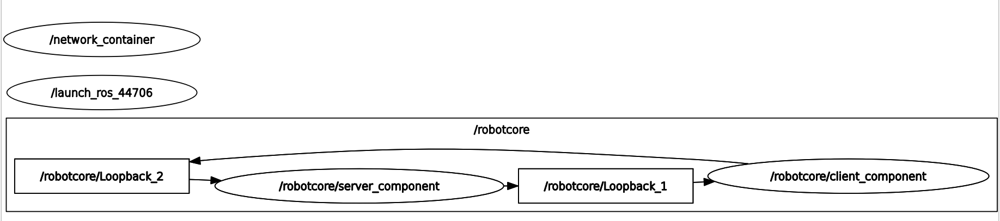

# n2_inter_process

Network computational graph composed by two nodes.

### ID
n2

### Description
A simple network computational graph composed by two nodes. Used to demonstrate a simple ping-pong for inter-process communication.



## Reproduction Steps

```bash
Refer to https://github.com/robotperf/benchmarks/tree/main/benchmarks/network/n2_inter_process and review the launch files to reproduce this package.
```

## Results

| Type | Hardware | Metric | Value | Category | Timestamp | Note | Data Source |
| --- | --- | --- | --- | --- | --- | --- | --- |


