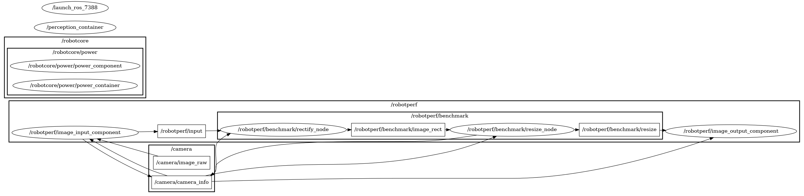

# a1_perception_2nodes

Perception computational graph composed by 2 dataflow-connected *Components*, `rectify` and `resize`.

### ID
a1

### Description
A simple perception computational graph composed by 2 Components, `rectify` and `resize` operations. Used to demonstrate a simple perception pipeline using the [image_pipeline](https://github.com/ros-perception/image_pipeline) package.




## Reproduction Steps

```bash
Refer to https://github.com/robotperf/benchmarks/tree/main/benchmarks/perception/a1_perception_2nodes and review the launch files to reproduce this package.
```

## Results

| Type | Hardware | Metric | Value | Category | Timestamp | Note | Data Source |
| --- | --- | --- | --- | --- | --- | --- | --- |
| [:black_circle:](https://github.com/robotperf/benchmarks/blob/main/benchmarks/README.md#type) | Intel i7-12700H | latency | 20.4 | workstation | 07-07-2023 | mean 14.73 ms, RMS 14.84 ms, max 20.40 ms, min 6.03 ms, throughput bounded to 30fps | [perception/image](https://github.com/robotperf/rosbags/tree/main/perception/image) |
| [:black_circle:](https://github.com/robotperf/benchmarks/blob/main/benchmarks/README.md#type) | Intel i7-12700H | power | 12.46 | workstation | 07-07-2023 | throughput bounded to 30fps, estimated with RAPL | [perception/image](https://github.com/robotperf/rosbags/tree/main/perception/image) |
| [:black_circle:](https://github.com/robotperf/benchmarks/blob/main/benchmarks/README.md#type) | Intel i7-12700H + NVIDIA GeForce RTX 3060 (ROBOTCORE® Perception) | latency | 17.47 | workstation | 07-07-2023 | mean 11.94 ms, RMS 12.06 ms, max 17.47 ms, min 7.41 ms, throughput bounded to 30fps | [perception/image](https://github.com/robotperf/rosbags/tree/main/perception/image) |
| [:black_circle:](https://github.com/robotperf/benchmarks/blob/main/benchmarks/README.md#type) | Intel i7-12700H + NVIDIA GeForce RTX 3060 (ROBOTCORE® Perception) | power | 39.4 | workstation | 07-07-2023 | throughput bounded to 30fps, estimated with RAPL and NVML | [perception/image](https://github.com/robotperf/rosbags/tree/main/perception/image) |
| [:black_circle:](https://github.com/robotperf/benchmarks/blob/main/benchmarks/README.md#type) | Intel i7-12700H | latency | 180.26 | workstation | 07-07-2023 | mean 66.17 ms, rms 71.71 ms, max 180.26 ms, min 3.92 ms, % frames lost 1.92 %. Throughput configured in the 30-500 FPS range. Mean FPS observed 174.432. | [perception/image](https://github.com/robotperf/rosbags/tree/main/perception/image) |
| [:black_circle:](https://github.com/robotperf/benchmarks/blob/main/benchmarks/README.md#type) | Intel i7-12700H | power | 41.44 | workstation | 07-07-2023 | Throughput configured in the 30-500 FPS range. Mean FPS observed 174.432. Estimated with RAPL | [perception/image](https://github.com/robotperf/rosbags/tree/main/perception/image) |
| [:black_circle:](https://github.com/robotperf/benchmarks/blob/main/benchmarks/README.md#type) | Intel i7-12700H | throughput | 174.432 | workstation | 07-07-2023 | Throughput configured in the 30-500 FPS range. Mean FPS observed 174.432. % frames lost 1.92 % | [perception/image](https://github.com/robotperf/rosbags/tree/main/perception/image) |
| [:black_circle:](https://github.com/robotperf/benchmarks/blob/main/benchmarks/README.md#type) | Intel i7-12700H + NVIDIA GeForce RTX 3060 | latency | 197.53 | workstation | 07-07-2023 | mean 88.81 ms, rms 101.41 ms, max 197.53 ms, min 3.22 ms, % frames lost 3.24 %. Throughput configured in the 30-500 FPS range. Mean FPS observed 220.91. | [perception/image](https://github.com/robotperf/rosbags/tree/main/perception/image) |
| [:black_circle:](https://github.com/robotperf/benchmarks/blob/main/benchmarks/README.md#type) | Intel i7-12700H + NVIDIA GeForce RTX 3060 | power | 42.08 | workstation | 07-07-2023 | Estimated with RAPL and NVML. Throughput configured in the 30-500 FPS range. Mean FPS observed 220.91. | [perception/image](https://github.com/robotperf/rosbags/tree/main/perception/image) |
| [:black_circle:](https://github.com/robotperf/benchmarks/blob/main/benchmarks/README.md#type) | Intel i7-12700H + NVIDIA GeForce RTX 3060 | throughput | 220.91 | workstation | 07-07-2023 | Throughput configured in the 30-500 FPS range. Mean FPS observed 220.91. % frames lost 3.24 % | [perception/image](https://github.com/robotperf/rosbags/tree/main/perception/image) |
| [:black_circle:](https://github.com/robotperf/benchmarks/blob/main/benchmarks/README.md#type) | Intel i5-13600K | latency | 24.67 | workstation | 07-07-2023 | throughput bounded to 30fps | [perception/image](https://github.com/robotperf/rosbags/tree/main/perception/image) |
| [:black_circle:](https://github.com/robotperf/benchmarks/blob/main/benchmarks/README.md#type) | Intel i5-13600K | power | 21.37 | workstation | 07-07-2023 | throughput bounded to 30fps, estimated with RAPL | [perception/image](https://github.com/robotperf/rosbags/tree/main/perception/image) |
| [:white_circle:](https://github.com/robotperf/benchmarks/blob/main/benchmarks/README.md#type) | Kria KR260 (ROBOTCORE® Perception) | latency | 66.82 | edge | 14-10-2022 | Leveraging ROBOTCORE® Perception, the Kria KR260 is able to achieve a latency of 66.82 ms. | [perception/image](https://github.com/robotperf/rosbags/tree/main/perception/image) |
| [:white_circle:](https://github.com/robotperf/benchmarks/blob/main/benchmarks/README.md#type) | Kria KR260 (ROBOTCORE® Perception) | throughput | 30.0 | edge | 14-10-2022 | Leveraging ROBOTCORE® Perception. | [perception/image](https://github.com/robotperf/rosbags/tree/main/perception/image) |
| [:white_circle:](https://github.com/robotperf/benchmarks/blob/main/benchmarks/README.md#type) | Kria KR260 (ROBOTCORE® Perception) | power | 7.05 | edge | 14-10-2022 | Leveraging ROBOTCORE® Perception. | [perception/image](https://github.com/robotperf/rosbags/tree/main/perception/image) |
| [:white_circle:](https://github.com/robotperf/benchmarks/blob/main/benchmarks/README.md#type) | Jetson Nano | latency | 238.13 | edge | 14-10-2022 |  | [perception/image](https://github.com/robotperf/rosbags/tree/main/perception/image) |
| [:white_circle:](https://github.com/robotperf/benchmarks/blob/main/benchmarks/README.md#type) | Jetson AGX Xavier | latency | 106.34 | edge | 14-10-2022 |  | [perception/image](https://github.com/robotperf/rosbags/tree/main/perception/image) |
| [:white_circle:](https://github.com/robotperf/benchmarks/blob/main/benchmarks/README.md#type) | Intel i7-8700K | latency | 27.86298 | workstation | 2023-06-25 15:10:31 | mean_benchmark 13.880188545454546, rms_benchmark 14.387412826011047, max_benchmark 27.86298, min_benchmark 9.530861999999999, lost messages 4.55 % | [perception/image](https://github.com/robotperf/rosbags/tree/main/perception/image) |
| [:black_circle:](https://github.com/robotperf/benchmarks/blob/main/benchmarks/README.md#type) | Intel i7-8700K | latency | 46.155170000000005 | workstation | 2023-06-30 21:13:04 | mean_benchmark 13.729018779411762, rms_benchmark 14.764683243129985, max_benchmark 46.155170000000005, min_benchmark 6.645244999999999, lost messages 0.00 % | [perception/image](https://github.com/robotperf/rosbags/tree/main/perception/image) |
| [:white_circle:](https://github.com/robotperf/benchmarks/blob/main/benchmarks/README.md#type) | Intel i7-8700K | latency | 16.729871 | workstation | 2023-07-01 13:33:05 | mean_benchmark 13.63853788, rms_benchmark 13.767741008697662, max_benchmark 16.729871, min_benchmark 10.103081999999999, lost messages 8.00 % | [perception/image](https://github.com/robotperf/rosbags/tree/main/perception/image) |
| [:white_circle:](https://github.com/robotperf/benchmarks/blob/main/benchmarks/README.md#type) | Intel i7-8700K | power | 7.1712188720703125 | workstation | 2023-07-01 13:36:18 |  | [perception/image](https://github.com/robotperf/rosbags/tree/main/perception/image) |
| [:white_circle:](https://github.com/robotperf/benchmarks/blob/main/benchmarks/README.md#type) | Intel i7-8700K | latency | 40.397632 | workstation | 2023-07-01 17:24:11 | mean_benchmark 14.55271958490566, rms_benchmark 15.300233260168039, max_benchmark 40.397632, min_benchmark 8.393206000000001, lost messages 0.00 % | [perception/image](https://github.com/robotperf/rosbags/tree/main/perception/image) |
| [:white_circle:](https://github.com/robotperf/benchmarks/blob/main/benchmarks/README.md#type) | Intel i7-8700K | power | 7.394293785095215 | workstation | 2023-07-01 17:27:21 |  | [perception/image](https://github.com/robotperf/rosbags/tree/main/perception/image) |
| [:white_circle:](https://github.com/robotperf/benchmarks/blob/main/benchmarks/README.md#type) | Intel i7-8700K | throughput | 45.27460770005173 | workstation | 2023-07-01 17:30:50 | mean_benchmark 29.25599254168803, rms_benchmark 29.710040331431454, max_benchmark 45.27460770005173, min_benchmark 9.43612660892683, lost messages 0.00 % | [perception/image](https://github.com/robotperf/rosbags/tree/main/perception/image) |
| [:white_circle:](https://github.com/robotperf/benchmarks/blob/main/benchmarks/README.md#type) | Intel i7-8700K | latency | 41.113 | workstation | 2023-07-01 17:34:06 | mean_benchmark 14.362254691176473, rms_benchmark 15.069385102593149, max_benchmark 41.113, min_benchmark 7.722244, lost messages 0.00 % | [perception/image](https://github.com/robotperf/rosbags/tree/main/perception/image) |
| [:white_circle:](https://github.com/robotperf/benchmarks/blob/main/benchmarks/README.md#type) | Intel i7-8700K | power | 8.909062385559082 | workstation | 2023-07-01 17:37:37 |  | [perception/image](https://github.com/robotperf/rosbags/tree/main/perception/image) |
| [:white_circle:](https://github.com/robotperf/benchmarks/blob/main/benchmarks/README.md#type) | Intel i7-8700K | throughput | 40.78378772658402 | workstation | 2023-07-01 17:40:49 | mean_benchmark 30.245347842949002, rms_benchmark 30.287857695872127, max_benchmark 40.78378772658402, min_benchmark 27.675432490902267, lost messages 0.00 % | [perception/image](https://github.com/robotperf/rosbags/tree/main/perception/image) |
| [:black_circle:](https://github.com/robotperf/benchmarks/blob/main/benchmarks/README.md#type) | Intel i7-8700K | latency | 18.400618 | workstation | 2023-07-01 17:44:20 | mean_benchmark 13.160526823529413, rms_benchmark 13.34882615613099, max_benchmark 18.400618, min_benchmark 7.568259, lost messages 0.00 % | [perception/image](https://github.com/robotperf/rosbags/tree/main/perception/image) |
| [:black_circle:](https://github.com/robotperf/benchmarks/blob/main/benchmarks/README.md#type) | Intel i7-8700K | power | 8.779195785522461 | workstation | 2023-07-01 17:47:49 |  | [perception/image](https://github.com/robotperf/rosbags/tree/main/perception/image) |
| [:black_circle:](https://github.com/robotperf/benchmarks/blob/main/benchmarks/README.md#type) | Intel i7-8700K | throughput | 32.865597813885636 | workstation | 2023-07-01 17:51:14 | mean_benchmark 30.004940357991266, rms_benchmark 30.012328118390013, max_benchmark 32.865597813885636, min_benchmark 28.0221810134255, lost messages 0.00 % | [perception/image](https://github.com/robotperf/rosbags/tree/main/perception/image) |
| [:white_circle:](https://github.com/robotperf/benchmarks/blob/main/benchmarks/README.md#type) | AMD Ryzen 5 PRO 4650G | latency | 15.917812 | workstation | 2023-07-04 19:24:54 | ✋ mean_benchmark 15.065448686274511, rms_benchmark 15.081856587494695, max_benchmark 15.917812, min_benchmark 12.762773000000001, lost messages 7.84 % | [perception/image](https://github.com/robotperf/rosbags/tree/main/perception/image) |
| [:white_circle:](https://github.com/robotperf/benchmarks/blob/main/benchmarks/README.md#type) | AMD Ryzen 5 PRO 4650G | power | 4.9055280685424805 | workstation | 2023-07-04 19:27:08 | ✋  | [perception/image](https://github.com/robotperf/rosbags/tree/main/perception/image) |
| [:white_circle:](https://github.com/robotperf/benchmarks/blob/main/benchmarks/README.md#type) | AMD Ryzen 5 PRO 4650G | throughput | 41.49057892095183 | workstation | 2023-07-04 19:29:42 | ✋ mean_benchmark 29.46749702654583, rms_benchmark 29.85209139299099, max_benchmark 41.49057892095183, min_benchmark 9.56112998329441, lost messages 7.84 % | [perception/image](https://github.com/robotperf/rosbags/tree/main/perception/image) |
| [:white_circle:](https://github.com/robotperf/benchmarks/blob/main/benchmarks/README.md#type) | AMD Ryzen 5 PRO 4650G | latency | 13.539426000000002 | workstation | 2023-07-04 19:32:12 | mean_benchmark 11.184403911764704, rms_benchmark 11.238754668101638, max_benchmark 13.539426000000002, min_benchmark 6.467779999999999, lost messages 0.00 % | [perception/image](https://github.com/robotperf/rosbags/tree/main/perception/image) |
| [:white_circle:](https://github.com/robotperf/benchmarks/blob/main/benchmarks/README.md#type) | AMD Ryzen 5 PRO 4650G | power | 5.821311950683594 | workstation | 2023-07-04 19:34:36 |  | [perception/image](https://github.com/robotperf/rosbags/tree/main/perception/image) |
| [:white_circle:](https://github.com/robotperf/benchmarks/blob/main/benchmarks/README.md#type) | AMD Ryzen 5 PRO 4650G | throughput | 31.112538001242804 | workstation | 2023-07-04 19:36:55 | mean_benchmark 30.01906058364618, rms_benchmark 30.021442875132216, max_benchmark 31.112538001242804, min_benchmark 28.72153139758829, lost messages 0.00 % | [perception/image](https://github.com/robotperf/rosbags/tree/main/perception/image) |
| [:black_circle:](https://github.com/robotperf/benchmarks/blob/main/benchmarks/README.md#type) | Intel i7-8700K | latency | 279.754518 | workstation | 2023-07-04 19:39:18 | mean_latency 30.61729680003763, rms_latency 46.194445328429005, max_latency 279.754518, min_latency 4.734407, lost messages 0.67 % | [perception/image](https://github.com/robotperf/rosbags/tree/main/perception/image) |
| [:black_circle:](https://github.com/robotperf/benchmarks/blob/main/benchmarks/README.md#type) | AMD Ryzen 5 PRO 4650G | latency | 18.098937 | workstation | 2023-07-04 19:39:30 | mean_latency 14.913954683999998, rms_latency 14.940958418822296, max_latency 18.098937, min_latency 8.64745, lost messages 0.00 % | [perception/image](https://github.com/robotperf/rosbags/tree/main/perception/image) |
| [:black_circle:](https://github.com/robotperf/benchmarks/blob/main/benchmarks/README.md#type) | AMD Ryzen 5 PRO 4650G | power | 5.873101806640625 | workstation | 2023-07-04 19:41:52 | lost messages 0.00 % | [perception/image](https://github.com/robotperf/rosbags/tree/main/perception/image) |
| [:white_circle:](https://github.com/robotperf/benchmarks/blob/main/benchmarks/README.md#type) | Intel i7-8700K | latency | 21.843911999999996 | workstation | 2023-07-04 19:42:54 | ✋ mean_benchmark 15.402625624999999, rms_benchmark 15.749233067248435, max_benchmark 21.843911999999996, min_benchmark 10.943434, lost messages 8.33 % | [perception/image](https://github.com/robotperf/rosbags/tree/main/perception/image) |
| [:black_circle:](https://github.com/robotperf/benchmarks/blob/main/benchmarks/README.md#type) | AMD Ryzen 5 PRO 4650G | throughput | 30.18621988620588 | workstation | 2023-07-04 19:44:09 | lost messages 0.00 % | [perception/image](https://github.com/robotperf/rosbags/tree/main/perception/image) |
| [:white_circle:](https://github.com/robotperf/benchmarks/blob/main/benchmarks/README.md#type) | Intel i7-8700K | power | 7.200333595275879 | workstation | 2023-07-04 19:46:06 | ✋  | [perception/image](https://github.com/robotperf/rosbags/tree/main/perception/image) |
| [:white_circle:](https://github.com/robotperf/benchmarks/blob/main/benchmarks/README.md#type) | Intel i7-8700K | throughput | 33.00990122084147 | workstation | 2023-07-04 19:49:20 | ✋ mean_benchmark 28.852008970914273, rms_benchmark 29.31653467093937, max_benchmark 33.00990122084147, min_benchmark 5.05778373773526, lost messages 8.33 % | [perception/image](https://github.com/robotperf/rosbags/tree/main/perception/image) |
| [:white_circle:](https://github.com/robotperf/benchmarks/blob/main/benchmarks/README.md#type) | Intel i7-8700K | latency | 34.541771999999995 | workstation | 2023-07-04 19:52:40 | mean_benchmark 13.723548264705883, rms_benchmark 14.328320398268737, max_benchmark 34.541771999999995, min_benchmark 6.713529, lost messages 0.00 % | [perception/image](https://github.com/robotperf/rosbags/tree/main/perception/image) |
| [:white_circle:](https://github.com/robotperf/benchmarks/blob/main/benchmarks/README.md#type) | Intel i7-8700K | power | 9.386639595031738 | workstation | 2023-07-04 19:55:56 |  | [perception/image](https://github.com/robotperf/rosbags/tree/main/perception/image) |
| [:white_circle:](https://github.com/robotperf/benchmarks/blob/main/benchmarks/README.md#type) | Intel i7-8700K | throughput | 36.31387974586095 | workstation | 2023-07-04 19:59:11 | mean_benchmark 30.099580444929877, rms_benchmark 30.122942749312358, max_benchmark 36.31387974586095, min_benchmark 27.029732191846016, lost messages 0.00 % | [perception/image](https://github.com/robotperf/rosbags/tree/main/perception/image) |
| [:black_circle:](https://github.com/robotperf/benchmarks/blob/main/benchmarks/README.md#type) | Intel i7-8700K | latency | 35.64045 | workstation | 2023-07-04 20:02:42 | mean_latency 15.824567146666663, rms_latency 16.264707645733257, max_latency 35.64045, min_latency 8.539434, lost messages 0.00 % | [perception/image](https://github.com/robotperf/rosbags/tree/main/perception/image) |
| [:black_circle:](https://github.com/robotperf/benchmarks/blob/main/benchmarks/README.md#type) | Intel i7-8700K | power | 10.05392665863037 | workstation | 2023-07-04 20:05:56 | lost messages 0.00 % | [perception/image](https://github.com/robotperf/rosbags/tree/main/perception/image) |
| [:black_circle:](https://github.com/robotperf/benchmarks/blob/main/benchmarks/README.md#type) | Intel i7-8700K | throughput | 30.133737477748106 | workstation | 2023-07-04 20:09:11 | lost messages 0.00 % | [perception/image](https://github.com/robotperf/rosbags/tree/main/perception/image) |
| [:white_circle:](https://github.com/robotperf/benchmarks/blob/main/benchmarks/README.md#type) | Kria KR260 | latency | 285.33093 | edge | 2023-07-04 21:05:22 | ✋ mean_benchmark 205.70653579999998, rms_benchmark 212.6838805259807, max_benchmark 285.33093, min_benchmark 102.862154, lost messages 0.00 % | [perception/image](https://github.com/robotperf/rosbags/tree/main/perception/image) |
| [:white_circle:](https://github.com/robotperf/benchmarks/blob/main/benchmarks/README.md#type) | Kria KR260 | throughput | 164.43871393797338 | edge | 2023-07-04 21:10:15 | ✋ mean_benchmark 36.08898833599122, rms_benchmark 58.95959432184469, max_benchmark 164.43871393797338, min_benchmark 3.3160629129159465, lost messages 0.00 % | [perception/image](https://github.com/robotperf/rosbags/tree/main/perception/image) |
| [:white_circle:](https://github.com/robotperf/benchmarks/blob/main/benchmarks/README.md#type) | Kria KR260 | latency | 333.066004 | edge | 2023-07-04 21:12:37 | mean_benchmark 213.1567884137931, rms_benchmark 221.99726139542153, max_benchmark 333.066004, min_benchmark 138.89368499999998, lost messages 134.48 % | [perception/image](https://github.com/robotperf/rosbags/tree/main/perception/image) |
| [:white_circle:](https://github.com/robotperf/benchmarks/blob/main/benchmarks/README.md#type) | Kria KR260 | throughput | 33.282228471515324 | edge | 2023-07-04 21:17:26 | mean_benchmark 16.987402925011587, rms_benchmark 19.140614843121043, max_benchmark 33.282228471515324, min_benchmark 2.990200938094211, lost messages 134.48 % | [perception/image](https://github.com/robotperf/rosbags/tree/main/perception/image) |
| [:black_circle:](https://github.com/robotperf/benchmarks/blob/main/benchmarks/README.md#type) | Kria KR260 | latency | 8128.944581 | edge | 2023-07-04 21:19:47 | mean_latency 1501.675240872109, rms_latency 1964.2360924180048, max_latency 8128.944581, min_latency 54.538561, lost messages 49.33 % | [perception/image](https://github.com/robotperf/rosbags/tree/main/perception/image) |
| [:black_circle:](https://github.com/robotperf/benchmarks/blob/main/benchmarks/README.md#type) | Kria KR260 | power | 8.96831017167883e-44 | edge | 2023-07-04 21:22:09 | lost messages 49.33 % | [perception/image](https://github.com/robotperf/rosbags/tree/main/perception/image) |
| [:black_circle:](https://github.com/robotperf/benchmarks/blob/main/benchmarks/README.md#type) | Kria KR260 | throughput | 12.252896886152516 | edge | 2023-07-04 21:24:31 | lost messages 49.33 % | [perception/image](https://github.com/robotperf/rosbags/tree/main/perception/image) |
| [:white_circle:](https://github.com/robotperf/benchmarks/blob/main/benchmarks/README.md#type) | Kria KR260 | latency | 259.095073 | edge | 2023-07-04 21:26:51 | ✋ mean_benchmark 222.7508718, rms_benchmark 224.45958453083898, max_benchmark 259.095073, min_benchmark 174.50145700000002, lost messages 120.00 % | [perception/image](https://github.com/robotperf/rosbags/tree/main/perception/image) |
| [:white_circle:](https://github.com/robotperf/benchmarks/blob/main/benchmarks/README.md#type) | Kria KR260 | throughput | 246.50511214626823 | edge | 2023-07-04 21:32:05 | ✋ mean_benchmark 77.49089510354665, rms_benchmark 124.94491497961967, max_benchmark 246.50511214626823, min_benchmark 12.3101749480209, lost messages 120.00 % | [perception/image](https://github.com/robotperf/rosbags/tree/main/perception/image) |
| [:white_circle:](https://github.com/robotperf/benchmarks/blob/main/benchmarks/README.md#type) | Kria KR260 | latency | 287.390388 | edge | 2023-07-04 21:34:22 | mean_benchmark 172.67983381818183, rms_benchmark 175.4550642778125, max_benchmark 287.390388, min_benchmark 124.83838399999999, lost messages 106.06 % | [perception/image](https://github.com/robotperf/rosbags/tree/main/perception/image) |
| [:white_circle:](https://github.com/robotperf/benchmarks/blob/main/benchmarks/README.md#type) | Kria KR260 | throughput | 35.260237122273864 | edge | 2023-07-04 21:39:16 | mean_benchmark 16.749318888002247, rms_benchmark 18.41709240883319, max_benchmark 35.260237122273864, min_benchmark 7.939015279158882, lost messages 106.06 % | [perception/image](https://github.com/robotperf/rosbags/tree/main/perception/image) |
| [:white_circle:](https://github.com/robotperf/benchmarks/blob/main/benchmarks/README.md#type) | NVIDIA AGX Orin Dev. Kit | latency | 26.884701 | edge | 2023-07-04 21:41:38 | ✋ mean_benchmark 15.617896488888887, rms_benchmark 15.792335809152481, max_benchmark 26.884701, min_benchmark 11.359923000000002, lost messages 6.67 % | [perception/image](https://github.com/robotperf/rosbags/tree/main/perception/image) |
| [:white_circle:](https://github.com/robotperf/benchmarks/blob/main/benchmarks/README.md#type) | NVIDIA AGX Orin Dev. Kit | power | 11.319457054138184 | edge | 2023-07-04 21:44:04 | ✋  | [perception/image](https://github.com/robotperf/rosbags/tree/main/perception/image) |
| [:white_circle:](https://github.com/robotperf/benchmarks/blob/main/benchmarks/README.md#type) | NVIDIA AGX Orin Dev. Kit | throughput | 37.369213358626816 | edge | 2023-07-04 21:46:23 | ✋ mean_benchmark 28.72494072900588, rms_benchmark 29.326112707755627, max_benchmark 37.369213358626816, min_benchmark 5.9837027870890855, lost messages 6.67 % | [perception/image](https://github.com/robotperf/rosbags/tree/main/perception/image) |
| [:white_circle:](https://github.com/robotperf/benchmarks/blob/main/benchmarks/README.md#type) | NVIDIA AGX Orin Dev. Kit | latency | 30.509963000000003 | edge | 2023-07-04 21:48:45 | mean_benchmark 20.579600852941176, rms_benchmark 20.891457848327377, max_benchmark 30.509963000000003, min_benchmark 10.927502, lost messages 0.00 % | [perception/image](https://github.com/robotperf/rosbags/tree/main/perception/image) |
| [:white_circle:](https://github.com/robotperf/benchmarks/blob/main/benchmarks/README.md#type) | NVIDIA AGX Orin Dev. Kit | power | 12.452531814575195 | edge | 2023-07-04 21:51:14 |  | [perception/image](https://github.com/robotperf/rosbags/tree/main/perception/image) |
| [:white_circle:](https://github.com/robotperf/benchmarks/blob/main/benchmarks/README.md#type) | NVIDIA AGX Orin Dev. Kit | throughput | 33.262933443464696 | edge | 2023-07-04 21:53:37 | mean_benchmark 30.05063245740599, rms_benchmark 30.073910061929155, max_benchmark 33.262933443464696, min_benchmark 27.9845783704899, lost messages 0.00 % | [perception/image](https://github.com/robotperf/rosbags/tree/main/perception/image) |
| [:black_circle:](https://github.com/robotperf/benchmarks/blob/main/benchmarks/README.md#type) | NVIDIA AGX Orin Dev. Kit | latency | 26.814428 | edge | 2023-07-04 21:56:03 | mean_latency 21.822256292, rms_latency 21.927835342017772, max_latency 26.814428, min_latency 13.204732, lost messages 0.00 % | [perception/image](https://github.com/robotperf/rosbags/tree/main/perception/image) |
| [:black_circle:](https://github.com/robotperf/benchmarks/blob/main/benchmarks/README.md#type) | NVIDIA AGX Orin Dev. Kit | latency | 28.218066 | edge | 2023-07-04 21:58:56 | mean_latency 21.90228335333333, rms_latency 22.036998329929595, max_latency 28.218066, min_latency 12.540833, lost messages 0.00 % | [perception/image](https://github.com/robotperf/rosbags/tree/main/perception/image) |
| [:black_circle:](https://github.com/robotperf/benchmarks/blob/main/benchmarks/README.md#type) | NVIDIA AGX Orin Dev. Kit | power | 12.395606231689452 | edge | 2023-07-04 22:01:18 | lost messages 0.00 % | [perception/image](https://github.com/robotperf/rosbags/tree/main/perception/image) |
| [:black_circle:](https://github.com/robotperf/benchmarks/blob/main/benchmarks/README.md#type) | NVIDIA AGX Orin Dev. Kit | throughput | 30.20091438786381 | edge | 2023-07-04 22:03:48 | lost messages 0.00 % | [perception/image](https://github.com/robotperf/rosbags/tree/main/perception/image) |
| [:white_circle:](https://github.com/robotperf/benchmarks/blob/main/benchmarks/README.md#type) | NVIDIA Jetson Nano | latency | 156.612562 | edge | 2023-07-04 22:06:12 | ✋ mean_benchmark 130.50435546938775, rms_benchmark 131.5556707701636, max_benchmark 156.612562, min_benchmark 71.934322, lost messages 2.04 % | [perception/image](https://github.com/robotperf/rosbags/tree/main/perception/image) |
| [:white_circle:](https://github.com/robotperf/benchmarks/blob/main/benchmarks/README.md#type) | NVIDIA Jetson Nano | power | 0.0 | edge | 2023-07-04 22:08:43 | ✋  | [perception/image](https://github.com/robotperf/rosbags/tree/main/perception/image) |
| [:white_circle:](https://github.com/robotperf/benchmarks/blob/main/benchmarks/README.md#type) | NVIDIA Jetson Nano | throughput | 121.2741400723616 | edge | 2023-07-04 22:11:01 | ✋ mean_benchmark 32.03769698784685, rms_benchmark 36.53312393755075, max_benchmark 121.2741400723616, min_benchmark 14.219671023644993, lost messages 2.04 % | [perception/image](https://github.com/robotperf/rosbags/tree/main/perception/image) |
| [:white_circle:](https://github.com/robotperf/benchmarks/blob/main/benchmarks/README.md#type) | NVIDIA Jetson Nano | latency | 125.600832 | edge | 2023-07-04 22:13:43 | mean_benchmark 109.79226911111111, rms_benchmark 109.97850696127917, max_benchmark 125.600832, min_benchmark 96.406992, lost messages 7.94 % | [perception/image](https://github.com/robotperf/rosbags/tree/main/perception/image) |
| [:white_circle:](https://github.com/robotperf/benchmarks/blob/main/benchmarks/README.md#type) | NVIDIA Jetson Nano | power | 0.0 | edge | 2023-07-04 22:16:06 |  | [perception/image](https://github.com/robotperf/rosbags/tree/main/perception/image) |
| [:white_circle:](https://github.com/robotperf/benchmarks/blob/main/benchmarks/README.md#type) | NVIDIA Jetson Nano | throughput | 105.55514564973981 | edge | 2023-07-04 22:18:25 | mean_benchmark 29.83747206171792, rms_benchmark 31.68469354250264, max_benchmark 105.55514564973981, min_benchmark 13.852840335126807, lost messages 7.94 % | [perception/image](https://github.com/robotperf/rosbags/tree/main/perception/image) |
| [:black_circle:](https://github.com/robotperf/benchmarks/blob/main/benchmarks/README.md#type) | NVIDIA Jetson Nano | latency | 787.341237 | edge | 2023-07-04 22:20:47 | mean_latency 162.5014986085128, rms_latency 162.88856202877045, max_latency 787.341237, min_latency 26.890983, lost messages 2.67 % | [perception/image](https://github.com/robotperf/rosbags/tree/main/perception/image) |
| [:black_circle:](https://github.com/robotperf/benchmarks/blob/main/benchmarks/README.md#type) | NVIDIA Jetson Nano | power | 0.0 | edge | 2023-07-04 22:23:08 | lost messages 2.67 % | [perception/image](https://github.com/robotperf/rosbags/tree/main/perception/image) |
| [:black_circle:](https://github.com/robotperf/benchmarks/blob/main/benchmarks/README.md#type) | NVIDIA Jetson Nano | throughput | 29.78020782971232 | edge | 2023-07-04 22:25:24 | lost messages 2.67 % | [perception/image](https://github.com/robotperf/rosbags/tree/main/perception/image) |
| [:white_circle:](https://github.com/robotperf/benchmarks/blob/main/benchmarks/README.md#type) | Qualcomm RB5 Robotics Kit | latency | 159.687931 | edge | 2023-07-04 22:27:49 | ✋ mean_benchmark 132.96797244444446, rms_benchmark 133.76536163684995, max_benchmark 159.687931, min_benchmark 85.494862, lost messages 5.56 % | [perception/image](https://github.com/robotperf/rosbags/tree/main/perception/image) |
| [:white_circle:](https://github.com/robotperf/benchmarks/blob/main/benchmarks/README.md#type) | Qualcomm RB5 Robotics Kit | throughput | 109.33960301195624 | edge | 2023-07-04 22:30:10 | ✋ mean_benchmark 32.09990135437782, rms_benchmark 36.05970866530715, max_benchmark 109.33960301195624, min_benchmark 10.50448492660511, lost messages 5.56 % | [perception/image](https://github.com/robotperf/rosbags/tree/main/perception/image) |
| [:white_circle:](https://github.com/robotperf/benchmarks/blob/main/benchmarks/README.md#type) | Qualcomm RB5 Robotics Kit | latency | 191.920579 | edge | 2023-07-04 22:32:29 | mean_benchmark 162.71123968965517, rms_benchmark 163.73161342483974, max_benchmark 191.920579, min_benchmark 114.004559, lost messages 134.48 % | [perception/image](https://github.com/robotperf/rosbags/tree/main/perception/image) |
| [:white_circle:](https://github.com/robotperf/benchmarks/blob/main/benchmarks/README.md#type) | Qualcomm RB5 Robotics Kit | throughput | 126.59947357406887 | edge | 2023-07-04 22:34:48 | mean_benchmark 18.789082552864727, rms_benchmark 28.815050489457217, max_benchmark 126.59947357406887, min_benchmark 8.47731437188692, lost messages 134.48 % | [perception/image](https://github.com/robotperf/rosbags/tree/main/perception/image) |
| [:black_circle:](https://github.com/robotperf/benchmarks/blob/main/benchmarks/README.md#type) | Qualcomm RB5 Robotics Kit | latency | 3188.430139 | edge | 2023-07-04 22:37:10 | mean_latency 479.00345229822835, rms_latency 518.673348564968, max_latency 3188.430139, min_latency 17.581913, lost messages 13.33 % | [perception/image](https://github.com/robotperf/rosbags/tree/main/perception/image) |
| [:black_circle:](https://github.com/robotperf/benchmarks/blob/main/benchmarks/README.md#type) | Qualcomm RB5 Robotics Kit | latency | 1740.291604 | edge | 2023-07-04 22:39:31 | mean_latency 296.90674278478434, rms_latency 311.2311372416973, max_latency 1740.291604, min_latency 17.001629, lost messages 6.00 % | [perception/image](https://github.com/robotperf/rosbags/tree/main/perception/image) |
| [:black_circle:](https://github.com/robotperf/benchmarks/blob/main/benchmarks/README.md#type) | Qualcomm RB5 Robotics Kit | throughput | 26.252597332201503 | edge | 2023-07-04 22:42:11 | lost messages 13.33 % | [perception/image](https://github.com/robotperf/rosbags/tree/main/perception/image) |
| [:white_circle:](https://github.com/robotperf/benchmarks/blob/main/benchmarks/README.md#type) | AMD Ryzen 5 PRO 4650G | latency | 17.823665000000002 | workstation | 2023-07-05 03:39:08 | ✋ mean_benchmark 15.265816043478264, rms_benchmark 15.28605761616, max_benchmark 17.823665000000002, min_benchmark 13.160227, lost messages 2.17 % | [perception/image](https://github.com/robotperf/rosbags/tree/main/perception/image) |
| [:white_circle:](https://github.com/robotperf/benchmarks/blob/main/benchmarks/README.md#type) | AMD Ryzen 5 PRO 4650G | power | 4.916121959686279 | workstation | 2023-07-05 03:41:19 | ✋  | [perception/image](https://github.com/robotperf/rosbags/tree/main/perception/image) |
| [:white_circle:](https://github.com/robotperf/benchmarks/blob/main/benchmarks/README.md#type) | AMD Ryzen 5 PRO 4650G | throughput | 36.7076928972743 | workstation | 2023-07-05 03:43:39 | ✋ mean_benchmark 29.526662234418332, rms_benchmark 29.972368315711442, max_benchmark 36.7076928972743, min_benchmark 5.040462819328443, lost messages 2.17 % | [perception/image](https://github.com/robotperf/rosbags/tree/main/perception/image) |
| [:white_circle:](https://github.com/robotperf/benchmarks/blob/main/benchmarks/README.md#type) | AMD Ryzen 5 PRO 4650G | latency | 15.239392000000002 | workstation | 2023-07-05 03:45:57 | mean_benchmark 11.220488882352942, rms_benchmark 11.301317470462841, max_benchmark 15.239392000000002, min_benchmark 6.3873109999999995, lost messages 0.00 % | [perception/image](https://github.com/robotperf/rosbags/tree/main/perception/image) |
| [:white_circle:](https://github.com/robotperf/benchmarks/blob/main/benchmarks/README.md#type) | AMD Ryzen 5 PRO 4650G | power | 5.795474052429199 | workstation | 2023-07-05 03:48:18 |  | [perception/image](https://github.com/robotperf/rosbags/tree/main/perception/image) |
| [:white_circle:](https://github.com/robotperf/benchmarks/blob/main/benchmarks/README.md#type) | AMD Ryzen 5 PRO 4650G | throughput | 31.961003484740147 | workstation | 2023-07-05 03:50:39 | mean_benchmark 30.015841650713682, rms_benchmark 30.018891859429804, max_benchmark 31.961003484740147, min_benchmark 28.111084661703956, lost messages 0.00 % | [perception/image](https://github.com/robotperf/rosbags/tree/main/perception/image) |
| [:black_circle:](https://github.com/robotperf/benchmarks/blob/main/benchmarks/README.md#type) | Intel i7-8700K | latency | 285.939501 | workstation | 2023-07-05 03:52:33 | mean_latency 13.842483526884354, rms_latency 21.218586506690137, max_latency 285.939501, min_latency 4.709561, lost messages 0.00 % | [perception/image](https://github.com/robotperf/rosbags/tree/main/perception/image) |
| [:black_circle:](https://github.com/robotperf/benchmarks/blob/main/benchmarks/README.md#type) | AMD Ryzen 5 PRO 4650G | latency | 18.589356 | workstation | 2023-07-05 03:53:14 | mean_latency 14.869466718666668, rms_latency 14.895288231762114, max_latency 18.589356, min_latency 8.477791, lost messages 0.00 % | [perception/image](https://github.com/robotperf/rosbags/tree/main/perception/image) |
| [:black_circle:](https://github.com/robotperf/benchmarks/blob/main/benchmarks/README.md#type) | AMD Ryzen 5 PRO 4650G | power | 5.878498172760009 | workstation | 2023-07-05 03:55:34 | lost messages 0.00 % | [perception/image](https://github.com/robotperf/rosbags/tree/main/perception/image) |
| [:white_circle:](https://github.com/robotperf/benchmarks/blob/main/benchmarks/README.md#type) | Intel i7-8700K | latency | 58.597477000000005 | workstation | 2023-07-05 03:55:49 | ✋ mean_benchmark 15.10504340740741, rms_benchmark 17.515918084124774, max_benchmark 58.597477000000005, min_benchmark 9.535066, lost messages 3.70 % | [perception/image](https://github.com/robotperf/rosbags/tree/main/perception/image) |
| [:black_circle:](https://github.com/robotperf/benchmarks/blob/main/benchmarks/README.md#type) | AMD Ryzen 5 PRO 4650G | throughput | 30.194570801845355 | workstation | 2023-07-05 03:57:53 | lost messages 0.00 % | [perception/image](https://github.com/robotperf/rosbags/tree/main/perception/image) |
| [:white_circle:](https://github.com/robotperf/benchmarks/blob/main/benchmarks/README.md#type) | Intel i7-8700K | power | 7.468725681304932 | workstation | 2023-07-05 03:59:11 | ✋  | [perception/image](https://github.com/robotperf/rosbags/tree/main/perception/image) |
| [:white_circle:](https://github.com/robotperf/benchmarks/blob/main/benchmarks/README.md#type) | Intel i7-8700K | throughput | 68.38775859121219 | workstation | 2023-07-05 04:02:54 | ✋ mean_benchmark 30.362340755159714, rms_benchmark 32.12426119610666, max_benchmark 68.38775859121219, min_benchmark 9.344474114395688, lost messages 3.70 % | [perception/image](https://github.com/robotperf/rosbags/tree/main/perception/image) |
| [:white_circle:](https://github.com/robotperf/benchmarks/blob/main/benchmarks/README.md#type) | Intel i7-8700K | latency | 53.997499 | workstation | 2023-07-05 04:06:13 | mean_benchmark 14.721835205882353, rms_benchmark 16.48878726957063, max_benchmark 53.997499, min_benchmark 6.623689000000001, lost messages 0.00 % | [perception/image](https://github.com/robotperf/rosbags/tree/main/perception/image) |
| [:white_circle:](https://github.com/robotperf/benchmarks/blob/main/benchmarks/README.md#type) | Intel i7-8700K | power | 9.068142890930176 | workstation | 2023-07-05 04:09:27 |  | [perception/image](https://github.com/robotperf/rosbags/tree/main/perception/image) |
| [:white_circle:](https://github.com/robotperf/benchmarks/blob/main/benchmarks/README.md#type) | Intel i7-8700K | throughput | 50.05508311621525 | workstation | 2023-07-05 04:12:40 | mean_benchmark 30.31866503781318, rms_benchmark 30.445623028239, max_benchmark 50.05508311621525, min_benchmark 27.045158247306077, lost messages 0.00 % | [perception/image](https://github.com/robotperf/rosbags/tree/main/perception/image) |
| [:black_circle:](https://github.com/robotperf/benchmarks/blob/main/benchmarks/README.md#type) | Intel i7-8700K | latency | 34.963438 | workstation | 2023-07-05 04:16:20 | mean_latency 14.533261614666666, rms_latency 15.001588216769477, max_latency 34.963438, min_latency 8.527578, lost messages 0.00 % | [perception/image](https://github.com/robotperf/rosbags/tree/main/perception/image) |
| [:black_circle:](https://github.com/robotperf/benchmarks/blob/main/benchmarks/README.md#type) | Intel i7-8700K | power | 10.757136917114257 | workstation | 2023-07-05 04:19:35 | lost messages 0.00 % | [perception/image](https://github.com/robotperf/rosbags/tree/main/perception/image) |
| [:black_circle:](https://github.com/robotperf/benchmarks/blob/main/benchmarks/README.md#type) | Intel i7-8700K | throughput | 30.167578732410256 | workstation | 2023-07-05 04:22:50 | lost messages 0.00 % | [perception/image](https://github.com/robotperf/rosbags/tree/main/perception/image) |
| [:white_circle:](https://github.com/robotperf/benchmarks/blob/main/benchmarks/README.md#type) | Kria KR260 | latency | 281.762682 | edge | 2023-07-05 05:16:41 | ✋ mean_benchmark 221.01931566666664, rms_benchmark 225.91209973134752, max_benchmark 281.762682, min_benchmark 109.939794, lost messages 44.44 % | [perception/image](https://github.com/robotperf/rosbags/tree/main/perception/image) |
| [:white_circle:](https://github.com/robotperf/benchmarks/blob/main/benchmarks/README.md#type) | Kria KR260 | throughput | 166.9773279853835 | edge | 2023-07-05 05:21:36 | ✋ mean_benchmark 37.31905421898498, rms_benchmark 62.11550351730511, max_benchmark 166.9773279853835, min_benchmark 3.312572217593951, lost messages 44.44 % | [perception/image](https://github.com/robotperf/rosbags/tree/main/perception/image) |
| [:white_circle:](https://github.com/robotperf/benchmarks/blob/main/benchmarks/README.md#type) | Kria KR260 | latency | 313.32147 | edge | 2023-07-05 05:23:51 | mean_benchmark 230.63467660714286, rms_benchmark 235.90700487262535, max_benchmark 313.32147, min_benchmark 148.109357, lost messages 142.86 % | [perception/image](https://github.com/robotperf/rosbags/tree/main/perception/image) |
| [:white_circle:](https://github.com/robotperf/benchmarks/blob/main/benchmarks/README.md#type) | Kria KR260 | throughput | 33.19076021013336 | edge | 2023-07-05 05:28:45 | mean_benchmark 17.06033077162478, rms_benchmark 19.351494541625943, max_benchmark 33.19076021013336, min_benchmark 3.309865296128236, lost messages 142.86 % | [perception/image](https://github.com/robotperf/rosbags/tree/main/perception/image) |
| [:white_circle:](https://github.com/robotperf/benchmarks/blob/main/benchmarks/README.md#type) | Kria KR260 | latency | 237.01313 | edge | 2023-07-05 05:38:34 | ✋ mean_benchmark 199.021622, rms_benchmark 202.2990167511306, max_benchmark 237.01313, min_benchmark 120.424037, lost messages 20.00 % | [perception/image](https://github.com/robotperf/rosbags/tree/main/perception/image) |
| [:white_circle:](https://github.com/robotperf/benchmarks/blob/main/benchmarks/README.md#type) | Kria KR260 | throughput | 33.04096484903914 | edge | 2023-07-05 05:43:09 | ✋ mean_benchmark 19.31211079978057, rms_benchmark 20.267819161852074, max_benchmark 33.04096484903914, min_benchmark 10.979628353634155, lost messages 20.00 % | [perception/image](https://github.com/robotperf/rosbags/tree/main/perception/image) |
| [:white_circle:](https://github.com/robotperf/benchmarks/blob/main/benchmarks/README.md#type) | Kria KR260 | latency | 299.799013 | edge | 2023-07-05 05:45:24 | mean_benchmark 179.75249897058825, rms_benchmark 184.54775484333777, max_benchmark 299.799013, min_benchmark 142.454508, lost messages 100.00 % | [perception/image](https://github.com/robotperf/rosbags/tree/main/perception/image) |
| [:white_circle:](https://github.com/robotperf/benchmarks/blob/main/benchmarks/README.md#type) | Kria KR260 | throughput | 33.86626186098089 | edge | 2023-07-05 05:50:03 | mean_benchmark 17.607260339250452, rms_benchmark 18.88390609601643, max_benchmark 33.86626186098089, min_benchmark 5.006307371562822, lost messages 100.00 % | [perception/image](https://github.com/robotperf/rosbags/tree/main/perception/image) |
| [:white_circle:](https://github.com/robotperf/benchmarks/blob/main/benchmarks/README.md#type) | NVIDIA AGX Orin Dev. Kit | latency | 32.201545 | edge | 2023-07-05 05:52:23 | ✋ mean_benchmark 16.373398285714284, rms_benchmark 16.56314259778736, max_benchmark 32.201545, min_benchmark 11.535834, lost messages 0.00 % | [perception/image](https://github.com/robotperf/rosbags/tree/main/perception/image) |
| [:white_circle:](https://github.com/robotperf/benchmarks/blob/main/benchmarks/README.md#type) | NVIDIA AGX Orin Dev. Kit | power | 11.399286270141602 | edge | 2023-07-05 05:54:57 | ✋  | [perception/image](https://github.com/robotperf/rosbags/tree/main/perception/image) |
| [:white_circle:](https://github.com/robotperf/benchmarks/blob/main/benchmarks/README.md#type) | NVIDIA AGX Orin Dev. Kit | throughput | 42.1840701055373 | edge | 2023-07-05 05:57:17 | ✋ mean_benchmark 29.575135062657203, rms_benchmark 29.787443301368675, max_benchmark 42.1840701055373, min_benchmark 14.957185505206917, lost messages 0.00 % | [perception/image](https://github.com/robotperf/rosbags/tree/main/perception/image) |
| [:white_circle:](https://github.com/robotperf/benchmarks/blob/main/benchmarks/README.md#type) | NVIDIA AGX Orin Dev. Kit | latency | 29.068247 | edge | 2023-07-05 05:59:49 | mean_benchmark 20.657447897058823, rms_benchmark 20.91980822728996, max_benchmark 29.068247, min_benchmark 11.579471000000002, lost messages 0.00 % | [perception/image](https://github.com/robotperf/rosbags/tree/main/perception/image) |
| [:white_circle:](https://github.com/robotperf/benchmarks/blob/main/benchmarks/README.md#type) | NVIDIA AGX Orin Dev. Kit | power | 12.43931770324707 | edge | 2023-07-05 06:02:28 |  | [perception/image](https://github.com/robotperf/rosbags/tree/main/perception/image) |
| [:white_circle:](https://github.com/robotperf/benchmarks/blob/main/benchmarks/README.md#type) | NVIDIA AGX Orin Dev. Kit | throughput | 35.73012181470436 | edge | 2023-07-05 06:04:59 | mean_benchmark 30.08819764479997, rms_benchmark 30.11475075837718, max_benchmark 35.73012181470436, min_benchmark 25.031042247042695, lost messages 0.00 % | [perception/image](https://github.com/robotperf/rosbags/tree/main/perception/image) |
| [:black_circle:](https://github.com/robotperf/benchmarks/blob/main/benchmarks/README.md#type) | NVIDIA AGX Orin Dev. Kit | latency | 26.897406 | edge | 2023-07-05 06:07:55 | mean_latency 21.50124711333334, rms_latency 21.650649323518405, max_latency 26.897406, min_latency 11.893321, lost messages 0.00 % | [perception/image](https://github.com/robotperf/rosbags/tree/main/perception/image) |
| [:black_circle:](https://github.com/robotperf/benchmarks/blob/main/benchmarks/README.md#type) | NVIDIA AGX Orin Dev. Kit | latency | 27.949409 | edge | 2023-07-05 06:10:24 | mean_latency 21.394841323999998, rms_latency 21.530598101043104, max_latency 27.949409, min_latency 13.1029, lost messages 0.00 % | [perception/image](https://github.com/robotperf/rosbags/tree/main/perception/image) |
| [:black_circle:](https://github.com/robotperf/benchmarks/blob/main/benchmarks/README.md#type) | NVIDIA AGX Orin Dev. Kit | power | 12.362077331542968 | edge | 2023-07-05 06:12:42 | lost messages 0.00 % | [perception/image](https://github.com/robotperf/rosbags/tree/main/perception/image) |
| [:black_circle:](https://github.com/robotperf/benchmarks/blob/main/benchmarks/README.md#type) | NVIDIA AGX Orin Dev. Kit | throughput | 30.190430452357397 | edge | 2023-07-05 06:15:03 | lost messages 0.00 % | [perception/image](https://github.com/robotperf/rosbags/tree/main/perception/image) |
| [:white_circle:](https://github.com/robotperf/benchmarks/blob/main/benchmarks/README.md#type) | NVIDIA Jetson Nano | latency | 256.087228 | edge | 2023-07-05 06:17:23 | ✋ mean_benchmark 142.27469235714287, rms_benchmark 146.9175735540405, max_benchmark 256.087228, min_benchmark 90.724445, lost messages 0.00 % | [perception/image](https://github.com/robotperf/rosbags/tree/main/perception/image) |
| [:white_circle:](https://github.com/robotperf/benchmarks/blob/main/benchmarks/README.md#type) | NVIDIA Jetson Nano | power | 0.0 | edge | 2023-07-05 06:19:43 | ✋  | [perception/image](https://github.com/robotperf/rosbags/tree/main/perception/image) |
| [:white_circle:](https://github.com/robotperf/benchmarks/blob/main/benchmarks/README.md#type) | NVIDIA Jetson Nano | throughput | 64.73082656734358 | edge | 2023-07-05 06:22:19 | ✋ mean_benchmark 27.846977168035203, rms_benchmark 30.52512700941847, max_benchmark 64.73082656734358, min_benchmark 4.802536761389837, lost messages 0.00 % | [perception/image](https://github.com/robotperf/rosbags/tree/main/perception/image) |
| [:black_circle:](https://github.com/robotperf/benchmarks/blob/main/benchmarks/README.md#type) | NVIDIA Jetson Nano | latency | 35.719599 | edge | 2023-07-05 06:24:42 | mean_latency 26.995979568000003, rms_latency 27.02850517699519, max_latency 35.719599, min_latency 24.696163, lost messages 0.00 % | [perception/image](https://github.com/robotperf/rosbags/tree/main/perception/image) |
| [:black_circle:](https://github.com/robotperf/benchmarks/blob/main/benchmarks/README.md#type) | NVIDIA Jetson Nano | latency | 575.094871 | edge | 2023-07-05 06:27:25 | mean_latency 104.41877520741487, rms_latency 104.87536868696881, max_latency 575.094871, min_latency 26.298892, lost messages 1.33 % | [perception/image](https://github.com/robotperf/rosbags/tree/main/perception/image) |
| [:black_circle:](https://github.com/robotperf/benchmarks/blob/main/benchmarks/README.md#type) | NVIDIA Jetson Nano | power | 0.0 | edge | 2023-07-05 06:29:44 | lost messages 0.00 % | [perception/image](https://github.com/robotperf/rosbags/tree/main/perception/image) |
| [:black_circle:](https://github.com/robotperf/benchmarks/blob/main/benchmarks/README.md#type) | NVIDIA Jetson Nano | throughput | 30.22184287582416 | edge | 2023-07-05 06:32:38 | lost messages 0.00 % | [perception/image](https://github.com/robotperf/rosbags/tree/main/perception/image) |
| [:white_circle:](https://github.com/robotperf/benchmarks/blob/main/benchmarks/README.md#type) | Qualcomm RB5 Robotics Kit | latency | 161.437433 | edge | 2023-07-05 06:34:56 | ✋ mean_benchmark 134.48111464150944, rms_benchmark 134.65513090387336, max_benchmark 161.437433, min_benchmark 123.268866, lost messages 9.43 % | [perception/image](https://github.com/robotperf/rosbags/tree/main/perception/image) |
| [:white_circle:](https://github.com/robotperf/benchmarks/blob/main/benchmarks/README.md#type) | Qualcomm RB5 Robotics Kit | throughput | 34.569310638166 | edge | 2023-07-05 06:37:11 | ✋ mean_benchmark 29.685255637887153, rms_benchmark 29.836424058964305, max_benchmark 34.569310638166, min_benchmark 17.566276683613438, lost messages 9.43 % | [perception/image](https://github.com/robotperf/rosbags/tree/main/perception/image) |
| [:white_circle:](https://github.com/robotperf/benchmarks/blob/main/benchmarks/README.md#type) | Qualcomm RB5 Robotics Kit | latency | 309.89111099999997 | edge | 2023-07-05 06:39:50 | mean_benchmark 202.18195416666666, rms_benchmark 207.84485925224482, max_benchmark 309.89111099999997, min_benchmark 131.78598, lost messages 126.67 % | [perception/image](https://github.com/robotperf/rosbags/tree/main/perception/image) |
| [:white_circle:](https://github.com/robotperf/benchmarks/blob/main/benchmarks/README.md#type) | Qualcomm RB5 Robotics Kit | throughput | 200.62196822589394 | edge | 2023-07-05 06:42:14 | mean_benchmark 21.683754936587366, rms_benchmark 40.90016999700557, max_benchmark 200.62196822589394, min_benchmark 8.47476688162122, lost messages 126.67 % | [perception/image](https://github.com/robotperf/rosbags/tree/main/perception/image) |
| [:black_circle:](https://github.com/robotperf/benchmarks/blob/main/benchmarks/README.md#type) | Qualcomm RB5 Robotics Kit | latency | 697.071435 | edge | 2023-07-05 06:44:35 | mean_latency 143.5816904338788, rms_latency 145.2099325914228, max_latency 697.071435, min_latency 17.199814, lost messages 2.00 % | [perception/image](https://github.com/robotperf/rosbags/tree/main/perception/image) |
| [:black_circle:](https://github.com/robotperf/benchmarks/blob/main/benchmarks/README.md#type) | Qualcomm RB5 Robotics Kit | latency | 711.034389 | edge | 2023-07-05 06:47:30 | mean_latency 173.427709024234, rms_latency 177.92910406799018, max_latency 711.034389, min_latency 15.81125, lost messages 2.67 % | [perception/image](https://github.com/robotperf/rosbags/tree/main/perception/image) |
| [:black_circle:](https://github.com/robotperf/benchmarks/blob/main/benchmarks/README.md#type) | Qualcomm RB5 Robotics Kit | throughput | 29.606299899580506 | edge | 2023-07-05 06:49:53 | lost messages 2.00 % | [perception/image](https://github.com/robotperf/rosbags/tree/main/perception/image) |
| [:white_circle:](https://github.com/robotperf/benchmarks/blob/main/benchmarks/README.md#type) | AMD Ryzen 5 PRO 4650G | latency | 16.128576 | workstation | 2023-07-05 13:07:23 | ✋ mean_benchmark 14.7839480625, rms_benchmark 14.89190157762751, max_benchmark 16.128576, min_benchmark 8.327144, lost messages 4.17 % | [perception/image](https://github.com/robotperf/rosbags/tree/main/perception/image) |
| [:white_circle:](https://github.com/robotperf/benchmarks/blob/main/benchmarks/README.md#type) | AMD Ryzen 5 PRO 4650G | power | 5.173244953155518 | workstation | 2023-07-05 13:09:50 | ✋  | [perception/image](https://github.com/robotperf/rosbags/tree/main/perception/image) |
| [:white_circle:](https://github.com/robotperf/benchmarks/blob/main/benchmarks/README.md#type) | AMD Ryzen 5 PRO 4650G | throughput | 42.036982708129145 | workstation | 2023-07-05 13:12:14 | ✋ mean_benchmark 29.601670798169597, rms_benchmark 29.981302537912658, max_benchmark 42.036982708129145, min_benchmark 7.901979297256752, lost messages 4.17 % | [perception/image](https://github.com/robotperf/rosbags/tree/main/perception/image) |
| [:white_circle:](https://github.com/robotperf/benchmarks/blob/main/benchmarks/README.md#type) | AMD Ryzen 5 PRO 4650G | latency | 12.119776 | workstation | 2023-07-05 13:14:36 | mean_benchmark 9.731892779411762, rms_benchmark 9.816302889747247, max_benchmark 12.119776, min_benchmark 6.321032, lost messages 0.00 % | [perception/image](https://github.com/robotperf/rosbags/tree/main/perception/image) |
| [:white_circle:](https://github.com/robotperf/benchmarks/blob/main/benchmarks/README.md#type) | AMD Ryzen 5 PRO 4650G | power | 6.830331325531006 | workstation | 2023-07-05 13:17:08 |  | [perception/image](https://github.com/robotperf/rosbags/tree/main/perception/image) |
| [:white_circle:](https://github.com/robotperf/benchmarks/blob/main/benchmarks/README.md#type) | AMD Ryzen 5 PRO 4650G | throughput | 31.33529958160168 | workstation | 2023-07-05 13:19:25 | mean_benchmark 30.023992588866076, rms_benchmark 30.02677313704019, max_benchmark 31.33529958160168, min_benchmark 29.08558272746852, lost messages 0.00 % | [perception/image](https://github.com/robotperf/rosbags/tree/main/perception/image) |
| [:white_circle:](https://github.com/robotperf/benchmarks/blob/main/benchmarks/README.md#type) | Intel i7-8700K | latency | 27.225627 | workstation | 2023-07-05 13:19:54 | ✋ mean_benchmark 15.461804285714283, rms_benchmark 15.988234840781537, max_benchmark 27.225627, min_benchmark 10.656282000000001, lost messages 3.57 % | [perception/image](https://github.com/robotperf/rosbags/tree/main/perception/image) |
| [:black_circle:](https://github.com/robotperf/benchmarks/blob/main/benchmarks/README.md#type) | AMD Ryzen 5 PRO 4650G | latency | 19.013382 | workstation | 2023-07-05 13:21:58 | mean_latency 14.776901700000005, rms_latency 14.805333392260525, max_latency 19.013382, min_latency 8.487362, lost messages 0.00 % | [perception/image](https://github.com/robotperf/rosbags/tree/main/perception/image) |
| [:white_circle:](https://github.com/robotperf/benchmarks/blob/main/benchmarks/README.md#type) | Intel i7-8700K | power | 7.442248821258545 | workstation | 2023-07-05 13:23:21 | ✋  | [perception/image](https://github.com/robotperf/rosbags/tree/main/perception/image) |
| [:black_circle:](https://github.com/robotperf/benchmarks/blob/main/benchmarks/README.md#type) | AMD Ryzen 5 PRO 4650G | latency | 18.865871 | workstation | 2023-07-05 13:24:25 | mean_latency 13.97944146, rms_latency 14.08744782222588, max_latency 18.865871, min_latency 8.7374, lost messages 0.00 % | [perception/image](https://github.com/robotperf/rosbags/tree/main/perception/image) |
| [:white_circle:](https://github.com/robotperf/benchmarks/blob/main/benchmarks/README.md#type) | Intel i7-8700K | throughput | 35.44038093306089 | workstation | 2023-07-05 13:26:32 | ✋ mean_benchmark 28.507832400616014, rms_benchmark 29.121592187201713, max_benchmark 35.44038093306089, min_benchmark 2.9946426531702595, lost messages 3.57 % | [perception/image](https://github.com/robotperf/rosbags/tree/main/perception/image) |
| [:black_circle:](https://github.com/robotperf/benchmarks/blob/main/benchmarks/README.md#type) | AMD Ryzen 5 PRO 4650G | power | 5.730544948577881 | workstation | 2023-07-05 13:26:42 | lost messages 0.00 % | [perception/image](https://github.com/robotperf/rosbags/tree/main/perception/image) |
| [:black_circle:](https://github.com/robotperf/benchmarks/blob/main/benchmarks/README.md#type) | AMD Ryzen 5 PRO 4650G | throughput | 30.181081928142152 | workstation | 2023-07-05 13:29:20 | lost messages 0.00 % | [perception/image](https://github.com/robotperf/rosbags/tree/main/perception/image) |
| [:white_circle:](https://github.com/robotperf/benchmarks/blob/main/benchmarks/README.md#type) | Intel i7-8700K | latency | 22.034759 | workstation | 2023-07-05 13:29:48 | mean_benchmark 13.464772029411764, rms_benchmark 13.92469696012834, max_benchmark 22.034759, min_benchmark 6.781306999999999, lost messages 0.00 % | [perception/image](https://github.com/robotperf/rosbags/tree/main/perception/image) |
| [:white_circle:](https://github.com/robotperf/benchmarks/blob/main/benchmarks/README.md#type) | Intel i7-8700K | power | 9.109890937805176 | workstation | 2023-07-05 13:33:05 |  | [perception/image](https://github.com/robotperf/rosbags/tree/main/perception/image) |
| [:white_circle:](https://github.com/robotperf/benchmarks/blob/main/benchmarks/README.md#type) | Intel i7-8700K | throughput | 34.13282419902546 | workstation | 2023-07-05 13:36:37 | mean_benchmark 30.04080542191162, rms_benchmark 30.06128834848023, max_benchmark 34.13282419902546, min_benchmark 27.481224827198, lost messages 0.00 % | [perception/image](https://github.com/robotperf/rosbags/tree/main/perception/image) |
| [:black_circle:](https://github.com/robotperf/benchmarks/blob/main/benchmarks/README.md#type) | Intel i7-8700K | latency | 34.956984 | workstation | 2023-07-05 13:39:17 | mean_latency 14.561328352, rms_latency 14.987423867911383, max_latency 34.956984, min_latency 8.431092, lost messages 0.00 % | [perception/image](https://github.com/robotperf/rosbags/tree/main/perception/image) |
| [:black_circle:](https://github.com/robotperf/benchmarks/blob/main/benchmarks/README.md#type) | Intel i7-8700K | power | 10.599472808837891 | workstation | 2023-07-05 13:44:09 | lost messages 0.00 % | [perception/image](https://github.com/robotperf/rosbags/tree/main/perception/image) |
| [:black_circle:](https://github.com/robotperf/benchmarks/blob/main/benchmarks/README.md#type) | Intel i7-8700K | throughput | 30.179636464696067 | workstation | 2023-07-05 13:47:44 | lost messages 0.00 % | [perception/image](https://github.com/robotperf/rosbags/tree/main/perception/image) |
| [:white_circle:](https://github.com/robotperf/benchmarks/blob/main/benchmarks/README.md#type) | Kria KR260 | latency | 315.793596 | edge | 2023-07-05 14:59:16 | mean_benchmark 196.46189855882352, rms_benchmark 203.2897558820147, max_benchmark 315.793596, min_benchmark 132.605675, lost messages 100.00 % | [perception/image](https://github.com/robotperf/rosbags/tree/main/perception/image) |
| [:white_circle:](https://github.com/robotperf/benchmarks/blob/main/benchmarks/README.md#type) | Kria KR260 | throughput | 64.47772110974155 | edge | 2023-07-05 15:04:31 | mean_benchmark 18.750987643308708, rms_benchmark 21.917449988146995, max_benchmark 64.47772110974155, min_benchmark 7.163699260655376, lost messages 100.00 % | [perception/image](https://github.com/robotperf/rosbags/tree/main/perception/image) |
| [:white_circle:](https://github.com/robotperf/benchmarks/blob/main/benchmarks/README.md#type) | Kria KR260 | latency | 309.92839699999996 | edge | 2023-07-05 15:21:22 | mean_benchmark 195.9711603030303, rms_benchmark 202.73591207147595, max_benchmark 309.92839699999996, min_benchmark 131.252073, lost messages 106.06 % | [perception/image](https://github.com/robotperf/rosbags/tree/main/perception/image) |
| [:white_circle:](https://github.com/robotperf/benchmarks/blob/main/benchmarks/README.md#type) | Kria KR260 | throughput | 30.945665816578902 | edge | 2023-07-05 15:26:21 | mean_benchmark 16.871540482509136, rms_benchmark 18.12994983333517, max_benchmark 30.945665816578902, min_benchmark 4.255834557666004, lost messages 106.06 % | [perception/image](https://github.com/robotperf/rosbags/tree/main/perception/image) |
| [:white_circle:](https://github.com/robotperf/benchmarks/blob/main/benchmarks/README.md#type) | NVIDIA AGX Orin Dev. Kit | latency | 30.464352 | edge | 2023-07-05 15:28:50 | ✋ mean_benchmark 16.52604624489796, rms_benchmark 16.674166529431773, max_benchmark 30.464352, min_benchmark 13.586218999999998, lost messages 2.04 % | [perception/image](https://github.com/robotperf/rosbags/tree/main/perception/image) |
| [:white_circle:](https://github.com/robotperf/benchmarks/blob/main/benchmarks/README.md#type) | NVIDIA AGX Orin Dev. Kit | power | 11.357393264770508 | edge | 2023-07-05 15:31:10 | ✋  | [perception/image](https://github.com/robotperf/rosbags/tree/main/perception/image) |
| [:white_circle:](https://github.com/robotperf/benchmarks/blob/main/benchmarks/README.md#type) | NVIDIA AGX Orin Dev. Kit | throughput | 38.137366446279565 | edge | 2023-07-05 15:33:29 | ✋ mean_benchmark 29.288332199400344, rms_benchmark 29.655177573196205, max_benchmark 38.137366446279565, min_benchmark 4.158560333027493, lost messages 2.04 % | [perception/image](https://github.com/robotperf/rosbags/tree/main/perception/image) |
| [:white_circle:](https://github.com/robotperf/benchmarks/blob/main/benchmarks/README.md#type) | NVIDIA AGX Orin Dev. Kit | latency | 32.104033 | edge | 2023-07-05 15:35:53 | mean_benchmark 22.362729705882348, rms_benchmark 22.761566219809588, max_benchmark 32.104033, min_benchmark 11.387583000000001, lost messages 0.00 % | [perception/image](https://github.com/robotperf/rosbags/tree/main/perception/image) |
| [:white_circle:](https://github.com/robotperf/benchmarks/blob/main/benchmarks/README.md#type) | NVIDIA AGX Orin Dev. Kit | power | 12.463730812072754 | edge | 2023-07-05 15:38:14 |  | [perception/image](https://github.com/robotperf/rosbags/tree/main/perception/image) |
| [:white_circle:](https://github.com/robotperf/benchmarks/blob/main/benchmarks/README.md#type) | NVIDIA AGX Orin Dev. Kit | throughput | 34.418017143614335 | edge | 2023-07-05 15:40:38 | mean_benchmark 30.072437980548933, rms_benchmark 30.09681113250644, max_benchmark 34.418017143614335, min_benchmark 27.24812197087734, lost messages 0.00 % | [perception/image](https://github.com/robotperf/rosbags/tree/main/perception/image) |
| [:black_circle:](https://github.com/robotperf/benchmarks/blob/main/benchmarks/README.md#type) | NVIDIA AGX Orin Dev. Kit | latency | 26.646248 | edge | 2023-07-05 15:43:05 | mean_latency 21.196348977333333, rms_latency 21.284912572558696, max_latency 26.646248, min_latency 11.854689, lost messages 0.00 % | [perception/image](https://github.com/robotperf/rosbags/tree/main/perception/image) |
| [:black_circle:](https://github.com/robotperf/benchmarks/blob/main/benchmarks/README.md#type) | NVIDIA AGX Orin Dev. Kit | latency | 29.642218 | edge | 2023-07-05 15:45:39 | mean_latency 21.678796862666665, rms_latency 21.803262240224512, max_latency 29.642218, min_latency 13.321457, lost messages 0.00 % | [perception/image](https://github.com/robotperf/rosbags/tree/main/perception/image) |
| [:black_circle:](https://github.com/robotperf/benchmarks/blob/main/benchmarks/README.md#type) | NVIDIA AGX Orin Dev. Kit | power | 12.356117439270019 | edge | 2023-07-05 15:48:04 | lost messages 0.00 % | [perception/image](https://github.com/robotperf/rosbags/tree/main/perception/image) |
| [:black_circle:](https://github.com/robotperf/benchmarks/blob/main/benchmarks/README.md#type) | NVIDIA AGX Orin Dev. Kit | throughput | 30.184913649188644 | edge | 2023-07-05 15:50:27 | lost messages 0.00 % | [perception/image](https://github.com/robotperf/rosbags/tree/main/perception/image) |
| [:white_circle:](https://github.com/robotperf/benchmarks/blob/main/benchmarks/README.md#type) | NVIDIA Jetson Nano | latency | 150.54590100000001 | edge | 2023-07-05 15:52:50 | ✋ mean_benchmark 132.9311892608696, rms_benchmark 133.61894351476585, max_benchmark 150.54590100000001, min_benchmark 82.025603, lost messages 2.17 % | [perception/image](https://github.com/robotperf/rosbags/tree/main/perception/image) |
| [:white_circle:](https://github.com/robotperf/benchmarks/blob/main/benchmarks/README.md#type) | NVIDIA Jetson Nano | power | 0.0 | edge | 2023-07-05 15:55:12 | ✋  | [perception/image](https://github.com/robotperf/rosbags/tree/main/perception/image) |
| [:white_circle:](https://github.com/robotperf/benchmarks/blob/main/benchmarks/README.md#type) | NVIDIA Jetson Nano | throughput | 69.15919637843716 | edge | 2023-07-05 15:57:35 | ✋ mean_benchmark 29.465051947220566, rms_benchmark 30.604419181530073, max_benchmark 69.15919637843716, min_benchmark 14.200388411863916, lost messages 2.17 % | [perception/image](https://github.com/robotperf/rosbags/tree/main/perception/image) |
| [:white_circle:](https://github.com/robotperf/benchmarks/blob/main/benchmarks/README.md#type) | NVIDIA Jetson Nano | latency | 121.459152 | edge | 2023-07-05 15:59:58 | mean_benchmark 102.19717089552238, rms_benchmark 103.23581081879038, max_benchmark 121.459152, min_benchmark 54.064847, lost messages 1.49 % | [perception/image](https://github.com/robotperf/rosbags/tree/main/perception/image) |
| [:white_circle:](https://github.com/robotperf/benchmarks/blob/main/benchmarks/README.md#type) | NVIDIA Jetson Nano | power | 0.0 | edge | 2023-07-05 16:02:26 |  | [perception/image](https://github.com/robotperf/rosbags/tree/main/perception/image) |
| [:white_circle:](https://github.com/robotperf/benchmarks/blob/main/benchmarks/README.md#type) | NVIDIA Jetson Nano | throughput | 34.795988509668604 | edge | 2023-07-05 16:04:54 | mean_benchmark 29.91899154911804, rms_benchmark 30.02461707695508, max_benchmark 34.795988509668604, min_benchmark 14.356993888974262, lost messages 1.49 % | [perception/image](https://github.com/robotperf/rosbags/tree/main/perception/image) |
| [:black_circle:](https://github.com/robotperf/benchmarks/blob/main/benchmarks/README.md#type) | NVIDIA Jetson Nano | latency | 268.788342 | edge | 2023-07-05 16:07:22 | mean_latency 74.71462766398136, rms_latency 74.74184213868445, max_latency 268.788342, min_latency 26.207007, lost messages 0.67 % | [perception/image](https://github.com/robotperf/rosbags/tree/main/perception/image) |
| [:white_circle:](https://github.com/robotperf/benchmarks/blob/main/benchmarks/README.md#type) | Qualcomm RB5 Robotics Kit | latency | 160.42339 | edge | 2023-07-05 16:09:47 | ✋ mean_benchmark 134.01125025454544, rms_benchmark 134.45656470984508, max_benchmark 160.42339, min_benchmark 94.61399, lost messages 12.73 % | [perception/image](https://github.com/robotperf/rosbags/tree/main/perception/image) |
| [:white_circle:](https://github.com/robotperf/benchmarks/blob/main/benchmarks/README.md#type) | Qualcomm RB5 Robotics Kit | throughput | 117.79933872163213 | edge | 2023-07-05 16:12:05 | ✋ mean_benchmark 31.70465953402319, rms_benchmark 34.46556273170739, max_benchmark 117.79933872163213, min_benchmark 12.317400389983677, lost messages 12.73 % | [perception/image](https://github.com/robotperf/rosbags/tree/main/perception/image) |
| [:white_circle:](https://github.com/robotperf/benchmarks/blob/main/benchmarks/README.md#type) | Qualcomm RB5 Robotics Kit | latency | 332.506038 | edge | 2023-07-05 16:14:25 | mean_benchmark 220.01823544, rms_benchmark 230.94205018996587, max_benchmark 332.506038, min_benchmark 136.6965, lost messages 172.00 % | [perception/image](https://github.com/robotperf/rosbags/tree/main/perception/image) |
| [:white_circle:](https://github.com/robotperf/benchmarks/blob/main/benchmarks/README.md#type) | Qualcomm RB5 Robotics Kit | throughput | 32.875521964662454 | edge | 2023-07-05 16:16:53 | mean_benchmark 13.405904283078153, rms_benchmark 15.125807734083804, max_benchmark 32.875521964662454, min_benchmark 5.036430820885646, lost messages 172.00 % | [perception/image](https://github.com/robotperf/rosbags/tree/main/perception/image) |
| [:black_circle:](https://github.com/robotperf/benchmarks/blob/main/benchmarks/README.md#type) | Qualcomm RB5 Robotics Kit | latency | 2651.383632 | edge | 2023-07-05 16:19:17 | mean_latency 356.54041550720723, rms_latency 409.1824847807967, max_latency 2651.383632, min_latency 18.305221, lost messages 10.00 % | [perception/image](https://github.com/robotperf/rosbags/tree/main/perception/image) |
| [:black_circle:](https://github.com/robotperf/benchmarks/blob/main/benchmarks/README.md#type) | Qualcomm RB5 Robotics Kit | latency | 2857.14539 | edge | 2023-07-05 16:21:38 | mean_latency 425.14073690443075, rms_latency 466.85811192848314, max_latency 2857.14539, min_latency 17.49311, lost messages 12.00 % | [perception/image](https://github.com/robotperf/rosbags/tree/main/perception/image) |
| [:black_circle:](https://github.com/robotperf/benchmarks/blob/main/benchmarks/README.md#type) | Qualcomm RB5 Robotics Kit | throughput | 27.342763942564112 | edge | 2023-07-05 16:23:56 | lost messages 10.00 % | [perception/image](https://github.com/robotperf/rosbags/tree/main/perception/image) |
| [:white_circle:](https://github.com/robotperf/benchmarks/blob/main/benchmarks/README.md#type) | AMD Ryzen 5 PRO 4650G | latency | 14.106745 | workstation | 2023-07-05 19:51:13 | ✋ mean_benchmark 13.190742204545456, rms_benchmark 13.243047138409805, max_benchmark 14.106745, min_benchmark 7.017368000000001, lost messages 2.27 % | [perception/image](https://github.com/robotperf/rosbags/tree/main/perception/image) |
| [:white_circle:](https://github.com/robotperf/benchmarks/blob/main/benchmarks/README.md#type) | AMD Ryzen 5 PRO 4650G | power | 4.743834495544434 | workstation | 2023-07-05 19:53:26 | ✋  | [perception/image](https://github.com/robotperf/rosbags/tree/main/perception/image) |
| [:white_circle:](https://github.com/robotperf/benchmarks/blob/main/benchmarks/README.md#type) | AMD Ryzen 5 PRO 4650G | throughput | 41.85977803182945 | workstation | 2023-07-05 19:55:44 | ✋ mean_benchmark 29.14349288497167, rms_benchmark 29.80482032642783, max_benchmark 41.85977803182945, min_benchmark 5.013853452574335, lost messages 2.27 % | [perception/image](https://github.com/robotperf/rosbags/tree/main/perception/image) |
| [:white_circle:](https://github.com/robotperf/benchmarks/blob/main/benchmarks/README.md#type) | AMD Ryzen 5 PRO 4650G | latency | 13.853492 | workstation | 2023-07-05 19:58:13 | mean_benchmark 11.20594425, rms_benchmark 11.26107046715254, max_benchmark 13.853492, min_benchmark 6.541176, lost messages 0.00 % | [perception/image](https://github.com/robotperf/rosbags/tree/main/perception/image) |
| [:white_circle:](https://github.com/robotperf/benchmarks/blob/main/benchmarks/README.md#type) | AMD Ryzen 5 PRO 4650G | power | 5.8471856117248535 | workstation | 2023-07-05 20:00:32 |  | [perception/image](https://github.com/robotperf/rosbags/tree/main/perception/image) |
| [:white_circle:](https://github.com/robotperf/benchmarks/blob/main/benchmarks/README.md#type) | AMD Ryzen 5 PRO 4650G | throughput | 32.315408730136966 | workstation | 2023-07-05 20:02:57 | mean_benchmark 30.008951335282426, rms_benchmark 30.0136197803116, max_benchmark 32.315408730136966, min_benchmark 27.740826996218807, lost messages 0.00 % | [perception/image](https://github.com/robotperf/rosbags/tree/main/perception/image) |
| [:white_circle:](https://github.com/robotperf/benchmarks/blob/main/benchmarks/README.md#type) | Intel i7-8700K | latency | 14.051499 | workstation | 2023-07-05 20:04:12 | ✋ mean_benchmark 9.970859339999999, rms_benchmark 9.994514967439017, max_benchmark 14.051499, min_benchmark 9.413714, lost messages 0.00 % | [perception/image](https://github.com/robotperf/rosbags/tree/main/perception/image) |
| [:black_circle:](https://github.com/robotperf/benchmarks/blob/main/benchmarks/README.md#type) | AMD Ryzen 5 PRO 4650G | latency | 17.530604 | workstation | 2023-07-05 20:05:19 | mean_latency 14.899739837333334, rms_latency 14.92537979322017, max_latency 17.530604, min_latency 8.463055, lost messages 0.00 % | [perception/image](https://github.com/robotperf/rosbags/tree/main/perception/image) |
| [:white_circle:](https://github.com/robotperf/benchmarks/blob/main/benchmarks/README.md#type) | Intel i7-8700K | power | 28.98700523376465 | workstation | 2023-07-05 20:07:19 | ✋  | [perception/image](https://github.com/robotperf/rosbags/tree/main/perception/image) |
| [:black_circle:](https://github.com/robotperf/benchmarks/blob/main/benchmarks/README.md#type) | AMD Ryzen 5 PRO 4650G | latency | 19.836342 | workstation | 2023-07-05 20:07:45 | mean_latency 14.249407888000002, rms_latency 14.374673972215515, max_latency 19.836342, min_latency 9.342173, lost messages 0.00 % | [perception/image](https://github.com/robotperf/rosbags/tree/main/perception/image) |
| [:black_circle:](https://github.com/robotperf/benchmarks/blob/main/benchmarks/README.md#type) | AMD Ryzen 5 PRO 4650G | power | 5.792013645172119 | workstation | 2023-07-05 20:10:18 | lost messages 0.00 % | [perception/image](https://github.com/robotperf/rosbags/tree/main/perception/image) |
| [:white_circle:](https://github.com/robotperf/benchmarks/blob/main/benchmarks/README.md#type) | Intel i7-8700K | throughput | 32.23097074623625 | workstation | 2023-07-05 20:10:28 | ✋ mean_benchmark 28.983607836718075, rms_benchmark 29.3406380716787, max_benchmark 32.23097074623625, min_benchmark 4.9809217497541765, lost messages 0.00 % | [perception/image](https://github.com/robotperf/rosbags/tree/main/perception/image) |
| [:black_circle:](https://github.com/robotperf/benchmarks/blob/main/benchmarks/README.md#type) | AMD Ryzen 5 PRO 4650G | throughput | 30.194256231311623 | workstation | 2023-07-05 20:12:45 | lost messages 0.00 % | [perception/image](https://github.com/robotperf/rosbags/tree/main/perception/image) |
| [:white_circle:](https://github.com/robotperf/benchmarks/blob/main/benchmarks/README.md#type) | Intel i7-8700K | latency | 13.110409 | workstation | 2023-07-05 20:13:44 | mean_benchmark 7.162129823529412, rms_benchmark 7.222057204794319, max_benchmark 13.110409, min_benchmark 6.6304799999999995, lost messages 0.00 % | [perception/image](https://github.com/robotperf/rosbags/tree/main/perception/image) |
| [:white_circle:](https://github.com/robotperf/benchmarks/blob/main/benchmarks/README.md#type) | Intel i7-8700K | power | 31.556129455566406 | workstation | 2023-07-05 20:16:59 |  | [perception/image](https://github.com/robotperf/rosbags/tree/main/perception/image) |
| [:white_circle:](https://github.com/robotperf/benchmarks/blob/main/benchmarks/README.md#type) | Intel i7-8700K | throughput | 31.128416296995976 | workstation | 2023-07-05 20:20:14 | mean_benchmark 30.028826476504708, rms_benchmark 30.029460824147215, max_benchmark 31.128416296995976, min_benchmark 29.722003856311165, lost messages 0.00 % | [perception/image](https://github.com/robotperf/rosbags/tree/main/perception/image) |
| [:black_circle:](https://github.com/robotperf/benchmarks/blob/main/benchmarks/README.md#type) | Intel i7-8700K | latency | 10.911086 | workstation | 2023-07-05 20:23:29 | mean_latency 9.329886101333331, rms_latency 9.343599060038631, max_latency 10.911086, min_latency 8.399876, lost messages 0.00 % | [perception/image](https://github.com/robotperf/rosbags/tree/main/perception/image) |
| [:black_circle:](https://github.com/robotperf/benchmarks/blob/main/benchmarks/README.md#type) | Intel i7-8700K | latency | 234.047371 | workstation | 2023-07-05 20:26:45 | mean_latency 15.804800811963963, rms_latency 24.04693793160724, max_latency 234.047371, min_latency 4.858901, lost messages 0.00 % | [perception/image](https://github.com/robotperf/rosbags/tree/main/perception/image) |
| [:black_circle:](https://github.com/robotperf/benchmarks/blob/main/benchmarks/README.md#type) | Intel i7-8700K | power | 32.596326446533205 | workstation | 2023-07-05 20:29:52 | lost messages 0.00 % | [perception/image](https://github.com/robotperf/rosbags/tree/main/perception/image) |
| [:black_circle:](https://github.com/robotperf/benchmarks/blob/main/benchmarks/README.md#type) | Intel i7-8700K | throughput | 30.207680349675933 | workstation | 2023-07-05 20:33:25 | lost messages 0.00 % | [perception/image](https://github.com/robotperf/rosbags/tree/main/perception/image) |
| [:white_circle:](https://github.com/robotperf/benchmarks/blob/main/benchmarks/README.md#type) | Kria KR260 | latency | 245.72220299999998 | edge | 2023-07-05 21:34:36 | ✋ mean_benchmark 215.98236830000002, rms_benchmark 217.58908250415536, max_benchmark 245.72220299999998, min_benchmark 164.49537200000003, lost messages 20.00 % | [perception/image](https://github.com/robotperf/rosbags/tree/main/perception/image) |
| [:white_circle:](https://github.com/robotperf/benchmarks/blob/main/benchmarks/README.md#type) | Kria KR260 | throughput | 62.30411585973698 | edge | 2023-07-05 21:39:13 | ✋ mean_benchmark 24.86752098190595, rms_benchmark 29.554332142369407, max_benchmark 62.30411585973698, min_benchmark 14.238112614016673, lost messages 20.00 % | [perception/image](https://github.com/robotperf/rosbags/tree/main/perception/image) |
| [:white_circle:](https://github.com/robotperf/benchmarks/blob/main/benchmarks/README.md#type) | Kria KR260 | latency | 296.19937 | edge | 2023-07-05 21:41:35 | mean_benchmark 190.99102681250002, rms_benchmark 195.4446721024485, max_benchmark 296.19937, min_benchmark 132.66294100000002, lost messages 112.50 % | [perception/image](https://github.com/robotperf/rosbags/tree/main/perception/image) |
| [:white_circle:](https://github.com/robotperf/benchmarks/blob/main/benchmarks/README.md#type) | Kria KR260 | throughput | 37.52795128721811 | edge | 2023-07-05 21:46:21 | mean_benchmark 17.48818325323396, rms_benchmark 19.31412306807611, max_benchmark 37.52795128721811, min_benchmark 4.348673511072896, lost messages 112.50 % | [perception/image](https://github.com/robotperf/rosbags/tree/main/perception/image) |
| [:white_circle:](https://github.com/robotperf/benchmarks/blob/main/benchmarks/README.md#type) | Kria KR260 | latency | 222.33933900000005 | edge | 2023-07-05 21:55:37 | ✋ mean_benchmark 170.05152275, rms_benchmark 176.0696203467061, max_benchmark 222.33933900000005, min_benchmark 91.28514, lost messages 12.50 % | [perception/image](https://github.com/robotperf/rosbags/tree/main/perception/image) |
| [:white_circle:](https://github.com/robotperf/benchmarks/blob/main/benchmarks/README.md#type) | Kria KR260 | throughput | 44.581559488808225 | edge | 2023-07-05 22:00:26 | ✋ mean_benchmark 26.627153107630562, rms_benchmark 30.138915412445645, max_benchmark 44.581559488808225, min_benchmark 5.802053813329665, lost messages 12.50 % | [perception/image](https://github.com/robotperf/rosbags/tree/main/perception/image) |
| [:white_circle:](https://github.com/robotperf/benchmarks/blob/main/benchmarks/README.md#type) | Kria KR260 | latency | 222.617634 | edge | 2023-07-05 22:02:53 | mean_benchmark 163.64112905882348, rms_benchmark 164.87036151954612, max_benchmark 222.617634, min_benchmark 127.284859, lost messages 100.00 % | [perception/image](https://github.com/robotperf/rosbags/tree/main/perception/image) |
| [:white_circle:](https://github.com/robotperf/benchmarks/blob/main/benchmarks/README.md#type) | Kria KR260 | throughput | 34.83123794991548 | edge | 2023-07-05 22:07:56 | mean_benchmark 17.6244858377851, rms_benchmark 19.313004000384357, max_benchmark 34.83123794991548, min_benchmark 7.204475893038375, lost messages 100.00 % | [perception/image](https://github.com/robotperf/rosbags/tree/main/perception/image) |
| [:black_circle:](https://github.com/robotperf/benchmarks/blob/main/benchmarks/README.md#type) | Kria KR260 | latency | 7469.53678 | edge | 2023-07-05 22:10:18 | mean_latency 1688.8943149976271, rms_latency 2106.131814791611, max_latency 7469.53678, min_latency 278.046549, lost messages 60.67 % | [perception/image](https://github.com/robotperf/rosbags/tree/main/perception/image) |
| [:black_circle:](https://github.com/robotperf/benchmarks/blob/main/benchmarks/README.md#type) | Kria KR260 | power | 0.0 | edge | 2023-07-05 22:12:50 | lost messages 60.67 % | [perception/image](https://github.com/robotperf/rosbags/tree/main/perception/image) |
| [:black_circle:](https://github.com/robotperf/benchmarks/blob/main/benchmarks/README.md#type) | Kria KR260 | throughput | 10.753353092493054 | edge | 2023-07-05 22:15:09 | lost messages 60.67 % | [perception/image](https://github.com/robotperf/rosbags/tree/main/perception/image) |
| [:white_circle:](https://github.com/robotperf/benchmarks/blob/main/benchmarks/README.md#type) | NVIDIA AGX Orin Dev. Kit | latency | 26.135118999999992 | edge | 2023-07-05 22:17:29 | ✋ mean_benchmark 16.09488046808511, rms_benchmark 16.20323396485587, max_benchmark 26.135118999999992, min_benchmark 12.483968, lost messages 2.13 % | [perception/image](https://github.com/robotperf/rosbags/tree/main/perception/image) |
| [:white_circle:](https://github.com/robotperf/benchmarks/blob/main/benchmarks/README.md#type) | NVIDIA AGX Orin Dev. Kit | power | 11.407204627990723 | edge | 2023-07-05 22:19:53 | ✋  | [perception/image](https://github.com/robotperf/rosbags/tree/main/perception/image) |
| [:white_circle:](https://github.com/robotperf/benchmarks/blob/main/benchmarks/README.md#type) | NVIDIA AGX Orin Dev. Kit | throughput | 42.12722785105177 | edge | 2023-07-05 22:22:14 | ✋ mean_benchmark 28.676739853456535, rms_benchmark 29.299990344443742, max_benchmark 42.12722785105177, min_benchmark 5.0128046580905785, lost messages 2.13 % | [perception/image](https://github.com/robotperf/rosbags/tree/main/perception/image) |
| [:white_circle:](https://github.com/robotperf/benchmarks/blob/main/benchmarks/README.md#type) | NVIDIA AGX Orin Dev. Kit | latency | 31.738039999999998 | edge | 2023-07-05 22:24:34 | mean_benchmark 20.361641397058822, rms_benchmark 20.80554381917114, max_benchmark 31.738039999999998, min_benchmark 10.444966, lost messages 0.00 % | [perception/image](https://github.com/robotperf/rosbags/tree/main/perception/image) |
| [:white_circle:](https://github.com/robotperf/benchmarks/blob/main/benchmarks/README.md#type) | NVIDIA AGX Orin Dev. Kit | power | 12.454585075378418 | edge | 2023-07-05 22:26:58 |  | [perception/image](https://github.com/robotperf/rosbags/tree/main/perception/image) |
| [:white_circle:](https://github.com/robotperf/benchmarks/blob/main/benchmarks/README.md#type) | NVIDIA AGX Orin Dev. Kit | throughput | 33.965183105962474 | edge | 2023-07-05 22:29:33 | mean_benchmark 30.075860833281507, rms_benchmark 30.094408722216993, max_benchmark 33.965183105962474, min_benchmark 27.577077172327034, lost messages 0.00 % | [perception/image](https://github.com/robotperf/rosbags/tree/main/perception/image) |
| [:black_circle:](https://github.com/robotperf/benchmarks/blob/main/benchmarks/README.md#type) | NVIDIA AGX Orin Dev. Kit | latency | 28.060376 | edge | 2023-07-05 22:31:58 | mean_latency 21.509544534666663, rms_latency 21.59292347391992, max_latency 28.060376, min_latency 14.020828, lost messages 0.00 % | [perception/image](https://github.com/robotperf/rosbags/tree/main/perception/image) |
| [:black_circle:](https://github.com/robotperf/benchmarks/blob/main/benchmarks/README.md#type) | NVIDIA AGX Orin Dev. Kit | latency | 29.112961 | edge | 2023-07-05 22:34:42 | mean_latency 21.444453568, rms_latency 21.577448450548452, max_latency 29.112961, min_latency 13.380849, lost messages 0.00 % | [perception/image](https://github.com/robotperf/rosbags/tree/main/perception/image) |
| [:black_circle:](https://github.com/robotperf/benchmarks/blob/main/benchmarks/README.md#type) | NVIDIA AGX Orin Dev. Kit | power | 12.35595417022705 | edge | 2023-07-05 22:37:04 | lost messages 0.00 % | [perception/image](https://github.com/robotperf/rosbags/tree/main/perception/image) |
| [:black_circle:](https://github.com/robotperf/benchmarks/blob/main/benchmarks/README.md#type) | NVIDIA AGX Orin Dev. Kit | throughput | 30.190151356321373 | edge | 2023-07-05 22:39:24 | lost messages 0.00 % | [perception/image](https://github.com/robotperf/rosbags/tree/main/perception/image) |
| [:white_circle:](https://github.com/robotperf/benchmarks/blob/main/benchmarks/README.md#type) | NVIDIA Jetson Nano | latency | 143.699983 | edge | 2023-07-05 22:41:50 | ✋ mean_benchmark 127.22776171428573, rms_benchmark 128.35976410492987, max_benchmark 143.699983, min_benchmark 72.05726299999999, lost messages 16.67 % | [perception/image](https://github.com/robotperf/rosbags/tree/main/perception/image) |
| [:white_circle:](https://github.com/robotperf/benchmarks/blob/main/benchmarks/README.md#type) | NVIDIA Jetson Nano | power | 0.0 | edge | 2023-07-05 22:44:13 | ✋  | [perception/image](https://github.com/robotperf/rosbags/tree/main/perception/image) |
| [:white_circle:](https://github.com/robotperf/benchmarks/blob/main/benchmarks/README.md#type) | NVIDIA Jetson Nano | throughput | 385.276726935504 | edge | 2023-07-05 22:46:28 | ✋ mean_benchmark 49.43333737583661, rms_benchmark 90.99015907337254, max_benchmark 385.276726935504, min_benchmark 3.447929880139611, lost messages 16.67 % | [perception/image](https://github.com/robotperf/rosbags/tree/main/perception/image) |
| [:white_circle:](https://github.com/robotperf/benchmarks/blob/main/benchmarks/README.md#type) | NVIDIA Jetson Nano | latency | 120.668599 | edge | 2023-07-05 22:48:51 | mean_benchmark 93.7416903382353, rms_benchmark 95.15718831239076, max_benchmark 120.668599, min_benchmark 56.665155999999996, lost messages 0.00 % | [perception/image](https://github.com/robotperf/rosbags/tree/main/perception/image) |
| [:white_circle:](https://github.com/robotperf/benchmarks/blob/main/benchmarks/README.md#type) | NVIDIA Jetson Nano | power | 0.0 | edge | 2023-07-05 22:51:15 |  | [perception/image](https://github.com/robotperf/rosbags/tree/main/perception/image) |
| [:white_circle:](https://github.com/robotperf/benchmarks/blob/main/benchmarks/README.md#type) | NVIDIA Jetson Nano | throughput | 32.81461090239216 | edge | 2023-07-05 22:53:34 | mean_benchmark 30.05887685734644, rms_benchmark 30.089425193628372, max_benchmark 32.81461090239216, min_benchmark 26.37067795795819, lost messages 0.00 % | [perception/image](https://github.com/robotperf/rosbags/tree/main/perception/image) |
| [:black_circle:](https://github.com/robotperf/benchmarks/blob/main/benchmarks/README.md#type) | NVIDIA Jetson Nano | latency | 484.968119 | edge | 2023-07-05 22:55:57 | mean_latency 93.10716328514289, rms_latency 94.93914506970614, max_latency 484.968119, min_latency 26.693808, lost messages 1.33 % | [perception/image](https://github.com/robotperf/rosbags/tree/main/perception/image) |
| [:black_circle:](https://github.com/robotperf/benchmarks/blob/main/benchmarks/README.md#type) | NVIDIA Jetson Nano | latency | 856.124618 | edge | 2023-07-05 22:58:23 | mean_latency 279.3133342933846, rms_latency 283.94117194750004, max_latency 856.124618, min_latency 25.716444, lost messages 5.33 % | [perception/image](https://github.com/robotperf/rosbags/tree/main/perception/image) |
| [:black_circle:](https://github.com/robotperf/benchmarks/blob/main/benchmarks/README.md#type) | NVIDIA Jetson Nano | power | 0.0 | edge | 2023-07-05 23:00:42 | lost messages 1.33 % | [perception/image](https://github.com/robotperf/rosbags/tree/main/perception/image) |
| [:black_circle:](https://github.com/robotperf/benchmarks/blob/main/benchmarks/README.md#type) | NVIDIA Jetson Nano | throughput | 29.863069692655888 | edge | 2023-07-05 23:03:14 | lost messages 1.33 % | [perception/image](https://github.com/robotperf/rosbags/tree/main/perception/image) |
| [:white_circle:](https://github.com/robotperf/benchmarks/blob/main/benchmarks/README.md#type) | Qualcomm RB5 Robotics Kit | latency | 155.45465 | edge | 2023-07-05 23:05:36 | ✋ mean_benchmark 132.78955244, rms_benchmark 132.952242563103, max_benchmark 155.45465, min_benchmark 121.91943, lost messages 12.00 % | [perception/image](https://github.com/robotperf/rosbags/tree/main/perception/image) |
| [:white_circle:](https://github.com/robotperf/benchmarks/blob/main/benchmarks/README.md#type) | Qualcomm RB5 Robotics Kit | throughput | 34.78563111327036 | edge | 2023-07-05 23:07:54 | ✋ mean_benchmark 30.066531567430985, rms_benchmark 30.20272928162649, max_benchmark 34.78563111327036, min_benchmark 19.223273632765807, lost messages 12.00 % | [perception/image](https://github.com/robotperf/rosbags/tree/main/perception/image) |
| [:white_circle:](https://github.com/robotperf/benchmarks/blob/main/benchmarks/README.md#type) | Qualcomm RB5 Robotics Kit | latency | 212.160916 | edge | 2023-07-05 23:10:19 | mean_benchmark 166.49255222580643, rms_benchmark 167.25936253092658, max_benchmark 212.160916, min_benchmark 135.422966, lost messages 119.35 % | [perception/image](https://github.com/robotperf/rosbags/tree/main/perception/image) |
| [:white_circle:](https://github.com/robotperf/benchmarks/blob/main/benchmarks/README.md#type) | Qualcomm RB5 Robotics Kit | throughput | 40.04903924757788 | edge | 2023-07-05 23:12:44 | mean_benchmark 15.97184394303764, rms_benchmark 17.634962132859847, max_benchmark 40.04903924757788, min_benchmark 8.459856193104143, lost messages 119.35 % | [perception/image](https://github.com/robotperf/rosbags/tree/main/perception/image) |
| [:black_circle:](https://github.com/robotperf/benchmarks/blob/main/benchmarks/README.md#type) | Qualcomm RB5 Robotics Kit | latency | 245.32369 | edge | 2023-07-05 23:15:02 | mean_latency 51.7883825636347, rms_latency 52.52748307158174, max_latency 245.32369, min_latency 15.976435, lost messages 0.00 % | [perception/image](https://github.com/robotperf/rosbags/tree/main/perception/image) |
| [:black_circle:](https://github.com/robotperf/benchmarks/blob/main/benchmarks/README.md#type) | Qualcomm RB5 Robotics Kit | latency | 2758.277276 | edge | 2023-07-05 23:17:27 | mean_latency 305.7090004420469, rms_latency 347.74905410080424, max_latency 2758.277276, min_latency 17.167196, lost messages 10.00 % | [perception/image](https://github.com/robotperf/rosbags/tree/main/perception/image) |
| [:black_circle:](https://github.com/robotperf/benchmarks/blob/main/benchmarks/README.md#type) | Qualcomm RB5 Robotics Kit | throughput | 30.128769042189226 | edge | 2023-07-05 23:19:47 | lost messages 0.00 % | [perception/image](https://github.com/robotperf/rosbags/tree/main/perception/image) |
| [:black_circle:](https://github.com/robotperf/benchmarks/blob/main/benchmarks/README.md#type) | Kria KR260 | latency | 5512.579602 | edge | 2023-07-06 04:54:50 | mean_latency 1283.39849402394, rms_latency 1555.3795086465157, max_latency 5512.579602, min_latency -587.067085, lost messages 54.67 % | [perception/image](https://github.com/robotperf/rosbags/tree/main/perception/image) |
| [:white_circle:](https://github.com/robotperf/benchmarks/blob/main/benchmarks/README.md#type) | AMD Ryzen 5 PRO 4650G | latency | 19.168348 | workstation | 2023-07-06 06:21:30 | ✋ mean_benchmark 15.358042122807017, rms_benchmark 15.422080120268173, max_benchmark 19.168348, min_benchmark 8.218669, lost messages 1.75 % | [perception/image](https://github.com/robotperf/rosbags/tree/main/perception/image) |
| [:white_circle:](https://github.com/robotperf/benchmarks/blob/main/benchmarks/README.md#type) | AMD Ryzen 5 PRO 4650G | power | 5.042425632476807 | workstation | 2023-07-06 06:23:53 | ✋  | [perception/image](https://github.com/robotperf/rosbags/tree/main/perception/image) |
| [:white_circle:](https://github.com/robotperf/benchmarks/blob/main/benchmarks/README.md#type) | AMD Ryzen 5 PRO 4650G | throughput | 51.95975301451024 | workstation | 2023-07-06 06:27:15 | ✋ mean_benchmark 30.385186429100916, rms_benchmark 30.823711752187396, max_benchmark 51.95975301451024, min_benchmark 14.896297118682238, lost messages 1.75 % | [perception/image](https://github.com/robotperf/rosbags/tree/main/perception/image) |
| [:white_circle:](https://github.com/robotperf/benchmarks/blob/main/benchmarks/README.md#type) | AMD Ryzen 5 PRO 4650G | latency | 13.120409 | workstation | 2023-07-06 06:30:11 | mean_benchmark 11.350837367647058, rms_benchmark 11.408070003050154, max_benchmark 13.120409, min_benchmark 6.292041, lost messages 0.00 % | [perception/image](https://github.com/robotperf/rosbags/tree/main/perception/image) |
| [:white_circle:](https://github.com/robotperf/benchmarks/blob/main/benchmarks/README.md#type) | AMD Ryzen 5 PRO 4650G | power | 5.769596576690674 | workstation | 2023-07-06 06:32:36 |  | [perception/image](https://github.com/robotperf/rosbags/tree/main/perception/image) |
| [:white_circle:](https://github.com/robotperf/benchmarks/blob/main/benchmarks/README.md#type) | Intel i7-8700K | latency | 14.324985999999999 | workstation | 2023-07-06 06:33:45 | ✋ mean_benchmark 9.80467294594595, rms_benchmark 9.837684437818679, max_benchmark 14.324985999999999, min_benchmark 9.049252999999998, lost messages 2.70 % | [perception/image](https://github.com/robotperf/rosbags/tree/main/perception/image) |
| [:white_circle:](https://github.com/robotperf/benchmarks/blob/main/benchmarks/README.md#type) | AMD Ryzen 5 PRO 4650G | throughput | 31.97843783476427 | workstation | 2023-07-06 06:34:57 | mean_benchmark 30.02271827117355, rms_benchmark 30.025911422859846, max_benchmark 31.97843783476427, min_benchmark 29.029057564098633, lost messages 0.00 % | [perception/image](https://github.com/robotperf/rosbags/tree/main/perception/image) |
| [:white_circle:](https://github.com/robotperf/benchmarks/blob/main/benchmarks/README.md#type) | Intel i7-8700K | power | 29.098134994506836 | workstation | 2023-07-06 06:36:50 | ✋  | [perception/image](https://github.com/robotperf/rosbags/tree/main/perception/image) |
| [:black_circle:](https://github.com/robotperf/benchmarks/blob/main/benchmarks/README.md#type) | AMD Ryzen 5 PRO 4650G | latency | 19.864616 | workstation | 2023-07-06 06:37:21 | mean_latency 15.017704070666667, rms_latency 15.038260972954859, max_latency 19.864616, min_latency 9.366822, lost messages 0.00 % | [perception/image](https://github.com/robotperf/rosbags/tree/main/perception/image) |
| [:black_circle:](https://github.com/robotperf/benchmarks/blob/main/benchmarks/README.md#type) | AMD Ryzen 5 PRO 4650G | latency | 19.136221 | workstation | 2023-07-06 06:39:48 | Fast-DDS mean_latency 14.193813187999998, rms_latency 14.308342732021766, max_latency 19.136221, min_latency 8.933514, lost messages 0.00 % | [perception/image](https://github.com/robotperf/rosbags/tree/main/perception/image) |
| [:white_circle:](https://github.com/robotperf/benchmarks/blob/main/benchmarks/README.md#type) | Intel i7-8700K | throughput | 41.28540796568093 | workstation | 2023-07-06 06:40:11 | ✋ mean_benchmark 30.279110989365577, rms_benchmark 30.402041502273743, max_benchmark 41.28540796568093, min_benchmark 23.145028926888596, lost messages 2.70 % | [perception/image](https://github.com/robotperf/rosbags/tree/main/perception/image) |
| [:black_circle:](https://github.com/robotperf/benchmarks/blob/main/benchmarks/README.md#type) | AMD Ryzen 5 PRO 4650G | power | 5.845769214630127 | workstation | 2023-07-06 06:42:21 | lost messages 0.00 % | [perception/image](https://github.com/robotperf/rosbags/tree/main/perception/image) |
| [:white_circle:](https://github.com/robotperf/benchmarks/blob/main/benchmarks/README.md#type) | Intel i7-8700K | latency | 12.106592000000001 | workstation | 2023-07-06 06:43:30 | mean_benchmark 7.110679382352941, rms_benchmark 7.164791808236052, max_benchmark 12.106592000000001, min_benchmark 6.644742, lost messages 0.00 % | [perception/image](https://github.com/robotperf/rosbags/tree/main/perception/image) |
| [:black_circle:](https://github.com/robotperf/benchmarks/blob/main/benchmarks/README.md#type) | AMD Ryzen 5 PRO 4650G | throughput | 30.187160887497548 | workstation | 2023-07-06 06:44:52 | lost messages 0.00 % | [perception/image](https://github.com/robotperf/rosbags/tree/main/perception/image) |
| [:white_circle:](https://github.com/robotperf/benchmarks/blob/main/benchmarks/README.md#type) | Intel i7-8700K | power | 31.84099578857422 | workstation | 2023-07-06 06:46:47 |  | [perception/image](https://github.com/robotperf/rosbags/tree/main/perception/image) |
| [:black_circle:](https://github.com/robotperf/benchmarks/blob/main/benchmarks/README.md#type) | Intel i7-8700K | latency | 10.951905 | workstation | 2023-07-06 06:52:15 | mean_latency 8.9610038, rms_latency 8.965810381163848, max_latency 10.951905, min_latency 8.343383, lost messages 0.00 % | [perception/image](https://github.com/robotperf/rosbags/tree/main/perception/image) |
| [:black_circle:](https://github.com/robotperf/benchmarks/blob/main/benchmarks/README.md#type) | Intel i7-8700K | latency | 223.597165 | workstation | 2023-07-06 06:55:24 | Fast-DDS mean_latency 10.741690412250554, rms_latency 14.748231221334796, max_latency 223.597165, min_latency 4.822633, lost messages 0.00 % | [perception/image](https://github.com/robotperf/rosbags/tree/main/perception/image) |
| [:black_circle:](https://github.com/robotperf/benchmarks/blob/main/benchmarks/README.md#type) | Intel i7-8700K | power | 31.68084297180176 | workstation | 2023-07-06 06:58:31 | lost messages 0.00 % | [perception/image](https://github.com/robotperf/rosbags/tree/main/perception/image) |
| [:black_circle:](https://github.com/robotperf/benchmarks/blob/main/benchmarks/README.md#type) | Intel i7-8700K | throughput | 30.206763362617448 | workstation | 2023-07-06 07:01:49 | lost messages 0.00 % | [perception/image](https://github.com/robotperf/rosbags/tree/main/perception/image) |
| [:white_circle:](https://github.com/robotperf/benchmarks/blob/main/benchmarks/README.md#type) | Kria KR260 | latency | 275.86694 | edge | 2023-07-06 08:05:58 | ✋ mean_benchmark 225.65647977777778, rms_benchmark 227.46021878922943, max_benchmark 275.86694, min_benchmark 167.61594300000002, lost messages 33.33 % | [perception/image](https://github.com/robotperf/rosbags/tree/main/perception/image) |
| [:white_circle:](https://github.com/robotperf/benchmarks/blob/main/benchmarks/README.md#type) | Kria KR260 | throughput | 210.97059766071507 | edge | 2023-07-06 08:10:33 | ✋ mean_benchmark 42.2058828069855, rms_benchmark 77.17491162013664, max_benchmark 210.97059766071507, min_benchmark 3.483848963302355, lost messages 33.33 % | [perception/image](https://github.com/robotperf/rosbags/tree/main/perception/image) |
| [:white_circle:](https://github.com/robotperf/benchmarks/blob/main/benchmarks/README.md#type) | Kria KR260 | latency | 225.198974 | edge | 2023-07-06 08:13:08 | mean_benchmark 163.40137667647062, rms_benchmark 164.63080660910143, max_benchmark 225.198974, min_benchmark 125.324727, lost messages 100.00 % | [perception/image](https://github.com/robotperf/rosbags/tree/main/perception/image) |
| [:white_circle:](https://github.com/robotperf/benchmarks/blob/main/benchmarks/README.md#type) | Kria KR260 | throughput | 42.1944257534864 | edge | 2023-07-06 08:17:43 | mean_benchmark 17.791576346848455, rms_benchmark 19.60046231465367, max_benchmark 42.1944257534864, min_benchmark 7.5218121646146185, lost messages 100.00 % | [perception/image](https://github.com/robotperf/rosbags/tree/main/perception/image) |
| [:white_circle:](https://github.com/robotperf/benchmarks/blob/main/benchmarks/README.md#type) | Kria KR260 | latency | 300.576603 | edge | 2023-07-06 08:34:43 | mean_benchmark 172.6982115, rms_benchmark 176.12974161355703, max_benchmark 300.576603, min_benchmark 132.99673099999998, lost messages 100.00 % | [perception/image](https://github.com/robotperf/rosbags/tree/main/perception/image) |
| [:white_circle:](https://github.com/robotperf/benchmarks/blob/main/benchmarks/README.md#type) | Kria KR260 | throughput | 38.944778757243284 | edge | 2023-07-06 08:39:19 | mean_benchmark 16.57706816951044, rms_benchmark 17.857826621932446, max_benchmark 38.944778757243284, min_benchmark 6.175420984623943, lost messages 100.00 % | [perception/image](https://github.com/robotperf/rosbags/tree/main/perception/image) |
| [:white_circle:](https://github.com/robotperf/benchmarks/blob/main/benchmarks/README.md#type) | NVIDIA AGX Orin Dev. Kit | latency | 25.381853 | edge | 2023-07-06 08:41:54 | ✋ mean_benchmark 16.60736201923077, rms_benchmark 16.68837269753125, max_benchmark 25.381853, min_benchmark 11.7548, lost messages 1.92 % | [perception/image](https://github.com/robotperf/rosbags/tree/main/perception/image) |
| [:white_circle:](https://github.com/robotperf/benchmarks/blob/main/benchmarks/README.md#type) | NVIDIA AGX Orin Dev. Kit | power | 11.338035583496094 | edge | 2023-07-06 08:44:07 | ✋  | [perception/image](https://github.com/robotperf/rosbags/tree/main/perception/image) |
| [:white_circle:](https://github.com/robotperf/benchmarks/blob/main/benchmarks/README.md#type) | NVIDIA AGX Orin Dev. Kit | throughput | 42.12088956454567 | edge | 2023-07-06 08:46:24 | ✋ mean_benchmark 29.234071007157848, rms_benchmark 29.635871521189497, max_benchmark 42.12088956454567, min_benchmark 10.026525272874641, lost messages 1.92 % | [perception/image](https://github.com/robotperf/rosbags/tree/main/perception/image) |
| [:white_circle:](https://github.com/robotperf/benchmarks/blob/main/benchmarks/README.md#type) | NVIDIA AGX Orin Dev. Kit | latency | 30.395527 | edge | 2023-07-06 08:48:46 | mean_benchmark 20.636614058823533, rms_benchmark 20.990726091155768, max_benchmark 30.395527, min_benchmark 11.774384000000001, lost messages 0.00 % | [perception/image](https://github.com/robotperf/rosbags/tree/main/perception/image) |
| [:white_circle:](https://github.com/robotperf/benchmarks/blob/main/benchmarks/README.md#type) | NVIDIA AGX Orin Dev. Kit | power | 12.468761444091797 | edge | 2023-07-06 08:51:20 |  | [perception/image](https://github.com/robotperf/rosbags/tree/main/perception/image) |
| [:white_circle:](https://github.com/robotperf/benchmarks/blob/main/benchmarks/README.md#type) | NVIDIA AGX Orin Dev. Kit | throughput | 38.37123323992496 | edge | 2023-07-06 08:53:42 | mean_benchmark 30.15377608138141, rms_benchmark 30.189627367909434, max_benchmark 38.37123323992496, min_benchmark 27.65861447877027, lost messages 0.00 % | [perception/image](https://github.com/robotperf/rosbags/tree/main/perception/image) |
| [:black_circle:](https://github.com/robotperf/benchmarks/blob/main/benchmarks/README.md#type) | NVIDIA AGX Orin Dev. Kit | latency | 28.120058 | edge | 2023-07-06 08:56:18 | mean_latency 21.649327478666663, rms_latency 21.750753791793848, max_latency 28.120058, min_latency 12.210884, lost messages 0.00 % | [perception/image](https://github.com/robotperf/rosbags/tree/main/perception/image) |
| [:black_circle:](https://github.com/robotperf/benchmarks/blob/main/benchmarks/README.md#type) | NVIDIA AGX Orin Dev. Kit | latency | 29.050385 | edge | 2023-07-06 08:58:40 | Fast-DDS mean_latency 21.674355147999997, rms_latency 21.81493547838041, max_latency 29.050385, min_latency 11.572812, lost messages 0.00 % | [perception/image](https://github.com/robotperf/rosbags/tree/main/perception/image) |
| [:black_circle:](https://github.com/robotperf/benchmarks/blob/main/benchmarks/README.md#type) | NVIDIA AGX Orin Dev. Kit | power | 12.342970848083496 | edge | 2023-07-06 09:01:05 | lost messages 0.00 % | [perception/image](https://github.com/robotperf/rosbags/tree/main/perception/image) |
| [:black_circle:](https://github.com/robotperf/benchmarks/blob/main/benchmarks/README.md#type) | NVIDIA AGX Orin Dev. Kit | throughput | 30.179890906588263 | edge | 2023-07-06 09:03:30 | lost messages 0.00 % | [perception/image](https://github.com/robotperf/rosbags/tree/main/perception/image) |
| [:white_circle:](https://github.com/robotperf/benchmarks/blob/main/benchmarks/README.md#type) | NVIDIA Jetson Nano | latency | 146.46951899999996 | edge | 2023-07-06 09:05:57 | ✋ mean_benchmark 126.85250387878789, rms_benchmark 129.6310979091525, max_benchmark 146.46951899999996, min_benchmark 42.77440300000001, lost messages 30.30 % | [perception/image](https://github.com/robotperf/rosbags/tree/main/perception/image) |
| [:white_circle:](https://github.com/robotperf/benchmarks/blob/main/benchmarks/README.md#type) | NVIDIA Jetson Nano | power | 0.0 | edge | 2023-07-06 09:08:14 | ✋  | [perception/image](https://github.com/robotperf/rosbags/tree/main/perception/image) |
| [:white_circle:](https://github.com/robotperf/benchmarks/blob/main/benchmarks/README.md#type) | NVIDIA Jetson Nano | throughput | 118.02146456376008 | edge | 2023-07-06 09:10:34 | ✋ mean_benchmark 28.26531545088446, rms_benchmark 35.78682743029033, max_benchmark 118.02146456376008, min_benchmark 3.588434006394848, lost messages 30.30 % | [perception/image](https://github.com/robotperf/rosbags/tree/main/perception/image) |
| [:white_circle:](https://github.com/robotperf/benchmarks/blob/main/benchmarks/README.md#type) | NVIDIA Jetson Nano | latency | 122.04721200000002 | edge | 2023-07-06 09:12:53 | mean_benchmark 101.611942, rms_benchmark 102.60444182170436, max_benchmark 122.04721200000002, min_benchmark 51.800889999999995, lost messages 3.03 % | [perception/image](https://github.com/robotperf/rosbags/tree/main/perception/image) |
| [:white_circle:](https://github.com/robotperf/benchmarks/blob/main/benchmarks/README.md#type) | NVIDIA Jetson Nano | power | 0.0 | edge | 2023-07-06 09:15:20 |  | [perception/image](https://github.com/robotperf/rosbags/tree/main/perception/image) |
| [:white_circle:](https://github.com/robotperf/benchmarks/blob/main/benchmarks/README.md#type) | NVIDIA Jetson Nano | throughput | 35.23334675606401 | edge | 2023-07-06 09:17:42 | mean_benchmark 29.875145680402717, rms_benchmark 29.975637878283198, max_benchmark 35.23334675606401, min_benchmark 14.88178460932384, lost messages 3.03 % | [perception/image](https://github.com/robotperf/rosbags/tree/main/perception/image) |
| [:black_circle:](https://github.com/robotperf/benchmarks/blob/main/benchmarks/README.md#type) | NVIDIA Jetson Nano | latency | 1120.322889 | edge | 2023-07-06 09:20:03 | Fast-DDS mean_latency 428.71438160332366, rms_latency 442.4885414283841, max_latency 1120.322889, min_latency -2298.236986, lost messages 10.00 % | [perception/image](https://github.com/robotperf/rosbags/tree/main/perception/image) |
| [:white_circle:](https://github.com/robotperf/benchmarks/blob/main/benchmarks/README.md#type) | Qualcomm RB5 Robotics Kit | latency | 158.43828100000002 | edge | 2023-07-06 09:22:38 | ✋ mean_benchmark 135.46433072881356, rms_benchmark 135.67670452585114, max_benchmark 158.43828100000002, min_benchmark 113.678741, lost messages 10.17 % | [perception/image](https://github.com/robotperf/rosbags/tree/main/perception/image) |
| [:white_circle:](https://github.com/robotperf/benchmarks/blob/main/benchmarks/README.md#type) | Qualcomm RB5 Robotics Kit | throughput | 135.02151635373852 | edge | 2023-07-06 09:25:19 | ✋ mean_benchmark 32.12737851105719, rms_benchmark 35.92670062419632, max_benchmark 135.02151635373852, min_benchmark 16.866747901422357, lost messages 10.17 % | [perception/image](https://github.com/robotperf/rosbags/tree/main/perception/image) |
| [:white_circle:](https://github.com/robotperf/benchmarks/blob/main/benchmarks/README.md#type) | Qualcomm RB5 Robotics Kit | latency | 275.037771 | edge | 2023-07-06 09:27:40 | mean_benchmark 184.39223339393942, rms_benchmark 188.0407074602134, max_benchmark 275.037771, min_benchmark 129.01597299999997, lost messages 106.06 % | [perception/image](https://github.com/robotperf/rosbags/tree/main/perception/image) |
| [:white_circle:](https://github.com/robotperf/benchmarks/blob/main/benchmarks/README.md#type) | Qualcomm RB5 Robotics Kit | throughput | 38.971904024203724 | edge | 2023-07-06 09:30:18 | mean_benchmark 17.60650242279449, rms_benchmark 19.647308349190997, max_benchmark 38.971904024203724, min_benchmark 7.514973396618423, lost messages 106.06 % | [perception/image](https://github.com/robotperf/rosbags/tree/main/perception/image) |
| [:black_circle:](https://github.com/robotperf/benchmarks/blob/main/benchmarks/README.md#type) | Qualcomm RB5 Robotics Kit | latency | 867.933343 | edge | 2023-07-06 09:32:49 | mean_latency 178.35298259269285, rms_latency 179.57585158150422, max_latency 867.933343, min_latency 16.114185, lost messages 2.67 % | [perception/image](https://github.com/robotperf/rosbags/tree/main/perception/image) |
| [:black_circle:](https://github.com/robotperf/benchmarks/blob/main/benchmarks/README.md#type) | Qualcomm RB5 Robotics Kit | latency | 122.812316 | edge | 2023-07-06 09:35:14 | Fast-DDS mean_latency 29.730260419570463, rms_latency 30.72370122541176, max_latency 122.812316, min_latency 12.668772, lost messages 0.00 % | [perception/image](https://github.com/robotperf/rosbags/tree/main/perception/image) |
| [:black_circle:](https://github.com/robotperf/benchmarks/blob/main/benchmarks/README.md#type) | Qualcomm RB5 Robotics Kit | throughput | 29.660449255611734 | edge | 2023-07-06 09:37:42 | lost messages 2.67 % | [perception/image](https://github.com/robotperf/rosbags/tree/main/perception/image) |

