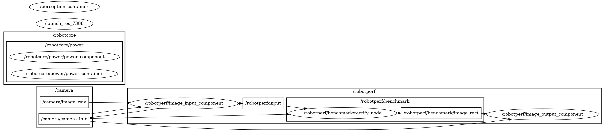

# a2_rectify

Perception rectify ROS Component.

### ID
a2

### Description
A simple perception rectify ROS robotics operation. Used to demonstrate a simple perception component [image_pipeline](https://github.com/ros-perception/image_pipeline) package.




## Reproduction Steps

```bash
Refer to https://github.com/robotperf/benchmarks/tree/main/benchmarks/perception/a2_rectify and review the launch files to reproduce this package.
```

## Results

| Type | Hardware | Metric | Value | Category | Timestamp | Note | Data Source |
| --- | --- | --- | --- | --- | --- | --- | --- |
| [:white_circle:](https://github.com/robotperf/benchmarks/blob/main/benchmarks/README.md#type) | ROBOTCORE | latency | 66.82 | edge | 14-10-2022 |  | [perception/image](https://github.com/robotperf/rosbags/tree/main/perception/image) |
| [:black_circle:](https://github.com/robotperf/benchmarks/blob/main/benchmarks/README.md#type) | NVIDIA AGX Orin Dev. Kit | throughput | 36.46251208914602 | edge | 2023-06-30 19:53:43 | mean_benchmark 30.204346636213202, rms_benchmark 30.273858539984825, max_benchmark 36.46251208914602, min_benchmark 26.931846242965786, lost messages 0.00 % | [perception/image](https://github.com/robotperf/rosbags/tree/main/perception/image) |
| [:white_circle:](https://github.com/robotperf/benchmarks/blob/main/benchmarks/README.md#type) | Intel i7-8700K | latency | 10.612124 | workstation | 2023-07-01 17:54:28 | mean_benchmark 9.59008332142857, rms_benchmark 9.818872594532918, max_benchmark 10.612124, min_benchmark 3.820048, lost messages 7.14 % | [perception/image](https://github.com/robotperf/rosbags/tree/main/perception/image) |
| [:white_circle:](https://github.com/robotperf/benchmarks/blob/main/benchmarks/README.md#type) | Intel i7-8700K | power | 6.592531204223633 | workstation | 2023-07-01 17:57:52 |  | [perception/image](https://github.com/robotperf/rosbags/tree/main/perception/image) |
| [:white_circle:](https://github.com/robotperf/benchmarks/blob/main/benchmarks/README.md#type) | Intel i7-8700K | throughput | 43.18326658783711 | workstation | 2023-07-01 18:01:23 | mean_benchmark 28.13578647678196, rms_benchmark 29.073051247606564, max_benchmark 43.18326658783711, min_benchmark 5.915050470316012, lost messages 7.14 % | [perception/image](https://github.com/robotperf/rosbags/tree/main/perception/image) |
| [:white_circle:](https://github.com/robotperf/benchmarks/blob/main/benchmarks/README.md#type) | Intel i7-8700K | latency | 19.59939 | workstation | 2023-07-01 18:04:50 | mean_benchmark 12.956591102941175, rms_benchmark 13.193771815681659, max_benchmark 19.59939, min_benchmark 5.019039, lost messages 0.00 % | [perception/image](https://github.com/robotperf/rosbags/tree/main/perception/image) |
| [:white_circle:](https://github.com/robotperf/benchmarks/blob/main/benchmarks/README.md#type) | Intel i7-8700K | power | 6.1853766441345215 | workstation | 2023-07-01 18:08:07 |  | [perception/image](https://github.com/robotperf/rosbags/tree/main/perception/image) |
| [:white_circle:](https://github.com/robotperf/benchmarks/blob/main/benchmarks/README.md#type) | Intel i7-8700K | throughput | 37.38958341909571 | workstation | 2023-07-01 18:11:18 | mean_benchmark 30.395764664758964, rms_benchmark 30.54505965326154, max_benchmark 37.38958341909571, min_benchmark 23.2270259454009, lost messages 0.00 % | [perception/image](https://github.com/robotperf/rosbags/tree/main/perception/image) |
| [:black_circle:](https://github.com/robotperf/benchmarks/blob/main/benchmarks/README.md#type) | Intel i7-8700K | latency | 17.968975 | workstation | 2023-07-01 18:14:34 | mean_benchmark 12.712246926470588, rms_benchmark 12.86785854143323, max_benchmark 17.968975, min_benchmark 7.869791, lost messages 0.00 % | [perception/image](https://github.com/robotperf/rosbags/tree/main/perception/image) |
| [:black_circle:](https://github.com/robotperf/benchmarks/blob/main/benchmarks/README.md#type) | Intel i7-8700K | power | 6.207215309143066 | workstation | 2023-07-01 18:17:46 |  | [perception/image](https://github.com/robotperf/rosbags/tree/main/perception/image) |
| [:black_circle:](https://github.com/robotperf/benchmarks/blob/main/benchmarks/README.md#type) | Intel i7-8700K | throughput | 40.56219527143775 | workstation | 2023-07-01 18:20:15 | mean_benchmark 30.328278850221153, rms_benchmark 30.460221865736965, max_benchmark 40.56219527143775, min_benchmark 25.21200332384969, lost messages 0.00 % | [perception/image](https://github.com/robotperf/rosbags/tree/main/perception/image) |
| [:white_circle:](https://github.com/robotperf/benchmarks/blob/main/benchmarks/README.md#type) | AMD Ryzen 5 PRO 4650G | latency | 8.115169 | workstation | 2023-07-04 19:46:26 | ✋ mean_benchmark 3.2632362115384614, rms_benchmark 3.353616084409562, max_benchmark 8.115169, min_benchmark 1.680432, lost messages 1.92 % | [perception/image](https://github.com/robotperf/rosbags/tree/main/perception/image) |
| [:white_circle:](https://github.com/robotperf/benchmarks/blob/main/benchmarks/README.md#type) | AMD Ryzen 5 PRO 4650G | power | 5.1224822998046875 | workstation | 2023-07-04 19:48:47 | ✋  | [perception/image](https://github.com/robotperf/rosbags/tree/main/perception/image) |
| [:white_circle:](https://github.com/robotperf/benchmarks/blob/main/benchmarks/README.md#type) | AMD Ryzen 5 PRO 4650G | throughput | 37.26233199672132 | workstation | 2023-07-04 19:51:21 | ✋ mean_benchmark 30.239173402022587, rms_benchmark 30.464668826611227, max_benchmark 37.26233199672132, min_benchmark 23.142795305308056, lost messages 1.92 % | [perception/image](https://github.com/robotperf/rosbags/tree/main/perception/image) |
| [:white_circle:](https://github.com/robotperf/benchmarks/blob/main/benchmarks/README.md#type) | AMD Ryzen 5 PRO 4650G | latency | 6.9777700000000005 | workstation | 2023-07-04 19:53:36 | mean_benchmark 5.429152897058823, rms_benchmark 5.515728442462671, max_benchmark 6.9777700000000005, min_benchmark 2.681845, lost messages 0.00 % | [perception/image](https://github.com/robotperf/rosbags/tree/main/perception/image) |
| [:white_circle:](https://github.com/robotperf/benchmarks/blob/main/benchmarks/README.md#type) | AMD Ryzen 5 PRO 4650G | power | 5.200368881225586 | workstation | 2023-07-04 19:56:06 |  | [perception/image](https://github.com/robotperf/rosbags/tree/main/perception/image) |
| [:white_circle:](https://github.com/robotperf/benchmarks/blob/main/benchmarks/README.md#type) | AMD Ryzen 5 PRO 4650G | throughput | 32.43596637480136 | workstation | 2023-07-04 19:58:28 | mean_benchmark 30.0127357163602, rms_benchmark 30.02295529268755, max_benchmark 32.43596637480136, min_benchmark 27.894573130323742, lost messages 0.00 % | [perception/image](https://github.com/robotperf/rosbags/tree/main/perception/image) |
| [:black_circle:](https://github.com/robotperf/benchmarks/blob/main/benchmarks/README.md#type) | AMD Ryzen 5 PRO 4650G | latency | 8.685369 | workstation | 2023-07-04 20:00:46 | mean_latency 6.145216874666666, rms_latency 6.194175536920753, max_latency 8.685369, min_latency 3.583662, lost messages 0.00 % | [perception/image](https://github.com/robotperf/rosbags/tree/main/perception/image) |
| [:black_circle:](https://github.com/robotperf/benchmarks/blob/main/benchmarks/README.md#type) | AMD Ryzen 5 PRO 4650G | power | 5.3094861030578615 | workstation | 2023-07-04 20:03:15 | lost messages 0.00 % | [perception/image](https://github.com/robotperf/rosbags/tree/main/perception/image) |
| [:black_circle:](https://github.com/robotperf/benchmarks/blob/main/benchmarks/README.md#type) | AMD Ryzen 5 PRO 4650G | throughput | 30.196854326720178 | workstation | 2023-07-04 20:05:35 | lost messages 0.00 % | [perception/image](https://github.com/robotperf/rosbags/tree/main/perception/image) |
| [:white_circle:](https://github.com/robotperf/benchmarks/blob/main/benchmarks/README.md#type) | Intel i7-8700K | latency | 16.871945 | workstation | 2023-07-04 20:12:31 | ✋ mean_benchmark 5.449222871794872, rms_benchmark 5.756732733777163, max_benchmark 16.871945, min_benchmark 4.993907999999999, lost messages 2.56 % | [perception/image](https://github.com/robotperf/rosbags/tree/main/perception/image) |
| [:white_circle:](https://github.com/robotperf/benchmarks/blob/main/benchmarks/README.md#type) | Intel i7-8700K | power | 6.629870891571045 | workstation | 2023-07-04 20:15:43 | ✋  | [perception/image](https://github.com/robotperf/rosbags/tree/main/perception/image) |
| [:white_circle:](https://github.com/robotperf/benchmarks/blob/main/benchmarks/README.md#type) | Intel i7-8700K | throughput | 42.08145479965702 | workstation | 2023-07-04 20:18:53 | ✋ mean_benchmark 27.890560387336976, rms_benchmark 28.888629446257834, max_benchmark 42.08145479965702, min_benchmark 2.9884181940302716, lost messages 2.56 % | [perception/image](https://github.com/robotperf/rosbags/tree/main/perception/image) |
| [:white_circle:](https://github.com/robotperf/benchmarks/blob/main/benchmarks/README.md#type) | Intel i7-8700K | latency | 21.872375 | workstation | 2023-07-04 20:21:38 | mean_benchmark 11.491341852941176, rms_benchmark 12.195063689406803, max_benchmark 21.872375, min_benchmark 2.860704, lost messages 0.00 % | [perception/image](https://github.com/robotperf/rosbags/tree/main/perception/image) |
| [:white_circle:](https://github.com/robotperf/benchmarks/blob/main/benchmarks/README.md#type) | Intel i7-8700K | power | 6.624725818634033 | workstation | 2023-07-04 20:24:52 |  | [perception/image](https://github.com/robotperf/rosbags/tree/main/perception/image) |
| [:white_circle:](https://github.com/robotperf/benchmarks/blob/main/benchmarks/README.md#type) | Intel i7-8700K | throughput | 40.676121749815245 | workstation | 2023-07-04 20:28:07 | mean_benchmark 30.157110660071357, rms_benchmark 30.323877503581596, max_benchmark 40.676121749815245, min_benchmark 23.214514791801314, lost messages 0.00 % | [perception/image](https://github.com/robotperf/rosbags/tree/main/perception/image) |
| [:black_circle:](https://github.com/robotperf/benchmarks/blob/main/benchmarks/README.md#type) | Intel i7-8700K | latency | 18.426932 | workstation | 2023-07-04 20:31:27 | mean_latency 11.442050901333333, rms_latency 11.766105786582626, max_latency 18.426932, min_latency 2.641497, lost messages 0.00 % | [perception/image](https://github.com/robotperf/rosbags/tree/main/perception/image) |
| [:black_circle:](https://github.com/robotperf/benchmarks/blob/main/benchmarks/README.md#type) | Intel i7-8700K | power | 6.716543388366699 | workstation | 2023-07-04 20:34:43 | lost messages 0.00 % | [perception/image](https://github.com/robotperf/rosbags/tree/main/perception/image) |
| [:black_circle:](https://github.com/robotperf/benchmarks/blob/main/benchmarks/README.md#type) | Intel i7-8700K | throughput | 30.120681884380286 | workstation | 2023-07-04 20:37:57 | lost messages 0.00 % | [perception/image](https://github.com/robotperf/rosbags/tree/main/perception/image) |
| [:white_circle:](https://github.com/robotperf/benchmarks/blob/main/benchmarks/README.md#type) | AMD Ryzen 5 PRO 4650G | latency | 8.136816 | workstation | 2023-07-05 04:00:09 | ✋ mean_benchmark 3.1901165128205125, rms_benchmark 3.312313252210505, max_benchmark 8.136816, min_benchmark 1.6772869999999998, lost messages 2.56 % | [perception/image](https://github.com/robotperf/rosbags/tree/main/perception/image) |
| [:white_circle:](https://github.com/robotperf/benchmarks/blob/main/benchmarks/README.md#type) | AMD Ryzen 5 PRO 4650G | power | 4.9160614013671875 | workstation | 2023-07-05 04:02:47 | ✋  | [perception/image](https://github.com/robotperf/rosbags/tree/main/perception/image) |
| [:white_circle:](https://github.com/robotperf/benchmarks/blob/main/benchmarks/README.md#type) | AMD Ryzen 5 PRO 4650G | throughput | 42.12568923946454 | workstation | 2023-07-05 04:05:06 | ✋ mean_benchmark 27.21224613124761, rms_benchmark 28.387530691137346, max_benchmark 42.12568923946454, min_benchmark 2.7109843789772685, lost messages 2.56 % | [perception/image](https://github.com/robotperf/rosbags/tree/main/perception/image) |
| [:white_circle:](https://github.com/robotperf/benchmarks/blob/main/benchmarks/README.md#type) | AMD Ryzen 5 PRO 4650G | latency | 8.348581 | workstation | 2023-07-05 04:07:21 | mean_benchmark 5.278054044117646, rms_benchmark 5.359485844312689, max_benchmark 8.348581, min_benchmark 2.6201019999999997, lost messages 0.00 % | [perception/image](https://github.com/robotperf/rosbags/tree/main/perception/image) |
| [:white_circle:](https://github.com/robotperf/benchmarks/blob/main/benchmarks/README.md#type) | AMD Ryzen 5 PRO 4650G | power | 5.277991771697998 | workstation | 2023-07-05 04:09:43 |  | [perception/image](https://github.com/robotperf/rosbags/tree/main/perception/image) |
| [:white_circle:](https://github.com/robotperf/benchmarks/blob/main/benchmarks/README.md#type) | AMD Ryzen 5 PRO 4650G | throughput | 31.43886702874564 | workstation | 2023-07-05 04:12:16 | mean_benchmark 30.010535929681286, rms_benchmark 30.019161198155523, max_benchmark 31.43886702874564, min_benchmark 28.319760568885123, lost messages 0.00 % | [perception/image](https://github.com/robotperf/rosbags/tree/main/perception/image) |
| [:black_circle:](https://github.com/robotperf/benchmarks/blob/main/benchmarks/README.md#type) | AMD Ryzen 5 PRO 4650G | latency | 8.536067 | workstation | 2023-07-05 04:14:43 | mean_latency 6.034210846666668, rms_latency 6.073023492521163, max_latency 8.536067, min_latency 3.272658, lost messages 0.00 % | [perception/image](https://github.com/robotperf/rosbags/tree/main/perception/image) |
| [:black_circle:](https://github.com/robotperf/benchmarks/blob/main/benchmarks/README.md#type) | AMD Ryzen 5 PRO 4650G | power | 5.274838161468506 | workstation | 2023-07-05 04:17:04 | lost messages 0.00 % | [perception/image](https://github.com/robotperf/rosbags/tree/main/perception/image) |
| [:black_circle:](https://github.com/robotperf/benchmarks/blob/main/benchmarks/README.md#type) | AMD Ryzen 5 PRO 4650G | throughput | 30.200422343710073 | workstation | 2023-07-05 04:19:25 | lost messages 0.00 % | [perception/image](https://github.com/robotperf/rosbags/tree/main/perception/image) |
| [:white_circle:](https://github.com/robotperf/benchmarks/blob/main/benchmarks/README.md#type) | Intel i7-8700K | latency | 5.202984 | workstation | 2023-07-05 04:26:30 | ✋ mean_benchmark 4.9676518, rms_benchmark 5.010658780484246, max_benchmark 5.202984, min_benchmark 1.7189670000000001, lost messages 4.00 % | [perception/image](https://github.com/robotperf/rosbags/tree/main/perception/image) |
| [:white_circle:](https://github.com/robotperf/benchmarks/blob/main/benchmarks/README.md#type) | Intel i7-8700K | power | 6.84242057800293 | workstation | 2023-07-05 04:28:54 | ✋  | [perception/image](https://github.com/robotperf/rosbags/tree/main/perception/image) |
| [:white_circle:](https://github.com/robotperf/benchmarks/blob/main/benchmarks/README.md#type) | Intel i7-8700K | throughput | 39.185731472016315 | workstation | 2023-07-05 04:32:07 | ✋ mean_benchmark 29.062982842825882, rms_benchmark 29.422296702739512, max_benchmark 39.185731472016315, min_benchmark 7.432974472051249, lost messages 4.00 % | [perception/image](https://github.com/robotperf/rosbags/tree/main/perception/image) |
| [:white_circle:](https://github.com/robotperf/benchmarks/blob/main/benchmarks/README.md#type) | Intel i7-8700K | latency | 33.27969 | workstation | 2023-07-05 04:35:23 | mean_benchmark 11.830756455882353, rms_benchmark 12.636022530306501, max_benchmark 33.27969, min_benchmark 2.6420470000000003, lost messages 0.00 % | [perception/image](https://github.com/robotperf/rosbags/tree/main/perception/image) |
| [:white_circle:](https://github.com/robotperf/benchmarks/blob/main/benchmarks/README.md#type) | Intel i7-8700K | power | 6.514914512634277 | workstation | 2023-07-05 04:38:36 |  | [perception/image](https://github.com/robotperf/rosbags/tree/main/perception/image) |
| [:white_circle:](https://github.com/robotperf/benchmarks/blob/main/benchmarks/README.md#type) | Intel i7-8700K | throughput | 39.47494533114798 | workstation | 2023-07-05 04:41:50 | mean_benchmark 30.401580578823086, rms_benchmark 30.566291579983183, max_benchmark 39.47494533114798, min_benchmark 25.0284448275465, lost messages 0.00 % | [perception/image](https://github.com/robotperf/rosbags/tree/main/perception/image) |
| [:black_circle:](https://github.com/robotperf/benchmarks/blob/main/benchmarks/README.md#type) | Intel i7-8700K | latency | 20.207852 | workstation | 2023-07-05 04:45:02 | mean_latency 13.329088199999997, rms_latency 13.584127611032708, max_latency 20.207852, min_latency 3.248657, lost messages 0.00 % | [perception/image](https://github.com/robotperf/rosbags/tree/main/perception/image) |
| [:black_circle:](https://github.com/robotperf/benchmarks/blob/main/benchmarks/README.md#type) | Intel i7-8700K | power | 6.592701625823975 | workstation | 2023-07-05 04:48:15 | lost messages 0.00 % | [perception/image](https://github.com/robotperf/rosbags/tree/main/perception/image) |
| [:black_circle:](https://github.com/robotperf/benchmarks/blob/main/benchmarks/README.md#type) | Intel i7-8700K | throughput | 30.114860441777417 | workstation | 2023-07-05 04:51:40 | lost messages 0.00 % | [perception/image](https://github.com/robotperf/rosbags/tree/main/perception/image) |
| [:white_circle:](https://github.com/robotperf/benchmarks/blob/main/benchmarks/README.md#type) | AMD Ryzen 5 PRO 4650G | latency | 7.558236 | workstation | 2023-07-05 13:31:48 | ✋ mean_benchmark 3.239095051724138, rms_benchmark 3.2970637123773323, max_benchmark 7.558236, min_benchmark 1.8424669999999999, lost messages 0.00 % | [perception/image](https://github.com/robotperf/rosbags/tree/main/perception/image) |
| [:white_circle:](https://github.com/robotperf/benchmarks/blob/main/benchmarks/README.md#type) | AMD Ryzen 5 PRO 4650G | power | 4.987146377563477 | workstation | 2023-07-05 13:34:20 | ✋  | [perception/image](https://github.com/robotperf/rosbags/tree/main/perception/image) |
| [:white_circle:](https://github.com/robotperf/benchmarks/blob/main/benchmarks/README.md#type) | AMD Ryzen 5 PRO 4650G | throughput | 55.56907118853643 | workstation | 2023-07-05 13:36:50 | ✋ mean_benchmark 30.48770512358743, rms_benchmark 30.843880875014918, max_benchmark 55.56907118853643, min_benchmark 20.117633435635575, lost messages 0.00 % | [perception/image](https://github.com/robotperf/rosbags/tree/main/perception/image) |
| [:white_circle:](https://github.com/robotperf/benchmarks/blob/main/benchmarks/README.md#type) | AMD Ryzen 5 PRO 4650G | latency | 9.064127 | workstation | 2023-07-05 13:39:11 | mean_benchmark 5.475033647058823, rms_benchmark 5.5578720347904715, max_benchmark 9.064127, min_benchmark 2.8366170000000004, lost messages 0.00 % | [perception/image](https://github.com/robotperf/rosbags/tree/main/perception/image) |
| [:white_circle:](https://github.com/robotperf/benchmarks/blob/main/benchmarks/README.md#type) | AMD Ryzen 5 PRO 4650G | power | 5.226265907287598 | workstation | 2023-07-05 13:41:41 |  | [perception/image](https://github.com/robotperf/rosbags/tree/main/perception/image) |
| [:white_circle:](https://github.com/robotperf/benchmarks/blob/main/benchmarks/README.md#type) | AMD Ryzen 5 PRO 4650G | throughput | 32.182336364244314 | workstation | 2023-07-05 13:44:04 | mean_benchmark 30.034191116226058, rms_benchmark 30.047050605450032, max_benchmark 32.182336364244314, min_benchmark 28.101039648543676, lost messages 0.00 % | [perception/image](https://github.com/robotperf/rosbags/tree/main/perception/image) |
| [:black_circle:](https://github.com/robotperf/benchmarks/blob/main/benchmarks/README.md#type) | AMD Ryzen 5 PRO 4650G | latency | 9.888069 | workstation | 2023-07-05 13:46:28 | mean_latency 6.493832766666666, rms_latency 6.530830855265177, max_latency 9.888069, min_latency 3.925823, lost messages 0.00 % | [perception/image](https://github.com/robotperf/rosbags/tree/main/perception/image) |
| [:black_circle:](https://github.com/robotperf/benchmarks/blob/main/benchmarks/README.md#type) | AMD Ryzen 5 PRO 4650G | power | 5.198787021636963 | workstation | 2023-07-05 13:49:00 | lost messages 0.00 % | [perception/image](https://github.com/robotperf/rosbags/tree/main/perception/image) |
| [:white_circle:](https://github.com/robotperf/benchmarks/blob/main/benchmarks/README.md#type) | Intel i7-8700K | latency | 12.088797 | workstation | 2023-07-05 13:51:05 | ✋ mean_benchmark 10.739824333333333, rms_benchmark 10.7997075304151, max_benchmark 12.088797, min_benchmark 7.329276, lost messages 3.70 % | [perception/image](https://github.com/robotperf/rosbags/tree/main/perception/image) |
| [:black_circle:](https://github.com/robotperf/benchmarks/blob/main/benchmarks/README.md#type) | AMD Ryzen 5 PRO 4650G | throughput | 30.19541064316734 | workstation | 2023-07-05 13:51:29 | lost messages 0.00 % | [perception/image](https://github.com/robotperf/rosbags/tree/main/perception/image) |
| [:white_circle:](https://github.com/robotperf/benchmarks/blob/main/benchmarks/README.md#type) | Intel i7-8700K | power | 6.666991233825684 | workstation | 2023-07-05 13:54:13 | ✋  | [perception/image](https://github.com/robotperf/rosbags/tree/main/perception/image) |
| [:white_circle:](https://github.com/robotperf/benchmarks/blob/main/benchmarks/README.md#type) | Intel i7-8700K | throughput | 41.96534979818643 | workstation | 2023-07-05 13:57:20 | ✋ mean_benchmark 27.470444028675335, rms_benchmark 28.563673658710997, max_benchmark 41.96534979818643, min_benchmark 3.739378020952356, lost messages 3.70 % | [perception/image](https://github.com/robotperf/rosbags/tree/main/perception/image) |
| [:white_circle:](https://github.com/robotperf/benchmarks/blob/main/benchmarks/README.md#type) | Intel i7-8700K | latency | 21.284289 | workstation | 2023-07-05 14:00:33 | mean_benchmark 9.357194029411765, rms_benchmark 10.108779488799406, max_benchmark 21.284289, min_benchmark 2.1858739999999997, lost messages 0.00 % | [perception/image](https://github.com/robotperf/rosbags/tree/main/perception/image) |
| [:white_circle:](https://github.com/robotperf/benchmarks/blob/main/benchmarks/README.md#type) | Intel i7-8700K | power | 6.447017192840576 | workstation | 2023-07-05 14:04:02 |  | [perception/image](https://github.com/robotperf/rosbags/tree/main/perception/image) |
| [:white_circle:](https://github.com/robotperf/benchmarks/blob/main/benchmarks/README.md#type) | Intel i7-8700K | throughput | 39.98482975559103 | workstation | 2023-07-05 14:07:08 | mean_benchmark 30.306872456197713, rms_benchmark 30.434213797403523, max_benchmark 39.98482975559103, min_benchmark 25.04051680822159, lost messages 0.00 % | [perception/image](https://github.com/robotperf/rosbags/tree/main/perception/image) |
| [:black_circle:](https://github.com/robotperf/benchmarks/blob/main/benchmarks/README.md#type) | Intel i7-8700K | latency | 18.661343 | workstation | 2023-07-05 14:10:28 | mean_latency 13.137840932000003, rms_latency 13.365482184876006, max_latency 18.661343, min_latency 2.704476, lost messages 0.00 % | [perception/image](https://github.com/robotperf/rosbags/tree/main/perception/image) |
| [:black_circle:](https://github.com/robotperf/benchmarks/blob/main/benchmarks/README.md#type) | Intel i7-8700K | power | 6.633075428009033 | workstation | 2023-07-05 14:13:44 | lost messages 0.00 % | [perception/image](https://github.com/robotperf/rosbags/tree/main/perception/image) |
| [:black_circle:](https://github.com/robotperf/benchmarks/blob/main/benchmarks/README.md#type) | Intel i7-8700K | throughput | 30.115830605398493 | workstation | 2023-07-05 14:16:56 | lost messages 0.00 % | [perception/image](https://github.com/robotperf/rosbags/tree/main/perception/image) |

