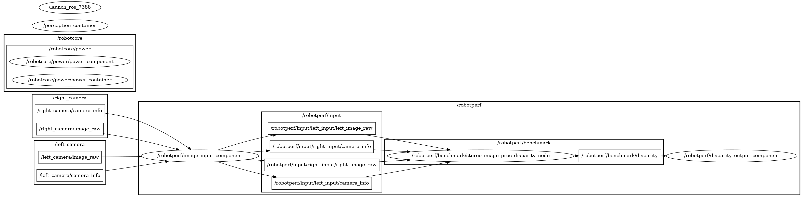

# a3_stereo_image_proc

Perception computational graph to compute a disparity map for stereo images.

### ID
a3

### Description
The [stereo_image_proc](https://github.com/ros-perception/image_pipeline/tree/humble/stereo_image_proc) package computes the disparity map using a left and right image. A disparity map represents the difference in pixel position between corresponding points in the stereo images. Disparity images are images that show the difference in displacement or distance between corresponding points in a pair of stereo images. Stereo images are two images of the same scene taken from slightly different viewpoints, such as from the left and right eyes of a human observer or from two cameras. Disparity images are often used in computer vision and image processing applications, such as 3D reconstruction, depth estimation, and object recognition. By analyzing the disparities between corresponding points in stereo images, it is possible to infer the depth of objects in the scene and create a 3D representation of the environment. 



## Reproduction Steps

```bash
Refer to https://github.com/robotperf/benchmarks/tree/main/benchmarks/perception/a3_stereo_image_proc and review the launch files to reproduce this package.
```

## Results

| Type | Hardware | Metric | Value | Category | Timestamp | Note | Data Source |
| --- | --- | --- | --- | --- | --- | --- | --- |
| [:black_circle:](https://github.com/robotperf/benchmarks/blob/main/benchmarks/README.md#type) | Intel i5-13600K | latency | 43.09 | workstation | 07-07-2023 | mean 3.03 ms, rms 17.73 ms, max 43.09 ms, min 4.14 ms, lost 0.00 %, throughput bounded to 30fps | [perception/image3](https://github.com/robotperf/rosbags/tree/main/perception/image3) |
| [:black_circle:](https://github.com/robotperf/benchmarks/blob/main/benchmarks/README.md#type) | Intel i5-13600K | power | 87.21 | workstation | 07-07-2023 | lost 0.00 %, throughput bounded to 30fps | [perception/image3](https://github.com/robotperf/rosbags/tree/main/perception/image3) |
| [:black_circle:](https://github.com/robotperf/benchmarks/blob/main/benchmarks/README.md#type) | Intel i7-12700H | latency | 49.58 | workstation | 07-07-2023 | mean 20.80 ms, rms 24.38 ms, max 49.58 ms, min 5.51 ms, lost 0.00 %, throughput bounded to 30fps | [perception/image3](https://github.com/robotperf/rosbags/tree/main/perception/image3) |
| [:black_circle:](https://github.com/robotperf/benchmarks/blob/main/benchmarks/README.md#type) | Intel i7-12700H | power | 14.35 | workstation | 07-07-2023 | lost 0.00 %, throughput bounded to 30fps | [perception/image3](https://github.com/robotperf/rosbags/tree/main/perception/image3) |
| [:black_circle:](https://github.com/robotperf/benchmarks/blob/main/benchmarks/README.md#type) | Intel i7-12700H + NVIDIA GeForce RTX 3060 (ROBOTCORE® Perception) | latency | 15.06 | workstation | 07-07-2023 | mean 0.77 ms, rms 10.85 ms, max 15.06 ms, min 6.16 ms, lost 0.00 %, throughput bounded to 30fps | [perception/image3](https://github.com/robotperf/rosbags/tree/main/perception/image3) |
| [:black_circle:](https://github.com/robotperf/benchmarks/blob/main/benchmarks/README.md#type) | Intel i7-12700H + NVIDIA GeForce RTX 3060 (ROBOTCORE® Perception) | power | 39.96 | workstation | 07-07-2023 | lost 0.00 %, throughput bounded to 30fps | [perception/image3](https://github.com/robotperf/rosbags/tree/main/perception/image3) |
| [:black_circle:](https://github.com/robotperf/benchmarks/blob/main/benchmarks/README.md#type) | Intel i5-13600K + NVIDIA GeForce RTX 3060 (ROBOTCORE® Perception) | latency | 10.49 | workstation | 07-07-2023 | mean 5.77 ms, rms 5.81 ms, max 10.49 ms, min 4.31 ms, lost 0.00 %, throughput bounded to 30fps | [perception/image3](https://github.com/robotperf/rosbags/tree/main/perception/image3) |
| [:black_circle:](https://github.com/robotperf/benchmarks/blob/main/benchmarks/README.md#type) | Intel i7-12700H + NVIDIA GeForce RTX 3060 (ROBOTCORE® Perception) | throughput | 291.567 | workstation | 07-07-2023 | mean 13.63 ms, rms 14.44 ms, max 46.67 ms, min 5.01 ms, lost 0.00 % | [perception/image3](https://github.com/robotperf/rosbags/tree/main/perception/image3) |
| [:black_circle:](https://github.com/robotperf/benchmarks/blob/main/benchmarks/README.md#type) | Intel i5-13600K + NVIDIA GeForce RTX 3060 (ROBOTCORE® Perception) | throughput | 296.77 | workstation | 07-07-2023 | mean 5.53 ms, rms 5.62 ms, max 9.46 ms, min 2.94 ms, lost 0.00 % | [perception/image3](https://github.com/robotperf/rosbags/tree/main/perception/image3) |
| [:white_circle:](https://github.com/robotperf/benchmarks/blob/main/benchmarks/README.md#type) | Intel i9-12900KF | latency | 132.12 | edge | 25-04-2023 | Mean: 26.25 ms,  RMS: 27.18 ms, Max: 132.12 ms, Min: 8.73 ms over 1124 samples. | [perception/image3](https://github.com/robotperf/rosbags/tree/main/perception/image3) |
| [:black_circle:](https://github.com/robotperf/benchmarks/blob/main/benchmarks/README.md#type) | NVIDIA AGX Orin Dev. Kit | throughput | 33.277046318720096 | edge | 2023-06-30 20:21:42 | mean_benchmark 27.791574487768035, rms_benchmark 28.373919572519444, max_benchmark 33.277046318720096, min_benchmark 10.077661482684006, lost messages 16.28 % | [perception/image3](https://github.com/robotperf/rosbags/tree/main/perception/image3) |
| [:white_circle:](https://github.com/robotperf/benchmarks/blob/main/benchmarks/README.md#type) | Intel i7-8700K | latency | 61.133489 | workstation | 2023-07-01 18:23:26 | mean_benchmark 40.67432786374315, rms_benchmark 41.17130628578445, max_benchmark 61.133489, min_benchmark 20.81411, lost messages 0.63 % | [perception/image3](https://github.com/robotperf/rosbags/tree/main/perception/image3) |
| [:white_circle:](https://github.com/robotperf/benchmarks/blob/main/benchmarks/README.md#type) | Intel i7-8700K | power | 5.897109508514404 | workstation | 2023-07-01 18:26:40 |  | [perception/image3](https://github.com/robotperf/rosbags/tree/main/perception/image3) |
| [:white_circle:](https://github.com/robotperf/benchmarks/blob/main/benchmarks/README.md#type) | Intel i7-8700K | throughput | 12.975265148245784 | workstation | 2023-07-01 18:29:58 | mean_benchmark 9.985250716576333, rms_benchmark 10.005649079478957, max_benchmark 12.975265148245784, min_benchmark 1.6551238056605884, lost messages 0.63 % | [perception/image3](https://github.com/robotperf/rosbags/tree/main/perception/image3) |
| [:white_circle:](https://github.com/robotperf/benchmarks/blob/main/benchmarks/README.md#type) | Intel i7-8700K | latency | 59.300551 | workstation | 2023-07-01 18:33:18 | mean_benchmark 22.975132699999996, rms_benchmark 26.949610502463365, max_benchmark 59.300551, min_benchmark 7.832851, lost messages 0.00 % | [perception/image3](https://github.com/robotperf/rosbags/tree/main/perception/image3) |
| [:white_circle:](https://github.com/robotperf/benchmarks/blob/main/benchmarks/README.md#type) | Intel i7-8700K | power | 9.084548950195312 | workstation | 2023-07-01 18:36:30 |  | [perception/image3](https://github.com/robotperf/rosbags/tree/main/perception/image3) |
| [:white_circle:](https://github.com/robotperf/benchmarks/blob/main/benchmarks/README.md#type) | Intel i7-8700K | throughput | 31.884678474583428 | workstation | 2023-07-01 18:40:02 | mean_benchmark 30.021894043899596, rms_benchmark 30.03041143308092, max_benchmark 31.884678474583428, min_benchmark 28.689014184651903, lost messages 0.00 % | [perception/image3](https://github.com/robotperf/rosbags/tree/main/perception/image3) |
| [:black_circle:](https://github.com/robotperf/benchmarks/blob/main/benchmarks/README.md#type) | Intel i7-8700K | latency | 64.159806 | workstation | 2023-07-01 18:43:16 | mean_benchmark 22.797836120000003, rms_benchmark 26.96963921531789, max_benchmark 64.159806, min_benchmark 8.604811999999999, lost messages 0.00 % | [perception/image3](https://github.com/robotperf/rosbags/tree/main/perception/image3) |
| [:black_circle:](https://github.com/robotperf/benchmarks/blob/main/benchmarks/README.md#type) | Intel i7-8700K | power | 9.158670425415039 | workstation | 2023-07-01 18:46:31 |  | [perception/image3](https://github.com/robotperf/rosbags/tree/main/perception/image3) |
| [:black_circle:](https://github.com/robotperf/benchmarks/blob/main/benchmarks/README.md#type) | Intel i7-8700K | throughput | 34.36352784361543 | workstation | 2023-07-01 18:49:44 | mean_benchmark 30.085827751710223, rms_benchmark 30.09714182807465, max_benchmark 34.36352784361543, min_benchmark 28.252331403576672, lost messages 0.00 % | [perception/image3](https://github.com/robotperf/rosbags/tree/main/perception/image3) |
| [:white_circle:](https://github.com/robotperf/benchmarks/blob/main/benchmarks/README.md#type) | AMD Ryzen 5 PRO 4650G | latency | 142.15711000000002 | workstation | 2023-07-04 20:07:57 | ✋ mean_benchmark 32.3114033081862, rms_benchmark 34.68918659518702, max_benchmark 142.15711000000002, min_benchmark 12.120403999999999, lost messages 0.72 % | [perception/image3](https://github.com/robotperf/rosbags/tree/main/perception/image3) |
| [:white_circle:](https://github.com/robotperf/benchmarks/blob/main/benchmarks/README.md#type) | AMD Ryzen 5 PRO 4650G | power | 4.991259574890137 | workstation | 2023-07-04 20:10:21 | ✋  | [perception/image3](https://github.com/robotperf/rosbags/tree/main/perception/image3) |
| [:white_circle:](https://github.com/robotperf/benchmarks/blob/main/benchmarks/README.md#type) | AMD Ryzen 5 PRO 4650G | throughput | 14.014305242218835 | workstation | 2023-07-04 20:12:43 | ✋ mean_benchmark 9.95786076576006, rms_benchmark 10.000320564763012, max_benchmark 14.014305242218835, min_benchmark 1.1055157177316373, lost messages 0.72 % | [perception/image3](https://github.com/robotperf/rosbags/tree/main/perception/image3) |
| [:white_circle:](https://github.com/robotperf/benchmarks/blob/main/benchmarks/README.md#type) | AMD Ryzen 5 PRO 4650G | latency | 24.369248000000002 | workstation | 2023-07-04 20:15:03 | mean_benchmark 17.6331561, rms_benchmark 18.099543689588273, max_benchmark 24.369248000000002, min_benchmark 5.983129, lost messages 0.00 % | [perception/image3](https://github.com/robotperf/rosbags/tree/main/perception/image3) |
| [:white_circle:](https://github.com/robotperf/benchmarks/blob/main/benchmarks/README.md#type) | AMD Ryzen 5 PRO 4650G | power | 5.4462056159973145 | workstation | 2023-07-04 20:17:42 |  | [perception/image3](https://github.com/robotperf/rosbags/tree/main/perception/image3) |
| [:white_circle:](https://github.com/robotperf/benchmarks/blob/main/benchmarks/README.md#type) | AMD Ryzen 5 PRO 4650G | throughput | 30.785183177535163 | workstation | 2023-07-04 20:20:16 | mean_benchmark 30.015308093574397, rms_benchmark 30.016198313579036, max_benchmark 30.785183177535163, min_benchmark 29.60869474717772, lost messages 0.00 % | [perception/image3](https://github.com/robotperf/rosbags/tree/main/perception/image3) |
| [:black_circle:](https://github.com/robotperf/benchmarks/blob/main/benchmarks/README.md#type) | AMD Ryzen 5 PRO 4650G | latency | 55.534672 | workstation | 2023-07-04 20:22:36 | mean_latency 21.6347996, rms_latency 21.919571154482348, max_latency 55.534672, min_latency 9.973629, lost messages 0.00 % | [perception/image3](https://github.com/robotperf/rosbags/tree/main/perception/image3) |
| [:black_circle:](https://github.com/robotperf/benchmarks/blob/main/benchmarks/README.md#type) | AMD Ryzen 5 PRO 4650G | power | 5.380381870269775 | workstation | 2023-07-04 20:24:58 | lost messages 0.00 % | [perception/image3](https://github.com/robotperf/rosbags/tree/main/perception/image3) |
| [:black_circle:](https://github.com/robotperf/benchmarks/blob/main/benchmarks/README.md#type) | AMD Ryzen 5 PRO 4650G | throughput | 30.17785995618677 | workstation | 2023-07-04 20:27:19 | lost messages 0.00 % | [perception/image3](https://github.com/robotperf/rosbags/tree/main/perception/image3) |
| [:white_circle:](https://github.com/robotperf/benchmarks/blob/main/benchmarks/README.md#type) | Intel i7-8700K | latency | 60.643169 | workstation | 2023-07-04 20:41:27 | ✋ mean_benchmark 40.59611141757387, rms_benchmark 41.09626116823718, max_benchmark 60.643169, min_benchmark 13.180157000000001, lost messages 0.23 % | [perception/image3](https://github.com/robotperf/rosbags/tree/main/perception/image3) |
| [:white_circle:](https://github.com/robotperf/benchmarks/blob/main/benchmarks/README.md#type) | Intel i7-8700K | power | 5.990500450134277 | workstation | 2023-07-04 20:44:45 | ✋  | [perception/image3](https://github.com/robotperf/rosbags/tree/main/perception/image3) |
| [:white_circle:](https://github.com/robotperf/benchmarks/blob/main/benchmarks/README.md#type) | Intel i7-8700K | throughput | 13.103120761099573 | workstation | 2023-07-04 20:48:19 | ✋ mean_benchmark 9.999751655473396, rms_benchmark 10.01639796608056, max_benchmark 13.103120761099573, min_benchmark 1.9803484400107794, lost messages 0.23 % | [perception/image3](https://github.com/robotperf/rosbags/tree/main/perception/image3) |
| [:white_circle:](https://github.com/robotperf/benchmarks/blob/main/benchmarks/README.md#type) | Intel i7-8700K | latency | 62.041148 | workstation | 2023-07-04 20:51:50 | mean_benchmark 26.0268131, rms_benchmark 30.84000782866287, max_benchmark 62.041148, min_benchmark 7.290354, lost messages 0.00 % | [perception/image3](https://github.com/robotperf/rosbags/tree/main/perception/image3) |
| [:white_circle:](https://github.com/robotperf/benchmarks/blob/main/benchmarks/README.md#type) | Intel i7-8700K | power | 9.378743171691895 | workstation | 2023-07-04 20:55:07 |  | [perception/image3](https://github.com/robotperf/rosbags/tree/main/perception/image3) |
| [:white_circle:](https://github.com/robotperf/benchmarks/blob/main/benchmarks/README.md#type) | Intel i7-8700K | throughput | 31.565990360062205 | workstation | 2023-07-04 20:58:18 | mean_benchmark 30.02965228348836, rms_benchmark 30.039870735495253, max_benchmark 31.565990360062205, min_benchmark 27.41622253528502, lost messages 0.00 % | [perception/image3](https://github.com/robotperf/rosbags/tree/main/perception/image3) |
| [:black_circle:](https://github.com/robotperf/benchmarks/blob/main/benchmarks/README.md#type) | Intel i7-8700K | latency | 70.352786 | workstation | 2023-07-04 21:01:42 | mean_latency 22.584123708, rms_latency 24.90450479966949, max_latency 70.352786, min_latency 8.102569, lost messages 0.00 % | [perception/image3](https://github.com/robotperf/rosbags/tree/main/perception/image3) |
| [:black_circle:](https://github.com/robotperf/benchmarks/blob/main/benchmarks/README.md#type) | Intel i7-8700K | power | 9.438055419921875 | workstation | 2023-07-04 21:05:16 | lost messages 0.00 % | [perception/image3](https://github.com/robotperf/rosbags/tree/main/perception/image3) |
| [:black_circle:](https://github.com/robotperf/benchmarks/blob/main/benchmarks/README.md#type) | Intel i7-8700K | throughput | 30.123718888372743 | workstation | 2023-07-04 21:08:49 | lost messages 0.00 % | [perception/image3](https://github.com/robotperf/rosbags/tree/main/perception/image3) |
| [:white_circle:](https://github.com/robotperf/benchmarks/blob/main/benchmarks/README.md#type) | AMD Ryzen 5 PRO 4650G | latency | 167.73728 | workstation | 2023-07-05 04:21:46 | ✋ mean_benchmark 31.67222337539683, rms_benchmark 34.072803616452454, max_benchmark 167.73728, min_benchmark 10.236117, lost messages 0.56 % | [perception/image3](https://github.com/robotperf/rosbags/tree/main/perception/image3) |
| [:white_circle:](https://github.com/robotperf/benchmarks/blob/main/benchmarks/README.md#type) | AMD Ryzen 5 PRO 4650G | power | 4.890318870544434 | workstation | 2023-07-05 04:24:03 | ✋  | [perception/image3](https://github.com/robotperf/rosbags/tree/main/perception/image3) |
| [:white_circle:](https://github.com/robotperf/benchmarks/blob/main/benchmarks/README.md#type) | AMD Ryzen 5 PRO 4650G | throughput | 13.52755127283494 | workstation | 2023-07-05 04:26:32 | ✋ mean_benchmark 9.992771175130876, rms_benchmark 10.023037345436832, max_benchmark 13.52755127283494, min_benchmark 1.1121367149396761, lost messages 0.56 % | [perception/image3](https://github.com/robotperf/rosbags/tree/main/perception/image3) |
| [:white_circle:](https://github.com/robotperf/benchmarks/blob/main/benchmarks/README.md#type) | AMD Ryzen 5 PRO 4650G | latency | 24.677001999999998 | workstation | 2023-07-05 04:28:51 | mean_benchmark 17.258439699999997, rms_benchmark 17.7422706124164, max_benchmark 24.677001999999998, min_benchmark 6.436769, lost messages 0.00 % | [perception/image3](https://github.com/robotperf/rosbags/tree/main/perception/image3) |
| [:white_circle:](https://github.com/robotperf/benchmarks/blob/main/benchmarks/README.md#type) | AMD Ryzen 5 PRO 4650G | power | 5.508819580078125 | workstation | 2023-07-05 04:31:14 |  | [perception/image3](https://github.com/robotperf/rosbags/tree/main/perception/image3) |
| [:white_circle:](https://github.com/robotperf/benchmarks/blob/main/benchmarks/README.md#type) | AMD Ryzen 5 PRO 4650G | throughput | 30.567931067359098 | workstation | 2023-07-05 04:33:36 | mean_benchmark 30.00752658817761, rms_benchmark 30.008686791462203, max_benchmark 30.567931067359098, min_benchmark 29.52769652165804, lost messages 0.00 % | [perception/image3](https://github.com/robotperf/rosbags/tree/main/perception/image3) |
| [:black_circle:](https://github.com/robotperf/benchmarks/blob/main/benchmarks/README.md#type) | AMD Ryzen 5 PRO 4650G | latency | 46.221303 | workstation | 2023-07-05 04:36:11 | mean_latency 21.497497947999996, rms_latency 21.77906532825144, max_latency 46.221303, min_latency 10.017148, lost messages 0.00 % | [perception/image3](https://github.com/robotperf/rosbags/tree/main/perception/image3) |
| [:black_circle:](https://github.com/robotperf/benchmarks/blob/main/benchmarks/README.md#type) | AMD Ryzen 5 PRO 4650G | power | 5.3956067085266115 | workstation | 2023-07-05 04:38:31 | lost messages 0.00 % | [perception/image3](https://github.com/robotperf/rosbags/tree/main/perception/image3) |
| [:black_circle:](https://github.com/robotperf/benchmarks/blob/main/benchmarks/README.md#type) | AMD Ryzen 5 PRO 4650G | throughput | 30.156793533907724 | workstation | 2023-07-05 04:40:53 | lost messages 0.00 % | [perception/image3](https://github.com/robotperf/rosbags/tree/main/perception/image3) |
| [:white_circle:](https://github.com/robotperf/benchmarks/blob/main/benchmarks/README.md#type) | Intel i7-8700K | latency | 61.390225 | workstation | 2023-07-05 04:54:59 | ✋ mean_benchmark 40.667252279561474, rms_benchmark 41.14203356077351, max_benchmark 61.390225, min_benchmark 18.031408, lost messages 0.55 % | [perception/image3](https://github.com/robotperf/rosbags/tree/main/perception/image3) |
| [:white_circle:](https://github.com/robotperf/benchmarks/blob/main/benchmarks/README.md#type) | Intel i7-8700K | power | 6.003722667694092 | workstation | 2023-07-05 04:58:37 | ✋  | [perception/image3](https://github.com/robotperf/rosbags/tree/main/perception/image3) |
| [:white_circle:](https://github.com/robotperf/benchmarks/blob/main/benchmarks/README.md#type) | Intel i7-8700K | throughput | 12.865070331860164 | workstation | 2023-07-05 05:01:57 | ✋ mean_benchmark 9.998811574542417, rms_benchmark 10.01543398154981, max_benchmark 12.865070331860164, min_benchmark 3.213400837801732, lost messages 0.55 % | [perception/image3](https://github.com/robotperf/rosbags/tree/main/perception/image3) |
| [:white_circle:](https://github.com/robotperf/benchmarks/blob/main/benchmarks/README.md#type) | Intel i7-8700K | latency | 63.093501 | workstation | 2023-07-05 05:05:20 | mean_benchmark 26.8524586, rms_benchmark 31.89981642301621, max_benchmark 63.093501, min_benchmark 6.36959, lost messages 0.00 % | [perception/image3](https://github.com/robotperf/rosbags/tree/main/perception/image3) |
| [:white_circle:](https://github.com/robotperf/benchmarks/blob/main/benchmarks/README.md#type) | Intel i7-8700K | power | 9.25777530670166 | workstation | 2023-07-05 05:08:35 |  | [perception/image3](https://github.com/robotperf/rosbags/tree/main/perception/image3) |
| [:white_circle:](https://github.com/robotperf/benchmarks/blob/main/benchmarks/README.md#type) | Intel i7-8700K | throughput | 40.80019296859267 | workstation | 2023-07-05 05:12:01 | mean_benchmark 30.20103740844159, rms_benchmark 30.250504433416246, max_benchmark 40.80019296859267, min_benchmark 28.022977272076332, lost messages 0.00 % | [perception/image3](https://github.com/robotperf/rosbags/tree/main/perception/image3) |
| [:black_circle:](https://github.com/robotperf/benchmarks/blob/main/benchmarks/README.md#type) | Intel i7-8700K | latency | 69.674379 | workstation | 2023-07-05 05:15:20 | mean_latency 22.132071910666664, rms_latency 24.13688631911655, max_latency 69.674379, min_latency 7.99689, lost messages 0.00 % | [perception/image3](https://github.com/robotperf/rosbags/tree/main/perception/image3) |
| [:black_circle:](https://github.com/robotperf/benchmarks/blob/main/benchmarks/README.md#type) | Intel i7-8700K | power | 9.503683471679688 | workstation | 2023-07-05 05:18:37 | lost messages 0.00 % | [perception/image3](https://github.com/robotperf/rosbags/tree/main/perception/image3) |
| [:black_circle:](https://github.com/robotperf/benchmarks/blob/main/benchmarks/README.md#type) | Intel i7-8700K | throughput | 30.144931928302505 | workstation | 2023-07-05 05:21:47 | lost messages 0.00 % | [perception/image3](https://github.com/robotperf/rosbags/tree/main/perception/image3) |
| [:white_circle:](https://github.com/robotperf/benchmarks/blob/main/benchmarks/README.md#type) | AMD Ryzen 5 PRO 4650G | latency | 148.540541 | workstation | 2023-07-05 13:53:54 | ✋ mean_benchmark 31.054195867879745, rms_benchmark 32.748681991168546, max_benchmark 148.540541, min_benchmark 11.966536, lost messages 0.55 % | [perception/image3](https://github.com/robotperf/rosbags/tree/main/perception/image3) |
| [:white_circle:](https://github.com/robotperf/benchmarks/blob/main/benchmarks/README.md#type) | AMD Ryzen 5 PRO 4650G | power | 4.95824670791626 | workstation | 2023-07-05 13:56:10 | ✋  | [perception/image3](https://github.com/robotperf/rosbags/tree/main/perception/image3) |
| [:white_circle:](https://github.com/robotperf/benchmarks/blob/main/benchmarks/README.md#type) | AMD Ryzen 5 PRO 4650G | throughput | 13.476212268508911 | workstation | 2023-07-05 13:58:55 | ✋ mean_benchmark 9.99395684781208, rms_benchmark 10.027046759370862, max_benchmark 13.476212268508911, min_benchmark 1.0011340987229076, lost messages 0.55 % | [perception/image3](https://github.com/robotperf/rosbags/tree/main/perception/image3) |
| [:white_circle:](https://github.com/robotperf/benchmarks/blob/main/benchmarks/README.md#type) | AMD Ryzen 5 PRO 4650G | latency | 22.541862000000002 | workstation | 2023-07-05 14:01:20 | mean_benchmark 16.91952196, rms_benchmark 17.367060454996214, max_benchmark 22.541862000000002, min_benchmark 6.926711, lost messages 0.00 % | [perception/image3](https://github.com/robotperf/rosbags/tree/main/perception/image3) |
| [:white_circle:](https://github.com/robotperf/benchmarks/blob/main/benchmarks/README.md#type) | AMD Ryzen 5 PRO 4650G | power | 5.384462833404541 | workstation | 2023-07-05 14:03:48 |  | [perception/image3](https://github.com/robotperf/rosbags/tree/main/perception/image3) |
| [:white_circle:](https://github.com/robotperf/benchmarks/blob/main/benchmarks/README.md#type) | AMD Ryzen 5 PRO 4650G | throughput | 30.82409576282116 | workstation | 2023-07-05 14:06:19 | mean_benchmark 30.009468598656817, rms_benchmark 30.010282393832185, max_benchmark 30.82409576282116, min_benchmark 29.45895969218923, lost messages 0.00 % | [perception/image3](https://github.com/robotperf/rosbags/tree/main/perception/image3) |
| [:black_circle:](https://github.com/robotperf/benchmarks/blob/main/benchmarks/README.md#type) | AMD Ryzen 5 PRO 4650G | latency | 27.318159 | workstation | 2023-07-05 14:08:46 | mean_latency 21.599631930666664, rms_latency 21.844087377154132, max_latency 27.318159, min_latency 9.914517, lost messages 0.00 % | [perception/image3](https://github.com/robotperf/rosbags/tree/main/perception/image3) |
| [:black_circle:](https://github.com/robotperf/benchmarks/blob/main/benchmarks/README.md#type) | AMD Ryzen 5 PRO 4650G | power | 5.356595516204834 | workstation | 2023-07-05 14:11:08 | lost messages 0.00 % | [perception/image3](https://github.com/robotperf/rosbags/tree/main/perception/image3) |
| [:black_circle:](https://github.com/robotperf/benchmarks/blob/main/benchmarks/README.md#type) | AMD Ryzen 5 PRO 4650G | throughput | 30.187649948188287 | workstation | 2023-07-05 14:13:43 | lost messages 0.00 % | [perception/image3](https://github.com/robotperf/rosbags/tree/main/perception/image3) |
| [:white_circle:](https://github.com/robotperf/benchmarks/blob/main/benchmarks/README.md#type) | Intel i7-8700K | latency | 60.821372 | workstation | 2023-07-05 14:20:10 | ✋ mean_benchmark 40.98972929186228, rms_benchmark 41.465300413019776, max_benchmark 60.821372, min_benchmark 18.734987, lost messages 0.23 % | [perception/image3](https://github.com/robotperf/rosbags/tree/main/perception/image3) |
| [:white_circle:](https://github.com/robotperf/benchmarks/blob/main/benchmarks/README.md#type) | Intel i7-8700K | power | 6.046652793884277 | workstation | 2023-07-05 14:23:20 | ✋  | [perception/image3](https://github.com/robotperf/rosbags/tree/main/perception/image3) |
| [:white_circle:](https://github.com/robotperf/benchmarks/blob/main/benchmarks/README.md#type) | Intel i7-8700K | latency | 59.726972999999994 | workstation | 2023-07-05 14:28:33 | mean_benchmark 21.74411848, rms_benchmark 25.30561883231595, max_benchmark 59.726972999999994, min_benchmark 6.374908, lost messages 0.00 % | [perception/image3](https://github.com/robotperf/rosbags/tree/main/perception/image3) |
| [:white_circle:](https://github.com/robotperf/benchmarks/blob/main/benchmarks/README.md#type) | Intel i7-8700K | power | 9.121424674987793 | workstation | 2023-07-05 14:31:58 |  | [perception/image3](https://github.com/robotperf/rosbags/tree/main/perception/image3) |
| [:white_circle:](https://github.com/robotperf/benchmarks/blob/main/benchmarks/README.md#type) | Intel i7-8700K | throughput | 40.7902923346434 | workstation | 2023-07-05 14:35:08 | mean_benchmark 30.216029310686125, rms_benchmark 30.26211477207322, max_benchmark 40.7902923346434, min_benchmark 28.75755734228169, lost messages 0.00 % | [perception/image3](https://github.com/robotperf/rosbags/tree/main/perception/image3) |
| [:black_circle:](https://github.com/robotperf/benchmarks/blob/main/benchmarks/README.md#type) | Intel i7-8700K | latency | 67.75825 | workstation | 2023-07-05 14:38:15 | mean_latency 21.567918357333333, rms_latency 23.23889476132209, max_latency 67.75825, min_latency 8.137907, lost messages 0.00 % | [perception/image3](https://github.com/robotperf/rosbags/tree/main/perception/image3) |
| [:black_circle:](https://github.com/robotperf/benchmarks/blob/main/benchmarks/README.md#type) | Intel i7-8700K | power | 9.493589210510255 | workstation | 2023-07-05 14:40:35 | lost messages 0.00 % | [perception/image3](https://github.com/robotperf/rosbags/tree/main/perception/image3) |
| [:black_circle:](https://github.com/robotperf/benchmarks/blob/main/benchmarks/README.md#type) | Intel i7-8700K | throughput | 30.15859282377587 | workstation | 2023-07-05 14:43:41 | lost messages 0.00 % | [perception/image3](https://github.com/robotperf/rosbags/tree/main/perception/image3) |
| [:white_circle:](https://github.com/robotperf/benchmarks/blob/main/benchmarks/README.md#type) | AMD Ryzen 5 PRO 4650G | latency | 146.692566 | workstation | 2023-07-05 20:37:13 | ✋ mean_benchmark 30.791134007064365, rms_benchmark 32.647780998388825, max_benchmark 146.692566, min_benchmark 8.97375, lost messages 0.39 % | [perception/image3](https://github.com/robotperf/rosbags/tree/main/perception/image3) |
| [:white_circle:](https://github.com/robotperf/benchmarks/blob/main/benchmarks/README.md#type) | AMD Ryzen 5 PRO 4650G | power | 4.967750549316406 | workstation | 2023-07-05 20:39:48 | ✋  | [perception/image3](https://github.com/robotperf/rosbags/tree/main/perception/image3) |
| [:white_circle:](https://github.com/robotperf/benchmarks/blob/main/benchmarks/README.md#type) | AMD Ryzen 5 PRO 4650G | throughput | 14.880279446886325 | workstation | 2023-07-05 20:42:15 | ✋ mean_benchmark 9.983773039615809, rms_benchmark 10.012628145230877, max_benchmark 14.880279446886325, min_benchmark 1.6921064292641064, lost messages 0.39 % | [perception/image3](https://github.com/robotperf/rosbags/tree/main/perception/image3) |
| [:white_circle:](https://github.com/robotperf/benchmarks/blob/main/benchmarks/README.md#type) | AMD Ryzen 5 PRO 4650G | latency | 22.534809 | workstation | 2023-07-05 20:44:41 | mean_benchmark 17.58534826, rms_benchmark 17.977122097004088, max_benchmark 22.534809, min_benchmark 6.314745, lost messages 0.00 % | [perception/image3](https://github.com/robotperf/rosbags/tree/main/perception/image3) |
| [:white_circle:](https://github.com/robotperf/benchmarks/blob/main/benchmarks/README.md#type) | AMD Ryzen 5 PRO 4650G | power | 5.363163471221924 | workstation | 2023-07-05 20:46:58 |  | [perception/image3](https://github.com/robotperf/rosbags/tree/main/perception/image3) |
| [:white_circle:](https://github.com/robotperf/benchmarks/blob/main/benchmarks/README.md#type) | AMD Ryzen 5 PRO 4650G | throughput | 30.421441616142733 | workstation | 2023-07-05 20:49:22 | mean_benchmark 30.003101801742858, rms_benchmark 30.00351714100634, max_benchmark 30.421441616142733, min_benchmark 29.719016506209304, lost messages 0.00 % | [perception/image3](https://github.com/robotperf/rosbags/tree/main/perception/image3) |
| [:black_circle:](https://github.com/robotperf/benchmarks/blob/main/benchmarks/README.md#type) | AMD Ryzen 5 PRO 4650G | latency | 26.363062 | workstation | 2023-07-05 20:51:47 | mean_latency 21.528215327999995, rms_latency 21.782180263780354, max_latency 26.363062, min_latency 11.728232, lost messages 0.00 % | [perception/image3](https://github.com/robotperf/rosbags/tree/main/perception/image3) |
| [:black_circle:](https://github.com/robotperf/benchmarks/blob/main/benchmarks/README.md#type) | AMD Ryzen 5 PRO 4650G | power | 5.734482002258301 | workstation | 2023-07-05 20:54:15 | lost messages 0.00 % | [perception/image3](https://github.com/robotperf/rosbags/tree/main/perception/image3) |
| [:black_circle:](https://github.com/robotperf/benchmarks/blob/main/benchmarks/README.md#type) | AMD Ryzen 5 PRO 4650G | throughput | 30.153863945962684 | workstation | 2023-07-05 20:56:34 | lost messages 0.00 % | [perception/image3](https://github.com/robotperf/rosbags/tree/main/perception/image3) |
| [:white_circle:](https://github.com/robotperf/benchmarks/blob/main/benchmarks/README.md#type) | Intel i7-8700K | latency | 38.789196999999994 | workstation | 2023-07-05 21:04:42 | ✋ mean_benchmark 20.650739927286946, rms_benchmark 21.425382469902644, max_benchmark 38.789196999999994, min_benchmark 6.146392, lost messages 0.39 % | [perception/image3](https://github.com/robotperf/rosbags/tree/main/perception/image3) |
| [:white_circle:](https://github.com/robotperf/benchmarks/blob/main/benchmarks/README.md#type) | Intel i7-8700K | power | 27.565385818481445 | workstation | 2023-07-05 21:07:49 | ✋  | [perception/image3](https://github.com/robotperf/rosbags/tree/main/perception/image3) |
| [:white_circle:](https://github.com/robotperf/benchmarks/blob/main/benchmarks/README.md#type) | Intel i7-8700K | throughput | 12.835034015984673 | workstation | 2023-07-05 21:10:59 | ✋ mean_benchmark 9.992528062069066, rms_benchmark 10.011685164393713, max_benchmark 12.835034015984673, min_benchmark 1.241436219150966, lost messages 0.39 % | [perception/image3](https://github.com/robotperf/rosbags/tree/main/perception/image3) |
| [:white_circle:](https://github.com/robotperf/benchmarks/blob/main/benchmarks/README.md#type) | Intel i7-8700K | latency | 40.61329 | workstation | 2023-07-05 21:14:08 | mean_benchmark 10.668365219999998, rms_benchmark 14.55250219836253, max_benchmark 40.61329, min_benchmark 6.1454629999999995, lost messages 0.00 % | [perception/image3](https://github.com/robotperf/rosbags/tree/main/perception/image3) |
| [:white_circle:](https://github.com/robotperf/benchmarks/blob/main/benchmarks/README.md#type) | Intel i7-8700K | power | 30.50154685974121 | workstation | 2023-07-05 21:17:18 |  | [perception/image3](https://github.com/robotperf/rosbags/tree/main/perception/image3) |
| [:white_circle:](https://github.com/robotperf/benchmarks/blob/main/benchmarks/README.md#type) | Intel i7-8700K | throughput | 31.587386853190612 | workstation | 2023-07-05 21:20:27 | mean_benchmark 30.032646739869456, rms_benchmark 30.033616001182804, max_benchmark 31.587386853190612, min_benchmark 29.775528838701515, lost messages 0.00 % | [perception/image3](https://github.com/robotperf/rosbags/tree/main/perception/image3) |
| [:black_circle:](https://github.com/robotperf/benchmarks/blob/main/benchmarks/README.md#type) | Intel i7-8700K | latency | 43.648845 | workstation | 2023-07-05 21:23:38 | mean_latency 10.184722074666666, rms_latency 11.635867543804517, max_latency 43.648845, min_latency 7.640834, lost messages 0.00 % | [perception/image3](https://github.com/robotperf/rosbags/tree/main/perception/image3) |
| [:black_circle:](https://github.com/robotperf/benchmarks/blob/main/benchmarks/README.md#type) | Intel i7-8700K | power | 30.022187423706054 | workstation | 2023-07-05 21:26:46 | lost messages 0.00 % | [perception/image3](https://github.com/robotperf/rosbags/tree/main/perception/image3) |
| [:black_circle:](https://github.com/robotperf/benchmarks/blob/main/benchmarks/README.md#type) | Intel i7-8700K | throughput | 30.260771636853566 | workstation | 2023-07-05 21:30:12 | lost messages 0.00 % | [perception/image3](https://github.com/robotperf/rosbags/tree/main/perception/image3) |
| [:white_circle:](https://github.com/robotperf/benchmarks/blob/main/benchmarks/README.md#type) | AMD Ryzen 5 PRO 4650G | latency | 138.92758600000002 | workstation | 2023-07-06 07:09:03 | ✋ mean_benchmark 31.21127833543804, rms_benchmark 33.16068863223038, max_benchmark 138.92758600000002, min_benchmark 10.839543, lost messages 0.47 % | [perception/image3](https://github.com/robotperf/rosbags/tree/main/perception/image3) |
| [:white_circle:](https://github.com/robotperf/benchmarks/blob/main/benchmarks/README.md#type) | AMD Ryzen 5 PRO 4650G | power | 4.954197406768799 | workstation | 2023-07-06 07:11:24 | ✋  | [perception/image3](https://github.com/robotperf/rosbags/tree/main/perception/image3) |
| [:white_circle:](https://github.com/robotperf/benchmarks/blob/main/benchmarks/README.md#type) | AMD Ryzen 5 PRO 4650G | throughput | 177.47101321575875 | workstation | 2023-07-06 07:13:42 | ✋ mean_benchmark 10.124620934177296, rms_benchmark 11.19343650684426, max_benchmark 177.47101321575875, min_benchmark 0.9974040266178023, lost messages 0.47 % | [perception/image3](https://github.com/robotperf/rosbags/tree/main/perception/image3) |
| [:white_circle:](https://github.com/robotperf/benchmarks/blob/main/benchmarks/README.md#type) | AMD Ryzen 5 PRO 4650G | latency | 21.948783 | workstation | 2023-07-06 07:16:04 | mean_benchmark 16.4537019, rms_benchmark 16.863258773322297, max_benchmark 21.948783, min_benchmark 7.890166, lost messages 0.00 % | [perception/image3](https://github.com/robotperf/rosbags/tree/main/perception/image3) |
| [:white_circle:](https://github.com/robotperf/benchmarks/blob/main/benchmarks/README.md#type) | AMD Ryzen 5 PRO 4650G | power | 5.202226161956787 | workstation | 2023-07-06 07:18:44 |  | [perception/image3](https://github.com/robotperf/rosbags/tree/main/perception/image3) |
| [:white_circle:](https://github.com/robotperf/benchmarks/blob/main/benchmarks/README.md#type) | AMD Ryzen 5 PRO 4650G | throughput | 30.97512864435553 | workstation | 2023-07-06 07:21:11 | mean_benchmark 30.009558409468184, rms_benchmark 30.010852962817612, max_benchmark 30.97512864435553, min_benchmark 29.495540716676885, lost messages 0.00 % | [perception/image3](https://github.com/robotperf/rosbags/tree/main/perception/image3) |
| [:black_circle:](https://github.com/robotperf/benchmarks/blob/main/benchmarks/README.md#type) | AMD Ryzen 5 PRO 4650G | latency | 26.832002 | workstation | 2023-07-06 07:23:39 | mean_latency 21.471452057333334, rms_latency 21.732255804478218, max_latency 26.832002, min_latency 11.352997, lost messages 0.00 % | [perception/image3](https://github.com/robotperf/rosbags/tree/main/perception/image3) |
| [:black_circle:](https://github.com/robotperf/benchmarks/blob/main/benchmarks/README.md#type) | AMD Ryzen 5 PRO 4650G | power | 5.278471279144287 | workstation | 2023-07-06 07:25:56 | lost messages 0.00 % | [perception/image3](https://github.com/robotperf/rosbags/tree/main/perception/image3) |
| [:black_circle:](https://github.com/robotperf/benchmarks/blob/main/benchmarks/README.md#type) | AMD Ryzen 5 PRO 4650G | throughput | 30.184747193055312 | workstation | 2023-07-06 07:28:19 | lost messages 0.00 % | [perception/image3](https://github.com/robotperf/rosbags/tree/main/perception/image3) |
| [:white_circle:](https://github.com/robotperf/benchmarks/blob/main/benchmarks/README.md#type) | Intel i7-8700K | latency | 38.87722600000001 | workstation | 2023-07-06 07:33:14 | ✋ mean_benchmark 20.60205770179547, rms_benchmark 21.377005024864538, max_benchmark 38.87722600000001, min_benchmark 5.950809, lost messages 0.31 % | [perception/image3](https://github.com/robotperf/rosbags/tree/main/perception/image3) |
| [:white_circle:](https://github.com/robotperf/benchmarks/blob/main/benchmarks/README.md#type) | Intel i7-8700K | power | 28.1240291595459 | workstation | 2023-07-06 07:36:23 | ✋  | [perception/image3](https://github.com/robotperf/rosbags/tree/main/perception/image3) |
| [:white_circle:](https://github.com/robotperf/benchmarks/blob/main/benchmarks/README.md#type) | Intel i7-8700K | throughput | 12.793996279070871 | workstation | 2023-07-06 07:39:31 | ✋ mean_benchmark 9.987480424378973, rms_benchmark 10.006740144005422, max_benchmark 12.793996279070871, min_benchmark 2.5006031392256722, lost messages 0.31 % | [perception/image3](https://github.com/robotperf/rosbags/tree/main/perception/image3) |
| [:white_circle:](https://github.com/robotperf/benchmarks/blob/main/benchmarks/README.md#type) | Intel i7-8700K | latency | 39.259577 | workstation | 2023-07-06 07:42:34 | mean_benchmark 12.170613099999999, rms_benchmark 16.40532036199987, max_benchmark 39.259577, min_benchmark 6.05405, lost messages 0.00 % | [perception/image3](https://github.com/robotperf/rosbags/tree/main/perception/image3) |
| [:white_circle:](https://github.com/robotperf/benchmarks/blob/main/benchmarks/README.md#type) | Intel i7-8700K | power | 30.728836059570312 | workstation | 2023-07-06 07:45:41 |  | [perception/image3](https://github.com/robotperf/rosbags/tree/main/perception/image3) |
| [:white_circle:](https://github.com/robotperf/benchmarks/blob/main/benchmarks/README.md#type) | Intel i7-8700K | throughput | 31.42033553022225 | workstation | 2023-07-06 07:49:00 | mean_benchmark 30.034328916942826, rms_benchmark 30.0353769438655, max_benchmark 31.42033553022225, min_benchmark 29.507026404923216, lost messages 0.00 % | [perception/image3](https://github.com/robotperf/rosbags/tree/main/perception/image3) |
| [:black_circle:](https://github.com/robotperf/benchmarks/blob/main/benchmarks/README.md#type) | Intel i7-8700K | latency | 44.979566 | workstation | 2023-07-06 07:52:12 | mean_latency 10.965374044, rms_latency 13.269755530392231, max_latency 44.979566, min_latency 6.895331, lost messages 0.00 % | [perception/image3](https://github.com/robotperf/rosbags/tree/main/perception/image3) |
| [:black_circle:](https://github.com/robotperf/benchmarks/blob/main/benchmarks/README.md#type) | Intel i7-8700K | power | 30.15460777282715 | workstation | 2023-07-06 07:54:29 | lost messages 0.00 % | [perception/image3](https://github.com/robotperf/rosbags/tree/main/perception/image3) |
| [:black_circle:](https://github.com/robotperf/benchmarks/blob/main/benchmarks/README.md#type) | Intel i7-8700K | throughput | 30.277107146802685 | workstation | 2023-07-06 07:58:02 | lost messages 0.00 % | [perception/image3](https://github.com/robotperf/rosbags/tree/main/perception/image3) |
| [:white_circle:](https://github.com/robotperf/benchmarks/blob/main/benchmarks/README.md#type) | NVIDIA AGX Orin Dev. Kit | latency | 199.638617 | edge | 2023-07-21 16:08:19 | mean_benchmark 149.21034663888886, rms_benchmark 159.1349413954558, max_benchmark 199.638617, min_benchmark 43.925546, lost messages 38.89 % | [perception/image](https://github.com/robotperf/rosbags/tree/main/perception/image) |
| [:white_circle:](https://github.com/robotperf/benchmarks/blob/main/benchmarks/README.md#type) | NVIDIA AGX Orin Dev. Kit | power | 11.591771125793457 | edge | 2023-07-21 16:22:57 |  | [perception/image](https://github.com/robotperf/rosbags/tree/main/perception/image) |
| [:white_circle:](https://github.com/robotperf/benchmarks/blob/main/benchmarks/README.md#type) | NVIDIA AGX Orin Dev. Kit | throughput | 32.53 | edge | 2023-07-21 16:39:36 | mean_benchmark 24.61, rms_benchmark 25.78, max_benchmark 32.53, min_benchmark 9.99, lost messages 38.89 % | [perception/image](https://github.com/robotperf/rosbags/tree/main/perception/image) |
| [:white_circle:](https://github.com/robotperf/benchmarks/blob/main/benchmarks/README.md#type) | NVIDIA AGX Orin Dev. Kit | latency | 119.25313899999999 | edge | 2023-07-21 16:51:35 | ✋ mean_benchmark 40.902395159810126, rms_benchmark 41.53703292913394, max_benchmark 119.25313899999999, min_benchmark 15.788268, lost messages 1.11 % | [perception/image](https://github.com/robotperf/rosbags/tree/main/perception/image) |
| [:white_circle:](https://github.com/robotperf/benchmarks/blob/main/benchmarks/README.md#type) | NVIDIA AGX Orin Dev. Kit | power | 11.331247329711914 | edge | 2023-07-21 17:16:45 | ✋  | [perception/image](https://github.com/robotperf/rosbags/tree/main/perception/image) |
| [:white_circle:](https://github.com/robotperf/benchmarks/blob/main/benchmarks/README.md#type) | NVIDIA AGX Orin Dev. Kit | throughput | 12.64 | edge | 2023-07-21 17:35:58 | ✋ mean_benchmark 9.95, rms_benchmark 9.99, max_benchmark 12.64, min_benchmark 1.66, lost messages 1.11 % | [perception/image](https://github.com/robotperf/rosbags/tree/main/perception/image) |
| [:black_circle:](https://github.com/robotperf/benchmarks/blob/main/benchmarks/README.md#type) | NVIDIA AGX Orin Dev. Kit | latency | 900.381254 | edge | 2023-07-21 18:07:52 | Fast-DDS mean_latency 235.48879822476798, rms_latency 267.2021138657415, max_latency 900.381254, min_latency 15.453983, lost messages 4.67 % | [perception/image](https://github.com/robotperf/rosbags/tree/main/perception/image) |
| [:black_circle:](https://github.com/robotperf/benchmarks/blob/main/benchmarks/README.md#type) | NVIDIA AGX Orin Dev. Kit | latency | 2636.580529 | edge | 2023-07-21 18:10:12 | mean_latency 1159.978509025736, rms_latency 1347.2939190353122, max_latency 2636.580529, min_latency 28.881448, lost messages 40.67 % | [perception/image](https://github.com/robotperf/rosbags/tree/main/perception/image) |
| [:black_circle:](https://github.com/robotperf/benchmarks/blob/main/benchmarks/README.md#type) | NVIDIA AGX Orin Dev. Kit | power | 11.373701667785644 | edge | 2023-07-21 18:27:19 | lost messages 40.67 % | [perception/image](https://github.com/robotperf/rosbags/tree/main/perception/image) |
| [:black_circle:](https://github.com/robotperf/benchmarks/blob/main/benchmarks/README.md#type) | NVIDIA AGX Orin Dev. Kit | throughput | 17.421949626337533 | edge | 2023-07-21 18:34:38 | lost messages 40.67 % | [perception/image](https://github.com/robotperf/rosbags/tree/main/perception/image) |

