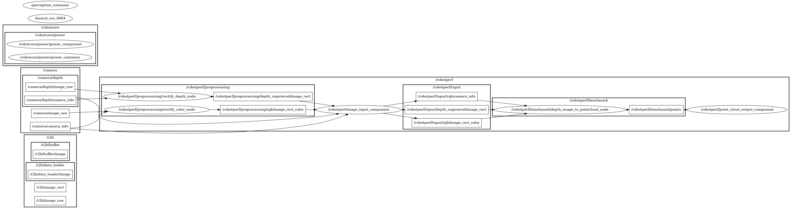

# a4_depth_image_proc

Perception computational graph to compute a point cloud using a rectified depth image and a rectified color image.

### ID
a4

### Description
Perception computational graph to compute a point cloud using a rectified depth image and a rectified color image. Benchmarks the depth_image_proc ROS 2 package.



## Reproduction Steps

```bash
Refer to https://github.com/robotperf/benchmarks/tree/main/benchmarks/perception/a4_depth_image_proc and review the launch files to reproduce this package.
```

## Results

| Type | Hardware | Metric | Value | Category | Timestamp | Note | Data Source |
| --- | --- | --- | --- | --- | --- | --- | --- |
| [:white_circle:](https://github.com/robotperf/benchmarks/blob/main/benchmarks/README.md#type) | 12th Gen Intel(R) Core(TM) i9-12900KF | latency | 939.43 | edge | 26-04-2023 | Mean: 37.09 ms,  RMS: 65.12 ms, Max: 939.43 ms, Min: 7.97 ms over 1147 samples. | [perception/depth_image1](https://github.com/robotperf/rosbags/tree/main/perception/depth_image1) |
| [:black_circle:](https://github.com/robotperf/benchmarks/blob/main/benchmarks/README.md#type) | NVIDIA AGX Orin Dev. Kit | power | 11.513117790222168 | edge | 2023-06-30 20:37:42 |  | [perception/depth_image1](https://github.com/robotperf/rosbags/tree/main/perception/depth_image1) |
| [:white_circle:](https://github.com/robotperf/benchmarks/blob/main/benchmarks/README.md#type) | Intel i7-8700K | latency | 492.41293299999995 | workstation | 2023-07-01 18:52:57 | mean_benchmark 52.36187717005076, rms_benchmark 67.83441415522553, max_benchmark 492.41293299999995, min_benchmark 15.982555999999999, lost messages 1.14 % | [perception/image](https://github.com/robotperf/rosbags/tree/main/perception/image) |
| [:white_circle:](https://github.com/robotperf/benchmarks/blob/main/benchmarks/README.md#type) | Intel i7-8700K | power | 10.32787799835205 | workstation | 2023-07-01 18:56:07 |  | [perception/image](https://github.com/robotperf/rosbags/tree/main/perception/image) |
| [:white_circle:](https://github.com/robotperf/benchmarks/blob/main/benchmarks/README.md#type) | Intel i7-8700K | throughput | 14.56166787712958 | workstation | 2023-07-01 18:59:21 | mean_benchmark 10.01179515336643, rms_benchmark 10.053770754687228, max_benchmark 14.56166787712958, min_benchmark 1.401752375219967, lost messages 1.14 % | [perception/image](https://github.com/robotperf/rosbags/tree/main/perception/image) |
| [:white_circle:](https://github.com/robotperf/benchmarks/blob/main/benchmarks/README.md#type) | Intel i7-8700K | latency | 56.589352000000005 | workstation | 2023-07-01 19:02:52 | mean_benchmark 24.904020833333334, rms_benchmark 25.9619138102967, max_benchmark 56.589352000000005, min_benchmark 15.475099000000002, lost messages 0.00 % | [perception/image](https://github.com/robotperf/rosbags/tree/main/perception/image) |
| [:white_circle:](https://github.com/robotperf/benchmarks/blob/main/benchmarks/README.md#type) | Intel i7-8700K | power | 20.117462158203125 | workstation | 2023-07-01 19:06:20 |  | [perception/image](https://github.com/robotperf/rosbags/tree/main/perception/image) |
| [:white_circle:](https://github.com/robotperf/benchmarks/blob/main/benchmarks/README.md#type) | Intel i7-8700K | throughput | 34.984497844237744 | workstation | 2023-07-01 19:09:30 | mean_benchmark 30.164149180490657, rms_benchmark 30.17906066071334, max_benchmark 34.984497844237744, min_benchmark 29.23188800258132, lost messages 0.00 % | [perception/image](https://github.com/robotperf/rosbags/tree/main/perception/image) |
| [:black_circle:](https://github.com/robotperf/benchmarks/blob/main/benchmarks/README.md#type) | Intel i7-8700K | latency | 32.137471999999995 | workstation | 2023-07-01 19:12:48 | mean_benchmark 27.460619466666667, rms_benchmark 27.531410528435206, max_benchmark 32.137471999999995, min_benchmark 23.952776, lost messages 0.00 % | [perception/image](https://github.com/robotperf/rosbags/tree/main/perception/image) |
| [:black_circle:](https://github.com/robotperf/benchmarks/blob/main/benchmarks/README.md#type) | Intel i7-8700K | power | 22.733518600463867 | workstation | 2023-07-01 19:16:17 |  | [perception/image](https://github.com/robotperf/rosbags/tree/main/perception/image) |
| [:black_circle:](https://github.com/robotperf/benchmarks/blob/main/benchmarks/README.md#type) | Intel i7-8700K | throughput | 32.56260364066182 | workstation | 2023-07-01 19:20:02 | mean_benchmark 30.002004606407837, rms_benchmark 30.016899528253816, max_benchmark 32.56260364066182, min_benchmark 28.05284763755054, lost messages 0.00 % | [perception/image](https://github.com/robotperf/rosbags/tree/main/perception/image) |
| [:white_circle:](https://github.com/robotperf/benchmarks/blob/main/benchmarks/README.md#type) | AMD Ryzen 5 PRO 4650G | power | 4.433058738708496 | workstation | 2023-07-04 20:31:59 | ✋  | [perception/image](https://github.com/robotperf/rosbags/tree/main/perception/image) |
| [:white_circle:](https://github.com/robotperf/benchmarks/blob/main/benchmarks/README.md#type) | AMD Ryzen 5 PRO 4650G | power | 5.608436107635498 | workstation | 2023-07-04 20:38:55 |  | [perception/image](https://github.com/robotperf/rosbags/tree/main/perception/image) |
| [:white_circle:](https://github.com/robotperf/benchmarks/blob/main/benchmarks/README.md#type) | Intel i7-8700K | latency | 491.570981 | workstation | 2023-07-04 21:12:12 | ✋ mean_benchmark 52.86061100765306, rms_benchmark 69.18327305966089, max_benchmark 491.570981, min_benchmark 15.885496, lost messages 0.64 % | [perception/image](https://github.com/robotperf/rosbags/tree/main/perception/image) |
| [:white_circle:](https://github.com/robotperf/benchmarks/blob/main/benchmarks/README.md#type) | Intel i7-8700K | power | 10.352216720581055 | workstation | 2023-07-04 21:15:36 | ✋  | [perception/image](https://github.com/robotperf/rosbags/tree/main/perception/image) |
| [:white_circle:](https://github.com/robotperf/benchmarks/blob/main/benchmarks/README.md#type) | Intel i7-8700K | throughput | 13.402456053681657 | workstation | 2023-07-04 21:19:12 | ✋ mean_benchmark 10.018792680515206, rms_benchmark 10.060285168123452, max_benchmark 13.402456053681657, min_benchmark 2.4505076243697257, lost messages 0.64 % | [perception/image](https://github.com/robotperf/rosbags/tree/main/perception/image) |
| [:white_circle:](https://github.com/robotperf/benchmarks/blob/main/benchmarks/README.md#type) | Intel i7-8700K | latency | 35.401984999999996 | workstation | 2023-07-04 21:21:42 | mean_benchmark 24.92899356666666, rms_benchmark 25.249646499466923, max_benchmark 35.401984999999996, min_benchmark 15.85738, lost messages 0.00 % | [perception/image](https://github.com/robotperf/rosbags/tree/main/perception/image) |
| [:white_circle:](https://github.com/robotperf/benchmarks/blob/main/benchmarks/README.md#type) | Intel i7-8700K | power | 19.50750160217285 | workstation | 2023-07-04 21:25:12 |  | [perception/image](https://github.com/robotperf/rosbags/tree/main/perception/image) |
| [:white_circle:](https://github.com/robotperf/benchmarks/blob/main/benchmarks/README.md#type) | Intel i7-8700K | throughput | 43.240244006426536 | workstation | 2023-07-04 21:28:41 | mean_benchmark 30.458207912685904, rms_benchmark 30.555029612781016, max_benchmark 43.240244006426536, min_benchmark 29.42664420197415, lost messages 0.00 % | [perception/image](https://github.com/robotperf/rosbags/tree/main/perception/image) |
| [:black_circle:](https://github.com/robotperf/benchmarks/blob/main/benchmarks/README.md#type) | Intel i7-8700K | latency | 92.668831 | workstation | 2023-07-04 21:32:10 | mean_latency 38.461124208, rms_latency 40.15482851254003, max_latency 92.668831, min_latency 20.937459, lost messages 0.00 % | [perception/image](https://github.com/robotperf/rosbags/tree/main/perception/image) |
| [:black_circle:](https://github.com/robotperf/benchmarks/blob/main/benchmarks/README.md#type) | Intel i7-8700K | power | 22.755641555786134 | workstation | 2023-07-04 21:35:29 | lost messages 0.00 % | [perception/image](https://github.com/robotperf/rosbags/tree/main/perception/image) |
| [:black_circle:](https://github.com/robotperf/benchmarks/blob/main/benchmarks/README.md#type) | Intel i7-8700K | throughput | 30.152673846639914 | workstation | 2023-07-04 21:38:47 | lost messages 0.00 % | [perception/image](https://github.com/robotperf/rosbags/tree/main/perception/image) |
| [:white_circle:](https://github.com/robotperf/benchmarks/blob/main/benchmarks/README.md#type) | AMD Ryzen 5 PRO 4650G | power | 4.234061241149902 | workstation | 2023-07-05 04:45:29 | ✋  | [perception/image](https://github.com/robotperf/rosbags/tree/main/perception/image) |
| [:white_circle:](https://github.com/robotperf/benchmarks/blob/main/benchmarks/README.md#type) | AMD Ryzen 5 PRO 4650G | power | 5.354733467102051 | workstation | 2023-07-05 04:52:17 |  | [perception/image](https://github.com/robotperf/rosbags/tree/main/perception/image) |
| [:white_circle:](https://github.com/robotperf/benchmarks/blob/main/benchmarks/README.md#type) | Intel i7-8700K | latency | 504.142138 | workstation | 2023-07-05 05:25:32 | ✋ mean_benchmark 52.97410495959596, rms_benchmark 68.21267123766143, max_benchmark 504.142138, min_benchmark 16.572849, lost messages 0.88 % | [perception/image](https://github.com/robotperf/rosbags/tree/main/perception/image) |
| [:white_circle:](https://github.com/robotperf/benchmarks/blob/main/benchmarks/README.md#type) | Intel i7-8700K | power | 10.467607498168945 | workstation | 2023-07-05 05:28:47 | ✋  | [perception/image](https://github.com/robotperf/rosbags/tree/main/perception/image) |
| [:white_circle:](https://github.com/robotperf/benchmarks/blob/main/benchmarks/README.md#type) | Intel i7-8700K | throughput | 14.695484433264344 | workstation | 2023-07-05 05:31:15 | ✋ mean_benchmark 10.001090744020777, rms_benchmark 10.049727847233086, max_benchmark 14.695484433264344, min_benchmark 2.4578538285817704, lost messages 0.88 % | [perception/image](https://github.com/robotperf/rosbags/tree/main/perception/image) |
| [:white_circle:](https://github.com/robotperf/benchmarks/blob/main/benchmarks/README.md#type) | Intel i7-8700K | latency | 90.591611 | workstation | 2023-07-05 05:34:51 | mean_benchmark 34.75213900000001, rms_benchmark 40.500695686005955, max_benchmark 90.591611, min_benchmark 16.591253000000002, lost messages 0.00 % | [perception/image](https://github.com/robotperf/rosbags/tree/main/perception/image) |
| [:white_circle:](https://github.com/robotperf/benchmarks/blob/main/benchmarks/README.md#type) | Intel i7-8700K | power | 21.662899017333984 | workstation | 2023-07-05 05:38:17 |  | [perception/image](https://github.com/robotperf/rosbags/tree/main/perception/image) |
| [:white_circle:](https://github.com/robotperf/benchmarks/blob/main/benchmarks/README.md#type) | Intel i7-8700K | throughput | 31.775115559740275 | workstation | 2023-07-05 05:41:30 | mean_benchmark 30.053021220336642, rms_benchmark 30.055717150717367, max_benchmark 31.775115559740275, min_benchmark 29.35094867696045, lost messages 0.00 % | [perception/image](https://github.com/robotperf/rosbags/tree/main/perception/image) |
| [:black_circle:](https://github.com/robotperf/benchmarks/blob/main/benchmarks/README.md#type) | Intel i7-8700K | latency | 72.214146 | workstation | 2023-07-05 05:44:55 | mean_latency 37.36571114933333, rms_latency 38.47380608450034, max_latency 72.214146, min_latency 21.15103, lost messages 0.00 % | [perception/image](https://github.com/robotperf/rosbags/tree/main/perception/image) |
| [:black_circle:](https://github.com/robotperf/benchmarks/blob/main/benchmarks/README.md#type) | Intel i7-8700K | power | 22.481166076660156 | workstation | 2023-07-05 05:48:15 | lost messages 0.00 % | [perception/image](https://github.com/robotperf/rosbags/tree/main/perception/image) |
| [:black_circle:](https://github.com/robotperf/benchmarks/blob/main/benchmarks/README.md#type) | Intel i7-8700K | throughput | 30.20798963112036 | workstation | 2023-07-05 05:51:38 | lost messages 0.00 % | [perception/image](https://github.com/robotperf/rosbags/tree/main/perception/image) |
| [:white_circle:](https://github.com/robotperf/benchmarks/blob/main/benchmarks/README.md#type) | AMD Ryzen 5 PRO 4650G | power | 4.5126752853393555 | workstation | 2023-07-05 14:18:22 | ✋  | [perception/image](https://github.com/robotperf/rosbags/tree/main/perception/image) |
| [:white_circle:](https://github.com/robotperf/benchmarks/blob/main/benchmarks/README.md#type) | AMD Ryzen 5 PRO 4650G | power | 5.697091579437256 | workstation | 2023-07-05 14:25:18 |  | [perception/image](https://github.com/robotperf/rosbags/tree/main/perception/image) |
| [:white_circle:](https://github.com/robotperf/benchmarks/blob/main/benchmarks/README.md#type) | Intel i7-8700K | latency | 501.39240599999994 | workstation | 2023-07-05 14:46:55 | ✋ mean_benchmark 51.84641596090795, rms_benchmark 67.53828730072699, max_benchmark 501.39240599999994, min_benchmark 16.383295, lost messages 0.76 % | [perception/image](https://github.com/robotperf/rosbags/tree/main/perception/image) |
| [:white_circle:](https://github.com/robotperf/benchmarks/blob/main/benchmarks/README.md#type) | Intel i7-8700K | power | 10.578880310058594 | workstation | 2023-07-05 14:50:01 | ✋  | [perception/image](https://github.com/robotperf/rosbags/tree/main/perception/image) |
| [:white_circle:](https://github.com/robotperf/benchmarks/blob/main/benchmarks/README.md#type) | Intel i7-8700K | throughput | 14.672484541547155 | workstation | 2023-07-05 14:53:19 | ✋ mean_benchmark 10.025722598178604, rms_benchmark 10.068203843051458, max_benchmark 14.672484541547155, min_benchmark 2.491312196456043, lost messages 0.76 % | [perception/image](https://github.com/robotperf/rosbags/tree/main/perception/image) |
| [:white_circle:](https://github.com/robotperf/benchmarks/blob/main/benchmarks/README.md#type) | Intel i7-8700K | latency | 28.931524 | workstation | 2023-07-05 14:56:30 | mean_benchmark 21.9268328, rms_benchmark 22.296288616411058, max_benchmark 28.931524, min_benchmark 15.713098, lost messages 0.00 % | [perception/image](https://github.com/robotperf/rosbags/tree/main/perception/image) |
| [:white_circle:](https://github.com/robotperf/benchmarks/blob/main/benchmarks/README.md#type) | Intel i7-8700K | power | 20.01552391052246 | workstation | 2023-07-05 14:59:49 |  | [perception/image](https://github.com/robotperf/rosbags/tree/main/perception/image) |
| [:white_circle:](https://github.com/robotperf/benchmarks/blob/main/benchmarks/README.md#type) | Intel i7-8700K | throughput | 31.460757581334715 | workstation | 2023-07-05 15:03:01 | mean_benchmark 30.052433654786537, rms_benchmark 30.053979838640625, max_benchmark 31.460757581334715, min_benchmark 29.694387149124434, lost messages 0.00 % | [perception/image](https://github.com/robotperf/rosbags/tree/main/perception/image) |
| [:black_circle:](https://github.com/robotperf/benchmarks/blob/main/benchmarks/README.md#type) | Intel i7-8700K | latency | 99.782809 | workstation | 2023-07-05 15:06:20 | mean_latency 37.121906218666666, rms_latency 38.44251511505979, max_latency 99.782809, min_latency 28.863635, lost messages 0.00 % | [perception/image](https://github.com/robotperf/rosbags/tree/main/perception/image) |
| [:black_circle:](https://github.com/robotperf/benchmarks/blob/main/benchmarks/README.md#type) | Intel i7-8700K | power | 22.585258102416994 | workstation | 2023-07-05 15:09:46 | lost messages 0.00 % | [perception/image](https://github.com/robotperf/rosbags/tree/main/perception/image) |
| [:black_circle:](https://github.com/robotperf/benchmarks/blob/main/benchmarks/README.md#type) | Intel i7-8700K | throughput | 30.136307987279515 | workstation | 2023-07-05 15:12:57 | lost messages 0.00 % | [perception/image](https://github.com/robotperf/rosbags/tree/main/perception/image) |

